# 部署k8s1.23.8

## 初始工作

安装ssh

```sh
sudo apt install openssh-server
sudo systemctl start ssh #开启

sudo systemctl status sshd #查看状态
sudo ps -e | grep ssh #查看是否开启
```

安装完之后可以使用xshell或是Mobaxterm来进行ssh连接，为了保证以后在物理机上部署集群需要使用物理机，所以我使用ssh来进行远程部署模拟

1.首先关闭防火墙

```sh
sudo ufw disable
```

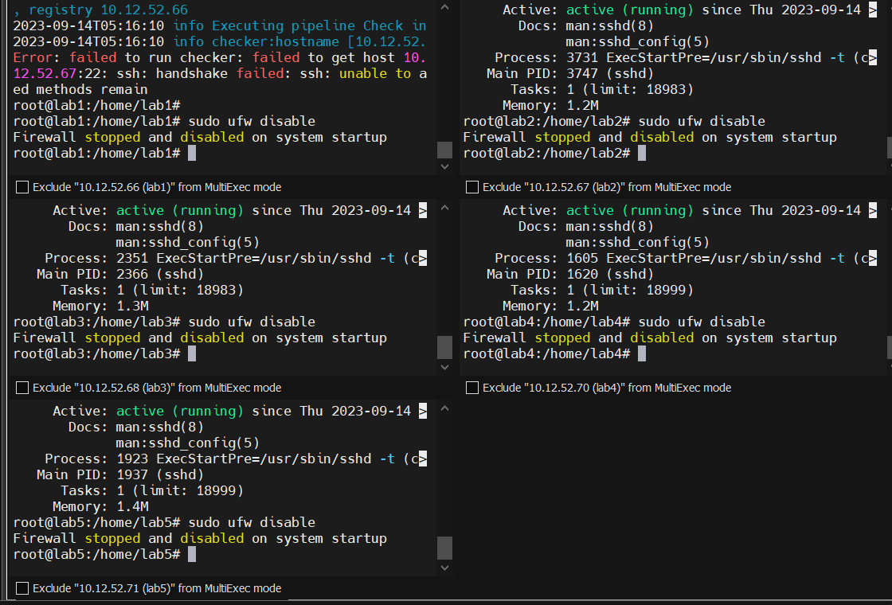

## 关闭swap

```sh
sudo sed -ri 's/.*swap.*/#&/' /etc/fstab #永久关闭
```

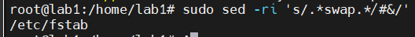

想要恢复swap可以使用以下命令恢复

```sh
sudo sed -ri 's/#(.*swap.*)/\1/' /etc/fstab
```

在master上添加hosts，这里要切换root用户，才能追加，如果直接vim编辑则只需要sudo就行

```sh
cat >> /etc/hosts << EOF
10.12.52.66 lab1
10.12.52.67 lab2
10.12.52.68 lab3
10.12.52.70 lab4
10.12.52.71 lab5
EOF
```

添加完记得查看一下

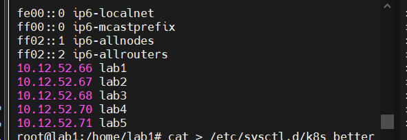

将桥接的 IPv4 流量传递到iptables的链

```sh
cat > /etc/sysctl.d/k8s_better.conf << EOF
net.bridge.bridge-nf-call-iptables=1
net.bridge.bridge-nf-call-ip6tables=1
net.ipv4.ip_forward=1
vm.swappiness=0
vm.overcommit_memory=1
vm.panic_on_oom=0
fs.inotify.max_user_instances=8192
fs.inotify.max_user_watches=1048576
fs.file-max=52706963
fs.nr_open=52706963
net.ipv6.conf.all.disable_ipv6=1
net.netfilter.nf_conntrack_max=2310720
EOF
```

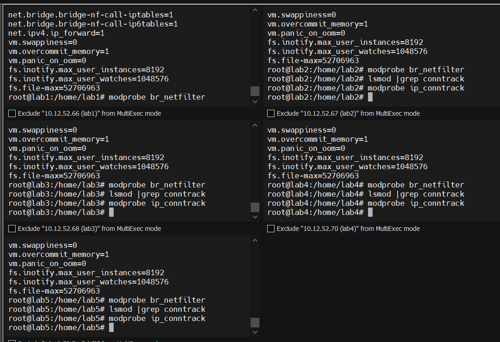

```sh
# modprobe br_netfilter 和 lsmod | grep conntrack 是用于加载 br_netfilter 模块和检查 conntrack 模块是否已加载。
modprobe br_netfilter
lsmod |grep conntrack
modprobe ip_conntrack

```

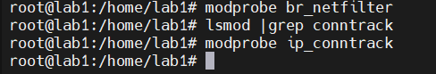

## 同步时间

```sh
sudo apt-get update
sudo apt-get install ntp
 //安装ntp服务

sudo systemctl enable ntp
 //开机启动服务

sudo systemctl start ntp
 //启动服务

sudo timedatectl set-timezone Asia/Shanghai
 //更改时区


ntpq -p
 //同步时间

```


## 使用sealos安装k8s

首先对除了master节点之外的其他节点的ssh配置文件进行更改，因为默认的ssh连接是不允许root用户登录的

```sh
vim /etc/ssh/sshd_config

PermitRootLogin yes               # 允许root用户以任何认证方式登录
PermitRootLogin prohibit-password # 只允许root用户用public key 方式登录验证
PermitRootLogin no                # 不允许root用户以任何认证方式登录

```

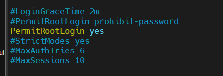

然后重启ssh

```sh
systemctl restart sshd
```

然后运行下面的命令安装k8s，这里sealos默认安装的网络插件是calico

```sh
 sealos run labring/kubernetes-docker:v1.23.8 labring/helm:v3.8.2 labring/calico:v3.24.1      --masters 10.12.52.66      --nodes 10.12.52.67,10.12.52.68 -p 123456
```

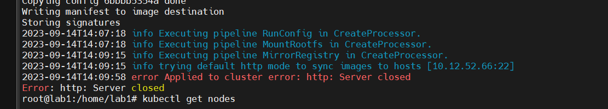

可能会遇到这样的报错，一直重试就成功了

安装成功的界面是这样的

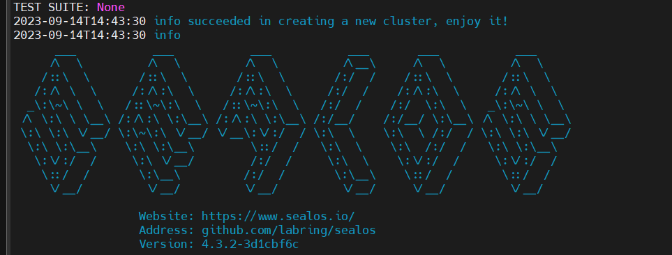

翻一下安装的log可以看到

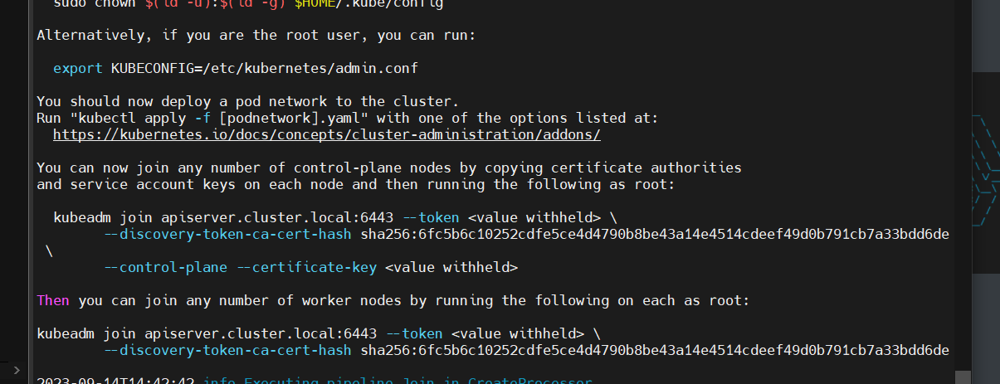

```sh
Your Kubernetes control-plane has initialized successfully!

To start using your cluster, you need to run the following as a regular user:

  mkdir -p $HOME/.kube
  sudo cp -i /etc/kubernetes/admin.conf $HOME/.kube/config
  sudo chown $(id -u):$(id -g) $HOME/.kube/config

Alternatively, if you are the root user, you can run:

  export KUBECONFIG=/etc/kubernetes/admin.conf

You should now deploy a pod network to the cluster.
Run "kubectl apply -f [podnetwork].yaml" with one of the options listed at:
  https://kubernetes.io/docs/concepts/cluster-administration/addons/

You can now join any number of control-plane nodes by copying certificate authorities
and service account keys on each node and then running the following as root:

  kubeadm join apiserver.cluster.local:6443 --token <value withheld> \
        --discovery-token-ca-cert-hash sha256:6fc5b6c10252cdfe5ce4d4790b8be43a14e4514cdeef49d0b791cb7a33bdd6de \
        --control-plane --certificate-key <value withheld>

Then you can join any number of worker nodes by running the following on each as root:

kubeadm join apiserver.cluster.local:6443 --token <value withheld> \
        --discovery-token-ca-cert-hash sha256:6fc5b6c10252cdfe5ce4d4790b8be43a14e4514cdeef49d0b791cb7a33bdd6de

```

虽然使用sealos不需要kubeadm了，但是还是记录下来了

增加节点

```sh
sealos add --nodes 10.12.52.70,10.12.52.71 -p 123456 
```

如果遇到了说端口监管不正确的地方就把端口改成22，比如这样

```sh
sealos add --nodes 10.12.52.70:22,10.12.52.71:22 -p 123456 
```


这样就安装完成了

## 部署dashboard

对应自己的k8s版本下载对应的dashboard，此处下载的是2.5.1

```sh
kubectl apply -f https://raw.githubusercontent.com/kubernetes/dashboard/v2.5.1/aio/deploy/recommended.yaml
```


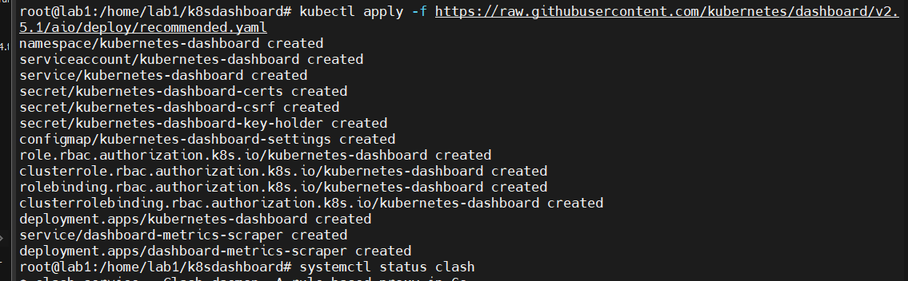

查看一下

```sh
kubectl get svc --all-namespaces
```

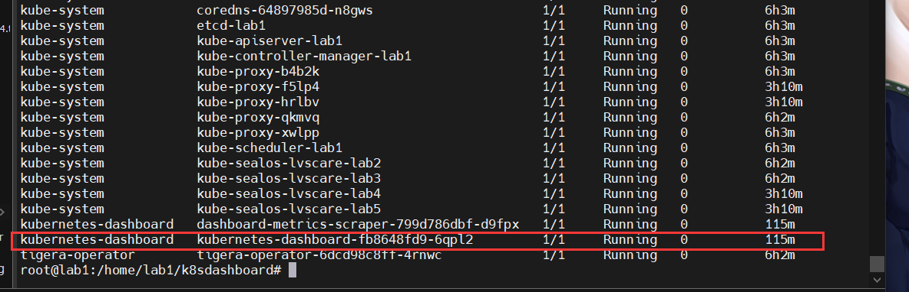

删除现有的service，因为后续要改成NODEPORT

```sh
kubectl delete service kubernetes-dashboard --namespace=kubernetes-dashboard
```

创建配置文件`dashboard-svc.yaml`

```yaml
kind: Service
apiVersion: v1
metadata:
  labels:
    k8s-app: kubernetes-dashboard
  name: kubernetes-dashboard
  namespace: kubernetes-dashboard
spec:
  type: NodePort
  ports:
    - port: 443
      targetPort: 8443
  selector:
    k8s-app: kubernetes-dashboard
```


```sh
root@lab1:/home/lab1/k8sdashboard# kubectl apply -f dashboard-svc.yaml
service/kubernetes-dashboard created
root@lab1:/home/lab1/k8sdashboard# kubectl get svc --all-namespaces
NAMESPACE              NAME                              TYPE        CLUSTER-IP    EXTERNAL-IP   PORT(S)                  AGE
calico-apiserver       calico-api                        ClusterIP   10.96.2.184   <none>        443/TCP                  6h5m
calico-system          calico-kube-controllers-metrics   ClusterIP   10.96.3.135   <none>        9094/TCP                 6h5m
calico-system          calico-typha                      ClusterIP   10.96.3.94    <none>        5473/TCP                 6h6m
default                kubernetes                        ClusterIP   10.96.0.1     <none>        443/TCP                  6h8m
kube-system            kube-dns                          ClusterIP   10.96.0.10    <none>        53/UDP,53/TCP,9153/TCP   6h7m
kubernetes-dashboard   dashboard-metrics-scraper         ClusterIP   10.96.3.104   <none>        8000/TCP                 120m
kubernetes-dashboard   kubernetes-dashboard              NodePort    10.96.2.221   <none>        443:30601/TCP            4s
root@lab1:/home/lab1/k8sdashboard#

```


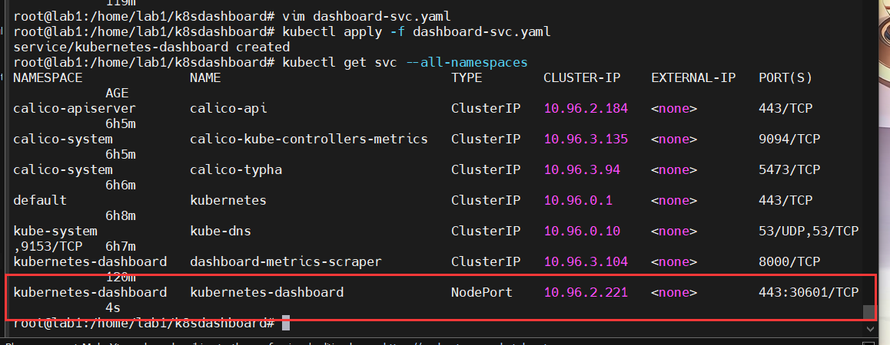

创建 kubernetes-dashboard 管理员角色，`dashboard-svc-account.yaml`内容如下：

```yaml
apiVersion: v1
kind: ServiceAccount
metadata:
  name: admin-user
  namespace: kubernetes-dashboard

---

apiVersion: rbac.authorization.k8s.io/v1
kind: ClusterRoleBinding
metadata:
  name: admin-user
roleRef:
  apiGroup: rbac.authorization.k8s.io
  kind: ClusterRole
  name: cluster-admin
subjects:
- kind: ServiceAccount
  name: admin-user
  namespace: kubernetes-dashboard
```

执行

```shell
root@lab1:/home/lab1/k8sdashboard# vim dashboard-svc-account.yaml
root@lab1:/home/lab1/k8sdashboard# kubectl apply -f dashboard-svc-account.yaml
serviceaccount/admin-user created
clusterrolebinding.rbac.authorization.k8s.io/admin-user created

```

获取token

```sh
root@lab1:/home/lab1/k8sdashboard# kubectl get secret -n kubernetes-dashboard |grep admin|awk '{print $1}'
admin-user-token-hcr5p


[root@k8s-master01 dashboard]# kubectl describe secret admin-user-token-hcr5p -n kubernetes-dashboard|grep '^token'|awk '{print $2}'
eyJhbGciOiJSUzI1NiIsImtpZCI6Im9VLUFMQ2g0OWZxcEw0enVkS0VHbHRrVnU4d0lJTFlWcXhMYi1PMEl3eU0ifQ.eyJpc3MiOiJrdWJlcm5ldGVzL3NlcnZpY2VhY2NvdW50Iiwia3ViZXJuZXRlcy5pby9zZXJ2aWNlYWNjb3VudC9uYW1lc3BhY2UiOiJrdWJlcm5ldGVzLWRhc2hib2FyZCIsImt1YmVybmV0ZXMuaW8vc2VydmljZWFjY291bnQvc2VjcmV0Lm5hbWUiOiJhZG1pbi11c2VyLXRva2VuLWhjcjVwIiwia3ViZXJuZXRlcy5pby9zZXJ2aWNlYWNjb3VudC9zZXJ2aWNlLWFjY291bnQubmFtZSI6ImFkbWluLXVzZXIiLCJrdWJlcm5ldGVzLmlvL3NlcnZpY2VhY2NvdW50L3NlcnZpY2UtYWNjb3VudC51aWQiOiI1ZmRiZTFjMC1mMWMzLTRkM2YtYWNlMi0xM2ZhNDZiMTRmNDYiLCJzdWIiOiJzeXN0ZW06c2VydmljZWFjY291bnQ6a3ViZXJuZXRlcy1kYXNoYm9hcmQ6YWRtaW4tdXNlciJ9.nChnvqiqFeXuTnMCW0y-m8KbR5KEyovjr7K0z32jkb88yvFTlQv50HyI8Y2fZ9fJ6qAeT3nIuZtcScbaS_bwi_PwvtwlItgjQhT09Hw8cpKLgts4FXLYwEGrm6Gyf2QIExuLf8JHjp_arBRTkY4uDHTeNVFx8AzCTFJEZ6EOoy7lYYGUcRIEkAQ5mU1N5kW-043_ufN9NwpeFi3DIcAlHofTrW9b7UqgbUTjJUxcanpqkc95A9C_iFeq9acVoMuNC_HSJVIcfeIXtZcmxY6e-JezhDdTAqONM8c3TVMelDbmFpPjlT-gIC7g5TXzlsK61RAktV6WLP96XUuyazqpGg
```

然后就可以访问了

[Kubernetes Dashboard](https://10.12.52.66:30601/#/login)

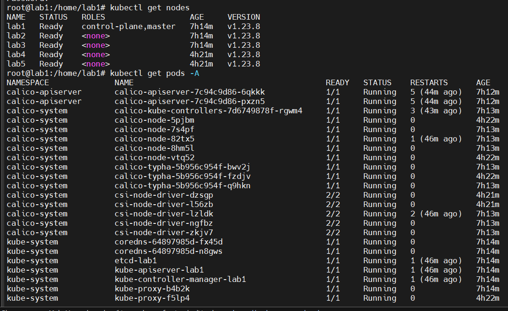

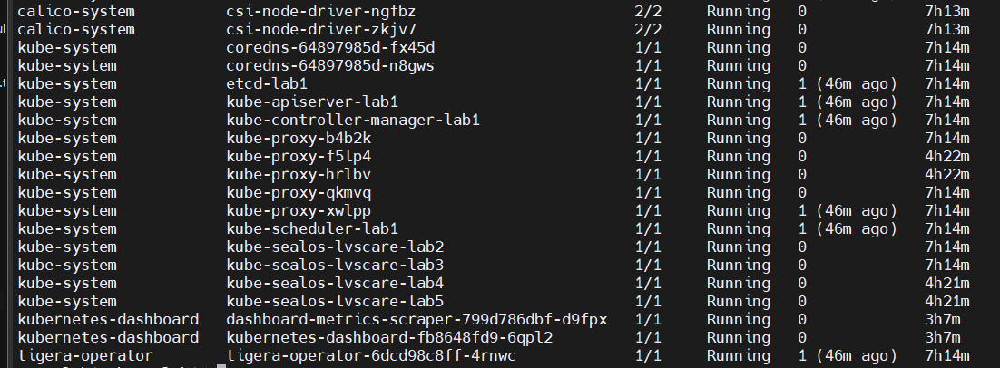

## 部署deepflow

官方文档

[All-in-One 快速部署 | DeepFlow 文档](https://deepflow.io/docs/zh/install/all-in-one/)

参考文档

[部署社区版deepflow_deepflow部署_ljyfree的博客-CSDN博客](https://blog.csdn.net/ljyfree/article/details/127547216)

```sh
root@lab1:/home/lab1# helm repo add deepflow https://deepflowio.github.io/deepflow
"deepflow" has been added to your repositories

```


```sh
helm repo add deepflow https://deepflowio.github.io/deepflow

cat << EOF > values-custom.yaml
global:
  allInOneLocalStorage: true
  image:
      repository: registry.cn-beijing.aliyuncs.com/deepflow-ce
grafana:
  image:
    repository: registry.cn-beijing.aliyuncs.com/deepflow-ce/grafana
EOF
```


```sh
helm install deepflow -n deepflow deepflow/deepflow --create-namespace
```


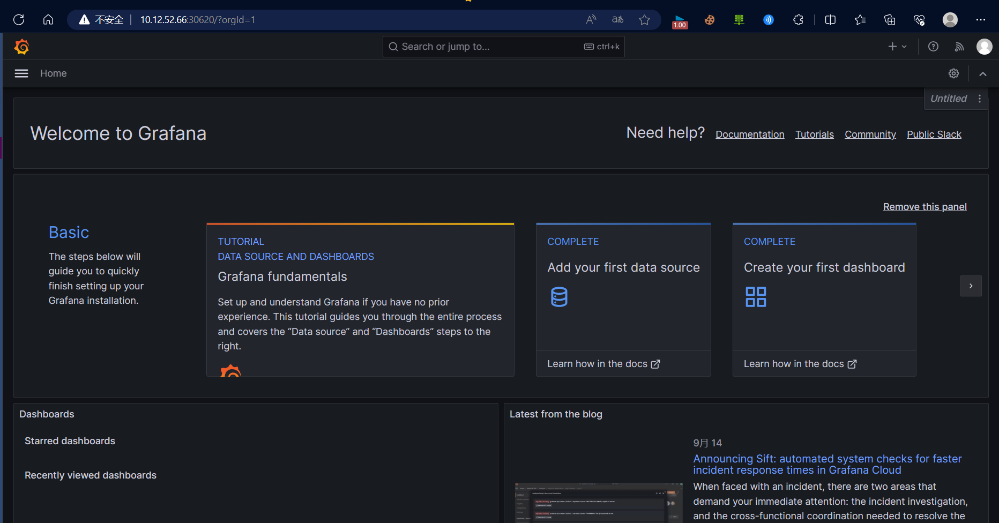


这里server的pod一直没跑起来，查看日志后发现是clickhouse数据库的问题

输出日志

```sh
kubectl logs deepflow-server-66666d6d7f-psvq5 -n deepflw
```

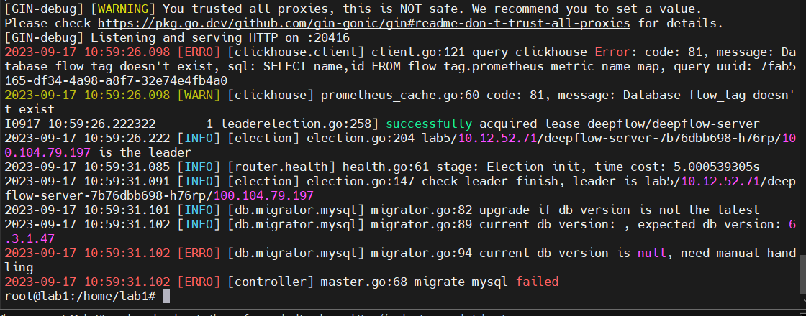

但是clickhouse的pod是成功运行的

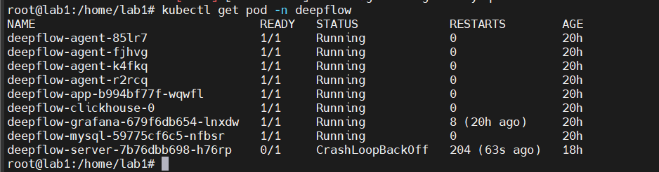

进入clickhouse容器内部看看

```sh
kubectl exec -it deepflow-clickhouse-0 -n deepflow -- /bin/bash
```

 检查存储目录的内容和权限

在 ClickHouse 容器内，检查 `/var/lib/clickhouse/` 和 `/var/lib/clickhouse_storage/` 的内容和权限。

```sh
ls -l /var/lib/clickhouse/
ls -l /var/lib/clickhouse_storage/
```

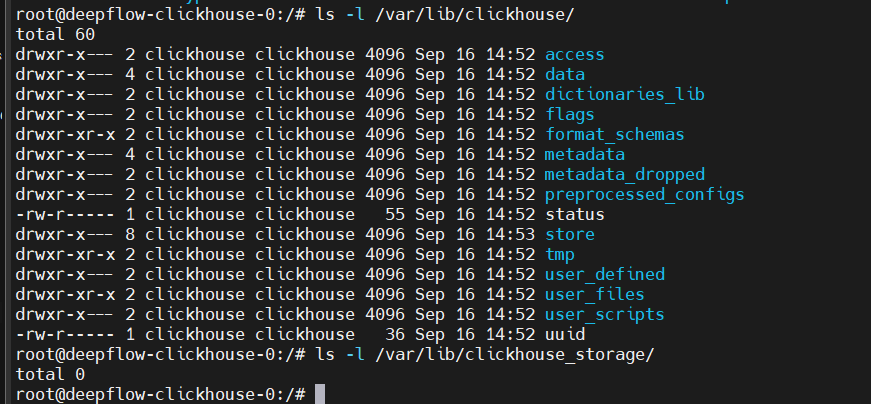

确保文件和目录的所有权是 `clickhouse` 用户

查看 ClickHouse 日志

```sh
cat /var/log/clickhouse-server/clickhouse-server.log
```

检查 ClickHouse 数据库

```sh
kubectl exec -it deepflow-clickhouse-0 -n deepflow -- /bin/bash
```

在 ClickHouse 容器内，使用 ClickHouse CLI 来查询数据库。

```sh
clickhouse-client
```


```sql
show database
```

这里没有截图，这里显示的database是没有flow_tag的，然后创建flow_tag

```sql
CREATE DATABASE flow_tag;
```

之后想解决MySQL的问题，搜索报错信息的时候，找到了这个一模一样的问题

[[BUG\] pod deepflow-server-XXX CrashLoopBackOff · Issue #3584 · deepflowio/deepflow (github.com)](https://github.com/deepflowio/deepflow/issues/3584)

Generally, mysql initialization fails due to poor disk performance or deepflow database table initialization fails. Try to log in mysql with root:deepflow to see if it can log in successfully. And add the following fields in the values - the custom files, update deepflow - server, if not successful landing, the empty mysql data directory/opt/deepflow/data/deepflow - mysql, Then add the following field to values-custom and update

> it.
> 一般是因为磁盘性能较差导致mysql初始化失败或者deepflow的数据库表初始化失败，使用 `root:deepflow` 尝试登陆 MySQL，看看是否能登陆成功，如果能登陆成功，则drop掉deepflow database，并在values-custom文件中添加如下字段，更新deepflow-server，如果不能成功登陆，则清空mysql数据目录 /opt/deepflow/data/deepflow-mysql，然后在values-custom中添加如下字段，并更新

```yaml
mysql:
  livenessProbe:
    failureThreshold: 20
  readinessProbe:
    failureThreshold: 20

server:
  livenessProbe:
    failureThreshold: 20
  readinessProbe:
    failureThreshold: 20
```

这里参照这个方法尝试一下

先进入mysql的pod

```sh
kubectl exec -it deepflow-mysql-6c97f94d8f-rbgnl -n deepflow -- /bin/bash
```

然后用`root:deepflow`连接一下数据库

```sh
mysql -u root -pdeepflow
```


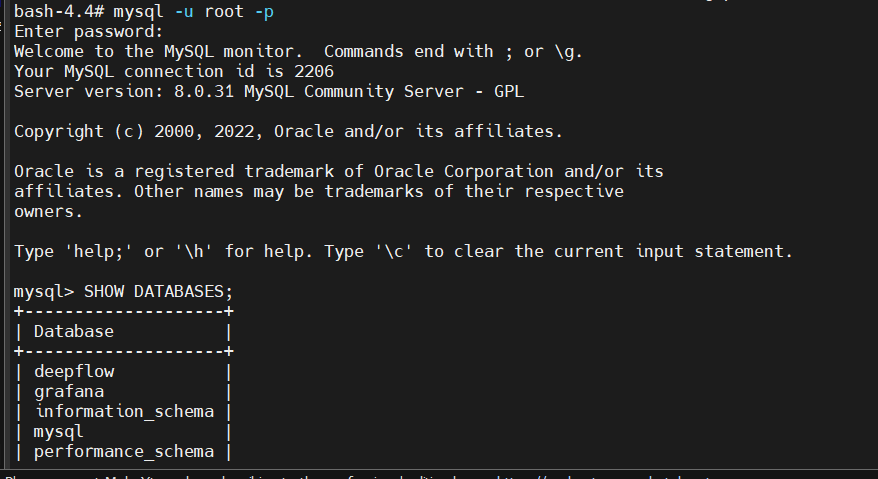

然后把deepflow database drop掉

```sql
DROP DATABASE deepflow
```

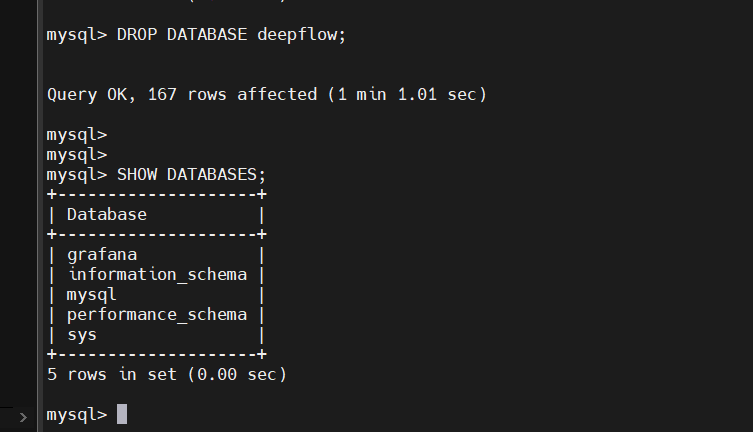

然后退出，在values-custom文件中添加如下字段

```sh
vim values-custom
```

```yaml
mysql:
  livenessProbe:
    failureThreshold: 20
  readinessProbe:
    failureThreshold: 20

server:
  livenessProbe:
    failureThreshold: 20
  readinessProbe:
    failureThreshold: 20
```

然后重启server

```sh
helm upgrade deepflow -f values-custom.yaml -n deepflow deepflow/deepflow
```

这里尝试了许多次，都失败了，找到了开发人员进行远程调试，他说他也用的同样的方法，但是我们重启server的方式有些许不同，可能就是这个原因吧，下面的图片是他的命令

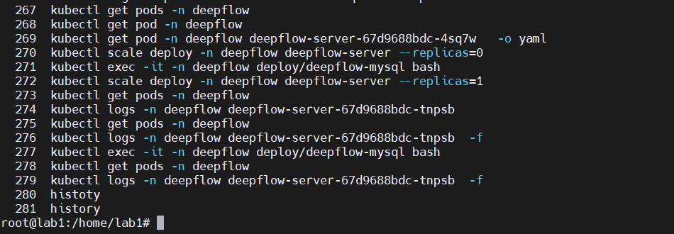

我这里进行一下复刻

首先查看pod情况

```sh
kubectl get pods -n deepflow
```

接着看看server的情况，以yaml文件形式输出

```sh
kubectl get pod deepflow-server-67d9688bdc-tnpsb -n deepflow -o yaml
```

查看之后，发现是同样的问题，就先将server的pod给停掉

```sh
kubectl scale deploy -n deepflow deepflow-server --replicas=0
```

然后进入mysql的pod

```sh
kubectl exec -it deepflow-mysql-6c97f94d8f-rbgnl -n deepflow -- /bin/bash
```

然后也是drop掉deepflow的database

```sql
DROP DATABASE deepflow
```

然后退出重启server

```sh
kubectl scale deploy -n deepflow deepflow-server --replicas=1
```

然后就是漫长的等待

```sh
kubectl logs -n deepflow deepflow-server-67d9688bdc-tnpsb -f
```

然后就好了
