# 部署k8s1.23.8

## 初始工作

安装ssh

```sh
sudo apt install openssh-server
sudo systemctl start ssh #开启

sudo systemctl status sshd #查看状态
sudo ps -e | grep ssh #查看是否开启
```

安装完之后可以使用xshell或是Mobaxterm来进行ssh连接，为了保证以后在物理机上部署集群需要使用物理机，所以我使用ssh来进行远程部署模拟

1.首先关闭防火墙

```sh
sudo ufw disable
```


## 关闭swap

```sh
sudo sed -ri 's/.*swap.*/#&/' /etc/fstab #永久关闭
```


想要恢复swap可以使用以下命令恢复

```sh
sudo sed -ri 's/#(.*swap.*)/\1/' /etc/fstab
```

在master上添加hosts，这里要切换root用户，才能追加，如果直接vim编辑则只需要sudo就行

```sh
cat >> /etc/hosts << EOF
10.12.52.66 lab1
10.12.52.67 lab2
10.12.52.68 lab3
10.12.52.70 lab4
10.12.52.71 lab5
EOF

cat >> /etc/hosts << EOF
192.168.52.51 lab1
192.168.52.52 lab2
192.168.52.53 lab3
EOF

cat >> /etc/hosts << EOF
192.168.52.134 lab1
EOF
```

添加完记得查看一下

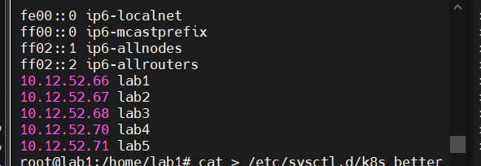

将桥接的 IPv4 流量传递到iptables的链

```sh
cat > /etc/sysctl.d/k8s_better.conf << EOF
net.bridge.bridge-nf-call-iptables=1
net.bridge.bridge-nf-call-ip6tables=1
net.ipv4.ip_forward=1
vm.swappiness=0
vm.overcommit_memory=1
vm.panic_on_oom=0
fs.inotify.max_user_instances=8192
fs.inotify.max_user_watches=1048576
fs.file-max=52706963
fs.nr_open=52706963
net.ipv6.conf.all.disable_ipv6=1
net.netfilter.nf_conntrack_max=2310720
EOF
```

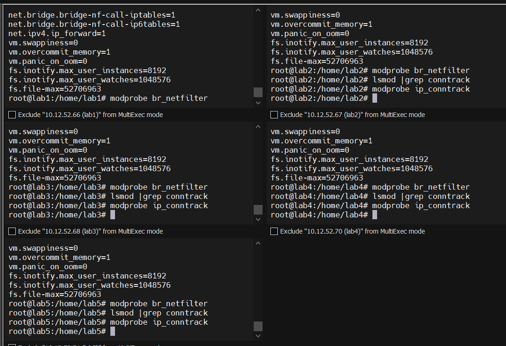

```sh
# modprobe br_netfilter 和 lsmod | grep conntrack 是用于加载 br_netfilter 模块和检查 conntrack 模块是否已加载。
modprobe br_netfilter
lsmod |grep conntrack
modprobe ip_conntrack

```


## 同步时间

```sh
sudo apt-get update
sudo apt-get install ntp
 //安装ntp服务

sudo systemctl enable ntp
 //开机启动服务

sudo systemctl start ntp
 //启动服务

sudo timedatectl set-timezone Asia/Shanghai
 //更改时区


ntpq -p
 //同步时间

```


## 使用sealos安装k8s

首先对除了master节点之外的其他节点的ssh配置文件进行更改，因为默认的ssh连接是不允许root用户登录的

```sh
vim /etc/ssh/sshd_config

PermitRootLogin yes               # 允许root用户以任何认证方式登录
PermitRootLogin prohibit-password # 只允许root用户用public key 方式登录验证
PermitRootLogin no                # 不允许root用户以任何认证方式登录

```

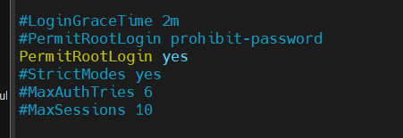

然后重启ssh

```sh
systemctl restart sshd
```

然后运行下面的命令安装k8s，这里sealos默认安装的网络插件是calico

```sh
 sealos run labring/kubernetes-docker:v1.23.8 labring/helm:v3.8.2 labring/calico:v3.24.1      --masters 10.12.52.66      --nodes 10.12.52.67,10.12.52.68 -p 123456
 
sealos run registry.cn-shanghai.aliyuncs.com/labring/kubernetes:v1.23.8 registry.cn-shanghai.aliyuncs.com/labring/helm:v3.8.2 registry.cn-shanghai.aliyuncs.com/labring/calico:v3.24.1 \
     --masters 192.168.52.134
     
sealos run registry.cn-shanghai.aliyuncs.com/labring/kubernetes:v1.21.2 registry.cn-shanghai.aliyuncs.com/labring/helm:v3.6.2 registry.cn-shanghai.aliyuncs.com/labring/calico:v3.20.1      --masters 192.168.52.134.cn-sh 
```

虚拟机

```sh
 sealos run labring/kubernetes-docker:v1.23.8 labring/helm:v3.8.2 labring/calico:v3.24.1      --masters 192.168.52.51      --nodes 192.168.52.52,192.168.52.53 -p 123456
```


可能会遇到这样的报错，一直重试就成功了

安装成功的界面是这样的

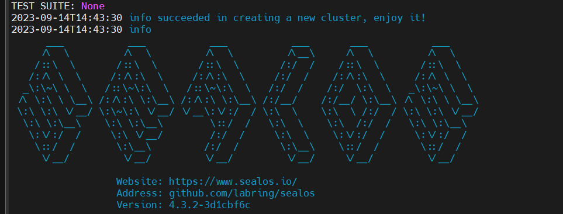

翻一下安装的log可以看到

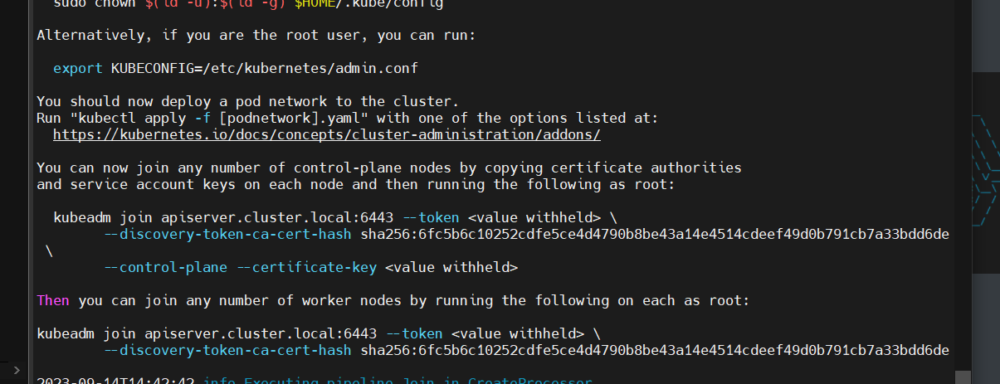

```sh
Your Kubernetes control-plane has initialized successfully!

To start using your cluster, you need to run the following as a regular user:

  mkdir -p $HOME/.kube
  sudo cp -i /etc/kubernetes/admin.conf $HOME/.kube/config
  sudo chown $(id -u):$(id -g) $HOME/.kube/config

Alternatively, if you are the root user, you can run:

  export KUBECONFIG=/etc/kubernetes/admin.conf

You should now deploy a pod network to the cluster.
Run "kubectl apply -f [podnetwork].yaml" with one of the options listed at:
  https://kubernetes.io/docs/concepts/cluster-administration/addons/

You can now join any number of control-plane nodes by copying certificate authorities
and service account keys on each node and then running the following as root:

  kubeadm join apiserver.cluster.local:6443 --token <value withheld> \
        --discovery-token-ca-cert-hash sha256:6fc5b6c10252cdfe5ce4d4790b8be43a14e4514cdeef49d0b791cb7a33bdd6de \
        --control-plane --certificate-key <value withheld>

Then you can join any number of worker nodes by running the following on each as root:

kubeadm join apiserver.cluster.local:6443 --token <value withheld> \
        --discovery-token-ca-cert-hash sha256:6fc5b6c10252cdfe5ce4d4790b8be43a14e4514cdeef49d0b791cb7a33bdd6de

```

虽然使用sealos不需要kubeadm了，但是还是记录下来了

增加节点

```sh
sealos add --nodes 10.12.52.70,10.12.52.71 -p 123456 
```

如果遇到了说端口监管不正确的地方就把端口改成22，比如这样

```sh
sealos add --nodes 10.12.52.70:22,10.12.52.71:22 -p 123456 
```

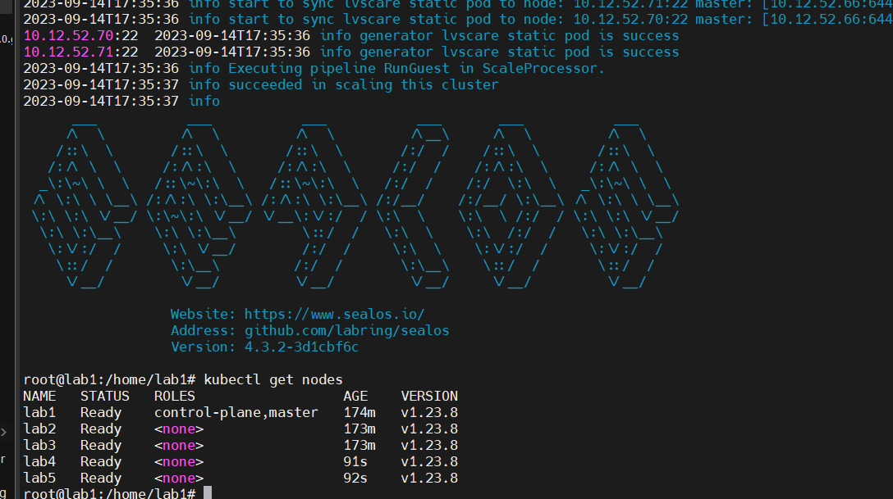

这样就安装完成了

## 部署dashboard

对应自己的k8s版本下载对应的dashboard，此处下载的是2.5.1

```sh
kubectl apply -f https://raw.githubusercontent.com/kubernetes/dashboard/v2.5.1/aio/deploy/recommended.yaml
```


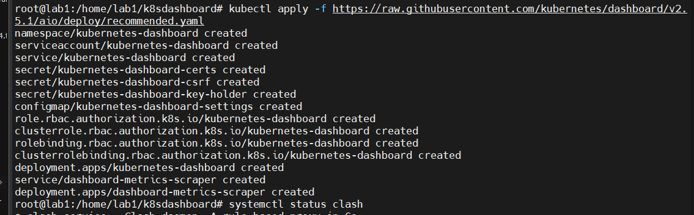

查看一下

```sh
kubectl get svc --all-namespaces
```

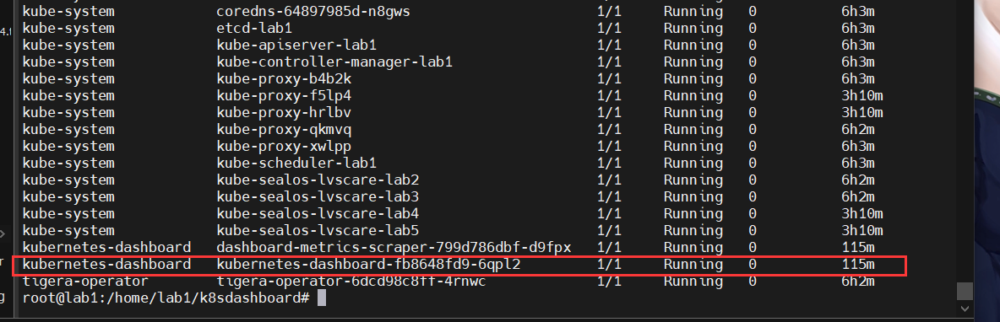

虚拟机

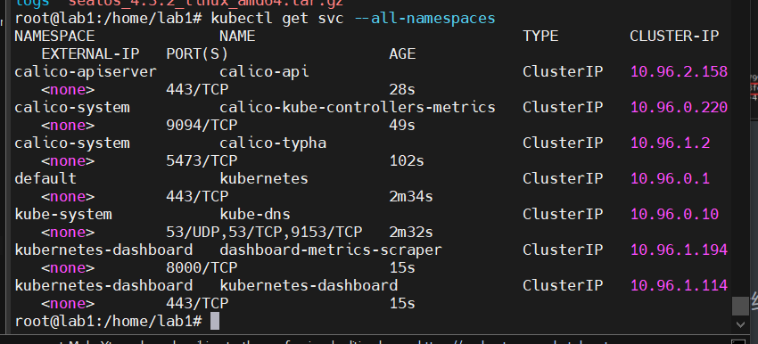

删除现有的service，因为后续要改成NODEPORT

```sh
kubectl delete service kubernetes-dashboard --namespace=kubernetes-dashboard
```

创建配置文件`dashboard-svc.yaml`

```yaml
kind: Service
apiVersion: v1
metadata:
  labels:
    k8s-app: kubernetes-dashboard
  name: kubernetes-dashboard
  namespace: kubernetes-dashboard
spec:
  type: NodePort
  ports:
    - port: 443
      targetPort: 8443
  selector:
    k8s-app: kubernetes-dashboard
```


```sh
root@lab1:/home/lab1/k8sdashboard# kubectl apply -f dashboard-svc.yaml
service/kubernetes-dashboard created
root@lab1:/home/lab1/k8sdashboard# kubectl get svc --all-namespaces
NAMESPACE              NAME                              TYPE        CLUSTER-IP    EXTERNAL-IP   PORT(S)                  AGE
calico-apiserver       calico-api                        ClusterIP   10.96.2.184   <none>        443/TCP                  6h5m
calico-system          calico-kube-controllers-metrics   ClusterIP   10.96.3.135   <none>        9094/TCP                 6h5m
calico-system          calico-typha                      ClusterIP   10.96.3.94    <none>        5473/TCP                 6h6m
default                kubernetes                        ClusterIP   10.96.0.1     <none>        443/TCP                  6h8m
kube-system            kube-dns                          ClusterIP   10.96.0.10    <none>        53/UDP,53/TCP,9153/TCP   6h7m
kubernetes-dashboard   dashboard-metrics-scraper         ClusterIP   10.96.3.104   <none>        8000/TCP                 120m
kubernetes-dashboard   kubernetes-dashboard              NodePort    10.96.2.221   <none>        443:30601/TCP            4s
root@lab1:/home/lab1/k8sdashboard#

```


创建 kubernetes-dashboard 管理员角色，`dashboard-svc-account.yaml`内容如下：

```yaml
apiVersion: v1
kind: ServiceAccount
metadata:
  name: admin-user
  namespace: kubernetes-dashboard

---

apiVersion: rbac.authorization.k8s.io/v1
kind: ClusterRoleBinding
metadata:
  name: admin-user
roleRef:
  apiGroup: rbac.authorization.k8s.io
  kind: ClusterRole
  name: cluster-admin
subjects:
- kind: ServiceAccount
  name: admin-user
  namespace: kubernetes-dashboard
```

执行

```shell
root@lab1:/home/lab1/k8sdashboard# vim dashboard-svc-account.yaml
root@lab1:/home/lab1/k8sdashboard# kubectl apply -f dashboard-svc-account.yaml
serviceaccount/admin-user created
clusterrolebinding.rbac.authorization.k8s.io/admin-user created

```

获取token

```sh
root@lab1:/home/lab1/k8sdashboard# kubectl get secret -n kubernetes-dashboard |grep admin|awk '{print $1}'
admin-user-token-hcr5p


[root@k8s-master01 dashboard]# kubectl describe secret admin-user-token-hcr5p -n kubernetes-dashboard|grep '^token'|awk '{print $2}'
eyJhbGciOiJSUzI1NiIsImtpZCI6Im9VLUFMQ2g0OWZxcEw0enVkS0VHbHRrVnU4d0lJTFlWcXhMYi1PMEl3eU0ifQ.eyJpc3MiOiJrdWJlcm5ldGVzL3NlcnZpY2VhY2NvdW50Iiwia3ViZXJuZXRlcy5pby9zZXJ2aWNlYWNjb3VudC9uYW1lc3BhY2UiOiJrdWJlcm5ldGVzLWRhc2hib2FyZCIsImt1YmVybmV0ZXMuaW8vc2VydmljZWFjY291bnQvc2VjcmV0Lm5hbWUiOiJhZG1pbi11c2VyLXRva2VuLWhjcjVwIiwia3ViZXJuZXRlcy5pby9zZXJ2aWNlYWNjb3VudC9zZXJ2aWNlLWFjY291bnQubmFtZSI6ImFkbWluLXVzZXIiLCJrdWJlcm5ldGVzLmlvL3NlcnZpY2VhY2NvdW50L3NlcnZpY2UtYWNjb3VudC51aWQiOiI1ZmRiZTFjMC1mMWMzLTRkM2YtYWNlMi0xM2ZhNDZiMTRmNDYiLCJzdWIiOiJzeXN0ZW06c2VydmljZWFjY291bnQ6a3ViZXJuZXRlcy1kYXNoYm9hcmQ6YWRtaW4tdXNlciJ9.nChnvqiqFeXuTnMCW0y-m8KbR5KEyovjr7K0z32jkb88yvFTlQv50HyI8Y2fZ9fJ6qAeT3nIuZtcScbaS_bwi_PwvtwlItgjQhT09Hw8cpKLgts4FXLYwEGrm6Gyf2QIExuLf8JHjp_arBRTkY4uDHTeNVFx8AzCTFJEZ6EOoy7lYYGUcRIEkAQ5mU1N5kW-043_ufN9NwpeFi3DIcAlHofTrW9b7UqgbUTjJUxcanpqkc95A9C_iFeq9acVoMuNC_HSJVIcfeIXtZcmxY6e-JezhDdTAqONM8c3TVMelDbmFpPjlT-gIC7g5TXzlsK61RAktV6WLP96XUuyazqpGg
```

虚拟机

```sh
root@lab1:/home/lab1/dashboard# kubectl get secret -n kubernetes-dashboard |grep admin|awk '{print $1}'
admin-user-token-2x5fq

root@lab1:/home/lab1/dashboard# kubectl describe secret admin-user-token-2x5fq -n kubernetes-dashboard|grep '^token'|awk '{print $2}'
eyJhbGciOiJSUzI1NiIsImtpZCI6IkMwdGw3cS1aUGNQV0pMbUxTeDRDMFV0RktvX202SW80c0tMRWp6dl9NRzgifQ.eyJpc3MiOiJrdWJlcm5ldGVzL3NlcnZpY2VhY2NvdW50Iiwia3ViZXJuZXRlcy5pby9zZXJ2aWNlYWNjb3VudC9uYW1lc3BhY2UiOiJrdWJlcm5ldGVzLWRhc2hib2FyZCIsImt1YmVybmV0ZXMuaW8vc2VydmljZWFjY291bnQvc2VjcmV0Lm5hbWUiOiJhZG1pbi11c2VyLXRva2VuLTJ4NWZxIiwia3ViZXJuZXRlcy5pby9zZXJ2aWNlYWNjb3VudC9zZXJ2aWNlLWFjY291bnQubmFtZSI6ImFkbWluLXVzZXIiLCJrdWJlcm5ldGVzLmlvL3NlcnZpY2VhY2NvdW50L3NlcnZpY2UtYWNjb3VudC51aWQiOiJhYTczMzYwMy0xY2VlLTQxMDMtYmVmOS1kMWI0NjVkZTc0NGIiLCJzdWIiOiJzeXN0ZW06c2VydmljZWFjY291bnQ6a3ViZXJuZXRlcy1kYXNoYm9hcmQ6YWRtaW4tdXNlciJ9.VoEuzCWU9c8swO3F6WyMVWtT_BKhhucl7ef5ug2AMmlrvNI8bs98Iw8Nf1G6f8-OwpjQKXSzcw9tUPY1745iEPfKBhXIeZ37AtH3HbN-NhpF1xtw4XsKI3-zxq6MOTR__4isF80sZdYoufqTFehkoOXJK4cdjPvhCx8LgFUuyIedHU8KmRCvPKH7kqh4iqN4z1LvTv_KzHmhZe1KmLgp1fEySUl_dN7tCu9-pBBNcU22t5h-UVefujohdDq_p4DWKcr-eZyyBUymsyzMLjcrZOYZnainRkrXwtiQs3DOhIR5SFqDexTsePgAF5jW5iq9TEDOzg_A_OheYQv_wNgcMA

```


```sh
root@lab1:/home/lab1/dashboard# kubectl get secret -n kubernetes-dashboard |grep admin|awk '{print $1}'
admin-user-token-vlpnx
root@lab1:/home/lab1/dashboard# kubectl describe secret admin-user-token-vlpnx -n kubernetes-dashboard|grep '^token'|awk '{print $2}'
eyJhbGciOiJSUzI1NiIsImtpZCI6IkMwdGw3cS1aUGNQV0pMbUxTeDRDMFV0RktvX202SW80c0tMRWp6dl9NRzgifQ.eyJpc3MiOiJrdWJlcm5ldGVzL3NlcnZpY2VhY2NvdW50Iiwia3ViZXJuZXRlcy5pby9zZXJ2aWNlYWNjb3VudC9uYW1lc3BhY2UiOiJrdWJlcm5ldGVzLWRhc2hib2FyZCIsImt1YmVybmV0ZXMuaW8vc2VydmljZWFjY291bnQvc2VjcmV0Lm5hbWUiOiJhZG1pbi11c2VyLXRva2VuLXZscG54Iiwia3ViZXJuZXRlcy5pby9zZXJ2aWNlYWNjb3VudC9zZXJ2aWNlLWFjY291bnQubmFtZSI6ImFkbWluLXVzZXIiLCJrdWJlcm5ldGVzLmlvL3NlcnZpY2VhY2NvdW50L3NlcnZpY2UtYWNjb3VudC51aWQiOiIwYjllMzliMy03MjQ1LTRhYWMtODk3ZC1mNDIzNjFhZWRjNzIiLCJzdWIiOiJzeXN0ZW06c2VydmljZWFjY291bnQ6a3ViZXJuZXRlcy1kYXNoYm9hcmQ6YWRtaW4tdXNlciJ9.jz6mZrz53DJr2tgJDgvBwxDuYDnOadq-6qKyC8jZIHWVwgaoLVdObPh6E8RiFnM7MVDOKOWHr5n_KFBpko0vY7qh4wvu6krNeRNi5aI_5whD5dy_L5-wEy6boKz9TUM9BCCTQ3tiI1CSPB-zIKfnTWxueBVoumG4uqC_YYgnIiwk0YqN_-RaM5A2pQo9Zrmz0HSXE6YoExLm1gGj0lmtBFkDjF2-n-ZbQQ1-9Sjz9bR6_QZhzSjQCzZpzwPCH5ODCiEo1BUDg9C88At1UeLAk4AafoWzVfrWP_ixevG9BAxTh93jxgsXXWwO_4Jw_povRuq6KRHab1nDtPisuDrNEA
```


然后就可以访问了

[Kubernetes Dashboard](https://10.12.52.66:30601/#/login)


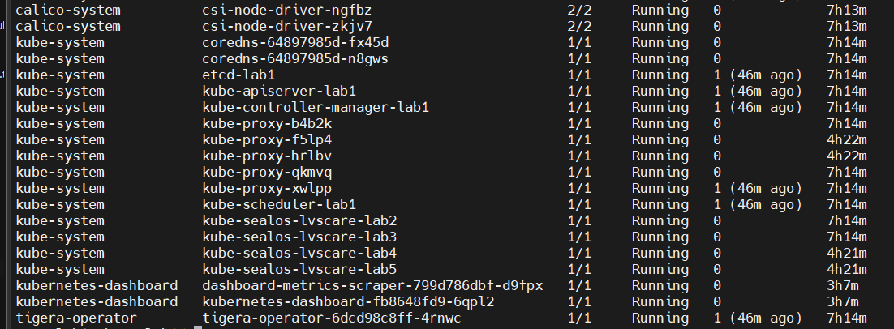

## 部署deepflow

官方文档

[All-in-One 快速部署 | DeepFlow 文档](https://deepflow.io/docs/zh/install/all-in-one/)

参考文档

[部署社区版deepflow_deepflow部署_ljyfree的博客-CSDN博客](https://blog.csdn.net/ljyfree/article/details/127547216)

```sh
root@lab1:/home/lab1# helm repo add deepflow https://deepflowio.github.io/deepflow
"deepflow" has been added to your repositories

```


```sh
helm repo add deepflow https://deepflowio.github.io/deepflow

cat << EOF > values-custom.yaml
global:
  allInOneLocalStorage: true
  image:
      repository: registry.cn-beijing.aliyuncs.com/deepflow-ce
grafana:
  image:
    repository: registry.cn-beijing.aliyuncs.com/deepflow-ce/grafana
EOF
```


```sh
helm install deepflow -n deepflow deepflow/deepflow --create-namespace -f values-custom.yaml
```

虚拟机

```sh
root@lab1:/home/lab1# helm install deepflow -n deepflow deepflow/deepflow --create-namespace -f values -custom.yaml
NAME: deepflow
LAST DEPLOYED: Sun Nov 26 06:39:31 2023
NAMESPACE: deepflow
STATUS: deployed
REVISION: 1
NOTES:
██████╗ ███████╗███████╗██████╗ ███████╗██╗      ██████╗ ██╗    ██╗
██╔══██╗██╔════╝██╔════╝██╔══██╗██╔════╝██║     ██╔═══██╗██║    ██║
██║  ██║█████╗  █████╗  ██████╔╝█████╗  ██║     ██║   ██║██║ █╗ ██║
██║  ██║██╔══╝  ██╔══╝  ██╔═══╝ ██╔══╝  ██║     ██║   ██║██║███╗██║
██████╔╝███████╗███████╗██║     ██║     ███████╗╚██████╔╝╚███╔███╔╝
╚═════╝ ╚══════╝╚══════╝╚═╝     ╚═╝     ╚══════╝ ╚═════╝  ╚══╝╚══╝

An automated observability platform for cloud-native developers.

# deepflow-agent Port for receiving trace, metrics, and log

deepflow-agent service: deepflow-agent.deepflow
deepflow-agent Host listening port: 38086

# Get the Grafana URL to visit by running these commands in the same shell

NODE_PORT=$(kubectl get --namespace deepflow -o jsonpath="{.spec.ports[0].nodePort}" services deepflow                                                            -grafana)
NODE_IP=$(kubectl get nodes -o jsonpath="{.items[0].status.addresses[0].address}")
echo -e "Grafana URL: http://$NODE_IP:$NODE_PORT  \nGrafana auth: admin:deepflow"

```

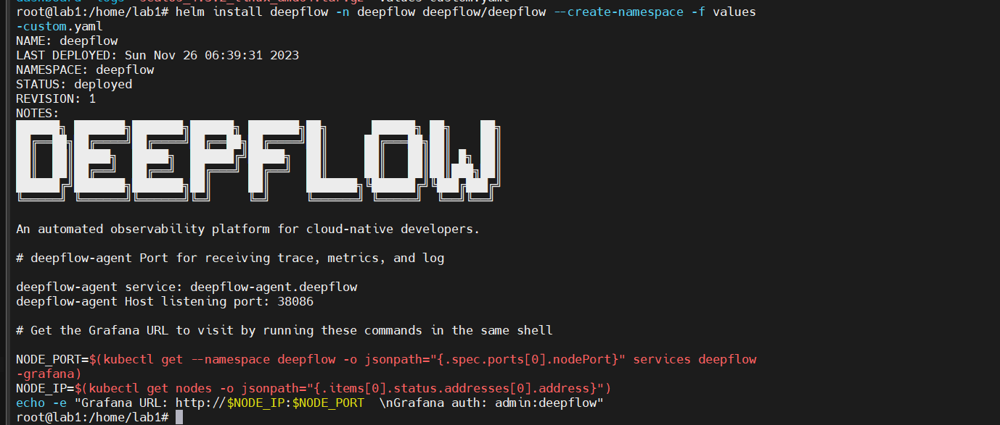

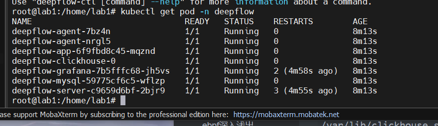

物理机：

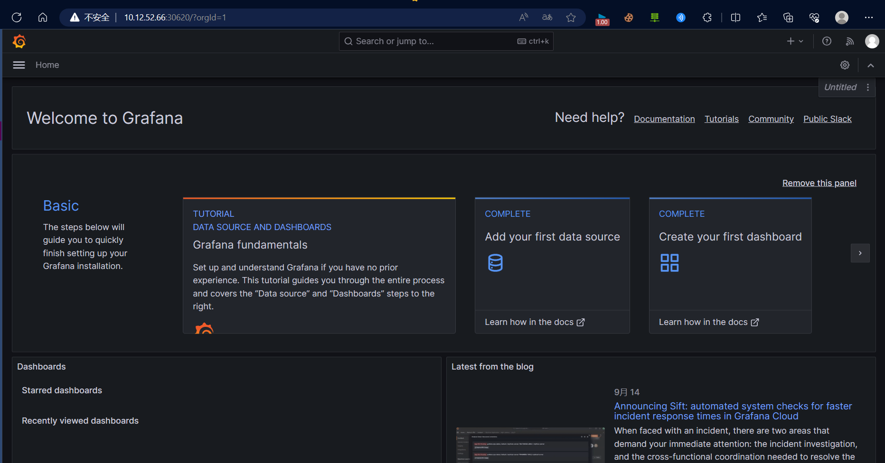

安装 deepflow-ctl

```sh
#要科学上网，已经部署过了
systemctl start clash 


export https_proxy=http://127.0.0.1:7890 http_proxy=http://127.0.0.1:7890 all_proxy=socks5://127.0.0.1:7890

```

```sh
curl -o /usr/bin/deepflow-ctl https://deepflow-ce.oss-cn-beijing.aliyuncs.com/bin/ctl/stable/linux/$(arch | sed 's|x86_64|amd64|' | sed 's|aarch64|arm64|')/deepflow-ctl
chmod a+x /usr/bin/deepflow-ctl

```

执行看看是否成功

```sh
deepflow-ctl
```

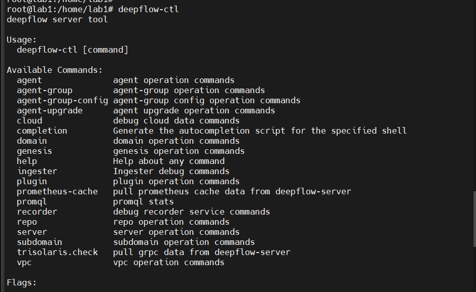

这样就是成功了

这里server的pod一直没跑起来，查看日志后发现是clickhouse数据库的问题

输出日志

```sh
kubectl logs deepflow-server-66666d6d7f-psvq5 -n deepflw
```

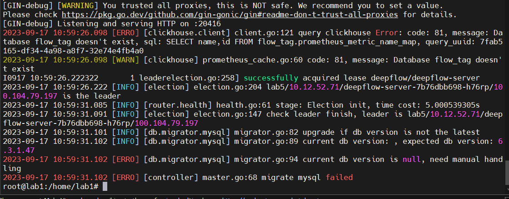

但是clickhouse的pod是成功运行的

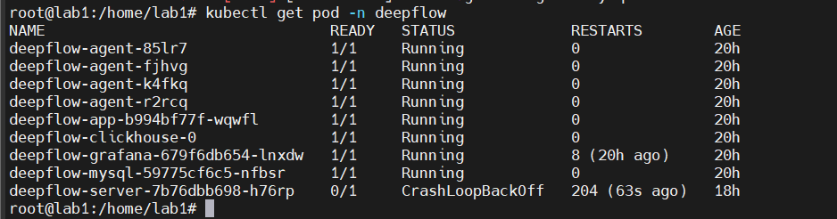

进入clickhouse容器内部看看

```sh
kubectl exec -it deepflow-clickhouse-0 -n deepflow -- /bin/bash
```

 检查存储目录的内容和权限

在 ClickHouse 容器内，检查 `/var/lib/clickhouse/` 和 `/var/lib/clickhouse_storage/` 的内容和权限。

```sh
ls -l /var/lib/clickhouse/
ls -l /var/lib/clickhouse_storage/
```

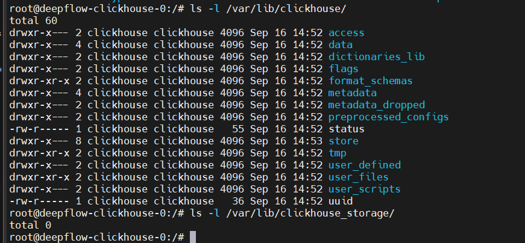

确保文件和目录的所有权是 `clickhouse` 用户

查看 ClickHouse 日志

```sh
cat /var/log/clickhouse-server/clickhouse-server.log
```

检查 ClickHouse 数据库

```sh
kubectl exec -it deepflow-clickhouse-0 -n deepflow -- /bin/bash
```

在 ClickHouse 容器内，使用 ClickHouse CLI 来查询数据库。

```sh
clickhouse-client
```


```sql
show database
```

这里没有截图，这里显示的database是没有flow_tag的，然后创建flow_tag

```sql
CREATE DATABASE flow_tag;
```

之后想解决MySQL的问题，搜索报错信息的时候，找到了这个一模一样的问题

[[BUG\] pod deepflow-server-XXX CrashLoopBackOff · Issue #3584 · deepflowio/deepflow (github.com)](https://github.com/deepflowio/deepflow/issues/3584)

Generally, mysql initialization fails due to poor disk performance or deepflow database table initialization fails. Try to log in mysql with root:deepflow to see if it can log in successfully. And add the following fields in the values - the custom files, update deepflow - server, if not successful landing, the empty mysql data directory/opt/deepflow/data/deepflow - mysql, Then add the following field to values-custom and update

> it.
> 一般是因为磁盘性能较差导致mysql初始化失败或者deepflow的数据库表初始化失败，使用 `root:deepflow` 尝试登陆 MySQL，看看是否能登陆成功，如果能登陆成功，则drop掉deepflow database，并在values-custom文件中添加如下字段，更新deepflow-server，如果不能成功登陆，则清空mysql数据目录 /opt/deepflow/data/deepflow-mysql，然后在values-custom中添加如下字段，并更新

```yaml
mysql:
  livenessProbe:
    failureThreshold: 20
  readinessProbe:
    failureThreshold: 20

server:
  livenessProbe:
    failureThreshold: 20
  readinessProbe:
    failureThreshold: 20
```

这里参照这个方法尝试一下

先进入mysql的pod

```sh
kubectl exec -it deepflow-mysql-6c97f94d8f-rbgnl -n deepflow -- /bin/bash
```

然后用`root:deepflow`连接一下数据库

```sh
mysql -u root -pdeepflow
```


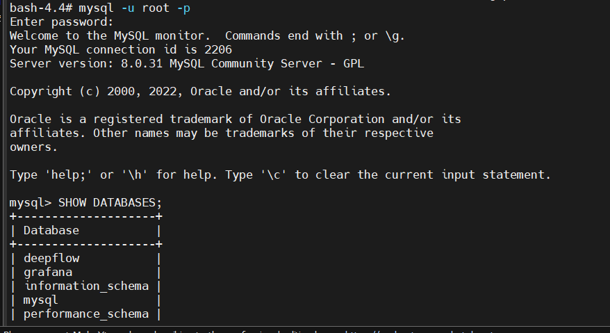

然后把deepflow database drop掉

```sql
DROP DATABASE deepflow
```

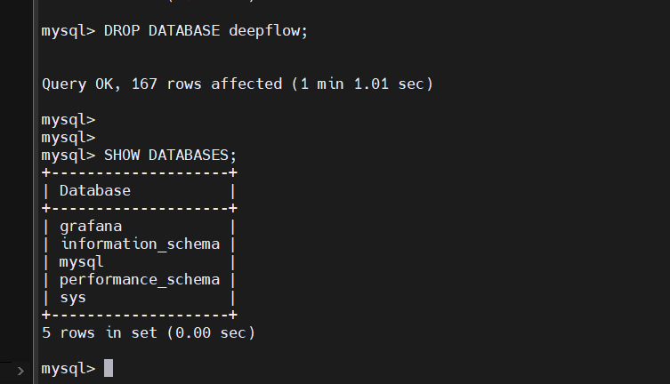

然后退出，在values-custom文件中添加如下字段

```sh
vim values-custom
```

```yaml
mysql:
  livenessProbe:
    failureThreshold: 20
  readinessProbe:
    failureThreshold: 20

server:
  livenessProbe:
    failureThreshold: 20
  readinessProbe:
    failureThreshold: 20
```

然后重启server

```sh
helm upgrade deepflow -f values-custom.yaml -n deepflow deepflow/deepflow
```

这里尝试了许多次，都失败了，找到了开发人员进行远程调试，他说他也用的同样的方法，但是我们重启server的方式有些许不同，可能就是这个原因吧，下面的图片是他的命令

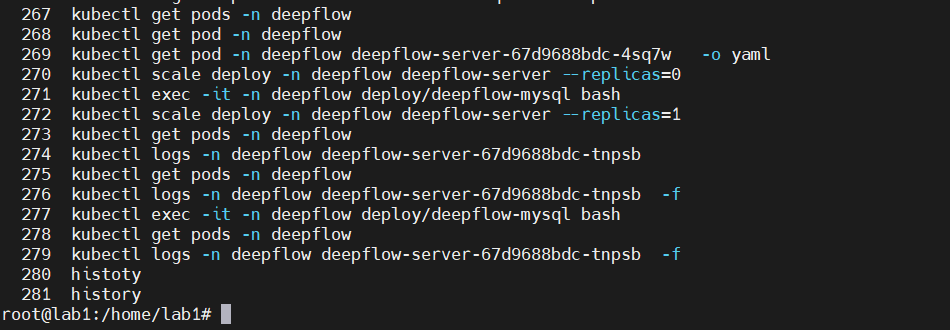

我这里进行一下复刻

首先查看pod情况

```sh
kubectl get pods -n deepflow
```

接着看看server的情况，以yaml文件形式输出

```sh
kubectl get pod deepflow-server-67d9688bdc-tnpsb -n deepflow -o yaml
```

查看之后，发现是同样的问题，就先将server的pod给停掉

```sh
kubectl scale deploy -n deepflow deepflow-server --replicas=0
```

然后进入mysql的pod

```sh
kubectl exec -it deepflow-mysql-6c97f94d8f-rbgnl -n deepflow -- /bin/bash
```

然后也是drop掉deepflow的database

```sql
DROP DATABASE deepflow
```

然后退出重启server

```sh
kubectl scale deploy -n deepflow deepflow-server --replicas=1
```

然后就是漫长的等待

```sh
kubectl logs -n deepflow deepflow-server-67d9688bdc-tnpsb -f
```

然后就好了

## 删除deepflow

1. 使用 `helm list` 查看当前 Helm releases：

   ```sh
   helm list -n deepflow
   ```

2. 确认你看到名为 `deepflow` 的 release 在上述 namespace (`deepflow`) 中。

3. 使用 `helm uninstall` 来删除这个 release：

   ```sh
   helm uninstall deepflow -n deepflow
   ```

4. 删除 `deepflow` namespace

   ```sh
   kubectl delete namespace deepflow
   ```

   **查看命名空间中的所有资源**：

   使用以下命令可以列出命名空间中的所有资源：

```sh
kubectl api-resources --verbs=list --namespaced -o name | xargs -n 1 kubectl get --show-kind --ignore-not-found -n deepflow
```

**手动删除残留资源**：

根据上述命令的输出，手动删除命名空间中的任何残留资源。例如，如果你发现有一个未删除的 ConfigMap，可以使用以下命令删除它：

```sh
kubectl delete configmap <configmap-name> -n <your-namespace-name>
```

**删除命名空间的终结器**：

如果在清理所有资源后命名空间仍然没有被删除，可能是因为命名空间对象上的终结器阻止了它。要删除它，你需要编辑命名空间并删除 `finalizers`。

使用以下命令编辑命名空间：

```sh
kubectl get namespace deepflow -o json | jq '.spec.finalizers=[]' | kubectl replace --raw "/api/v1/namespaces/deepflow/finalize" -f -

```

**手动删除处于 `Terminating` 状态的 Pods**

```sh
kubectl delete pod -n deepflow --force --grace-period=0 deepflow-agent-w6nzw
kubectl delete pod -n deepflow --force --grace-period=0 deepflow-app-7f69b47dd6-nk928
kubectl delete pod -n deepflow --force --grace-period=0 deepflow-clickhouse-0
kubectl delete pod -n deepflow --force --grace-period=0 deepflow-grafana-84cdcdf594-8f7sg
kubectl delete pod -n deepflow --force --grace-period=0 deepflow-mysql-6fc8c8cf85-f78sp
kubectl delete pod -n deepflow --force --grace-period=0 deepflow-server-bb9699c94-tcgcx
```


# 学习网站在这

## ebpf官网

[eBPF Applications Landscape](https://ebpf.io/applications/)

## ebpf入门实战

https://www.zadmei.com/ehxjsysz.html

## 基于 eBPF 的高度自动化可观测性实践 

[DeepFlow 基于 eBPF 的高度自动化可观测性实践 - DeepFlow](https://deepflow.io/blog/zh/018-the-practice-of-automatically-implementing-observability-based-on-ebpf/)

## deepflow高级配置

### Server

[Server 高级配置 | DeepFlow 文档](https://deepflow.io/docs/zh/install/advanced-config/server-advanced-config/)

### Agent

[Agent 高级配置 | DeepFlow 文档](https://deepflow.io/docs/zh/install/advanced-config/agent-advanced-config/)


## Linux性能优化实战

[Linux性能优化实战学习笔记（转载目录） - fiab13 - 博客园 (cnblogs.com)](https://www.cnblogs.com/fiab13/p/14394274.html)

## ebpf学习

### ebpf深入浅出

[【BPF入门系列-3】BPF 环境搭建 | 深入浅出 eBPF](https://www.ebpf.top/post/ebpf_c_env/)

### eBPF 核心技术与实战

https://www.zadmei.com/ehxjsysz.html


[ubuntu 20.04安装libbpf-mfc42d-ChinaUnix博客](http://blog.chinaunix.net/uid-192452-id-5862626.html)


## 搭建eBPF开发环境（在他给的docker容器里实际上是不需要搭建的）

### 注：从下面开始，到分割线的所有内容均可不做参考

参考文档：

[Ubuntu安装BCC - 骇人的籽 - 博客园 (cnblogs.com)](https://www.cnblogs.com/JoshuaYu/p/15086912.html)

[Ubuntu 安装 libbpf 教程_Chientol的博客-CSDN博客](https://blog.csdn.net/qq_43472789/article/details/130839929)

[ubuntu20.04安装bcc_JD怕秃头的博客-CSDN博客](https://blog.csdn.net/weixin_43966076/article/details/132618984)

主要参照的是第一个链接

其中

```sh

root@mobb-iMac:/home/mobb/bcc/build# sudo apt-get -y install bison build-essential cmake flex git libedit-dev \
>   libllvm3.7 llvm-3.7-dev libclang-3.7-dev python zlib1g-dev libelf-dev
正在读取软件包列表... 完成
正在分析软件包的依赖关系树
正在读取状态信息... 完成
注意，选中 'python-is-python2' 而非 'python'
E: 无法定位软件包 libllvm3.7
E: 无法按照 glob ‘libllvm3.7’ 找到任何软件包
E: 无法按照正则表达式 libllvm3.7 找到任何软件包
E: 无法定位软件包 llvm-3.7-dev
E: 无法按照 glob ‘llvm-3.7-dev’ 找到任何软件包
E: 无法按照正则表达式 llvm-3.7-dev 找到任何软件包
E: 无法定位软件包 libclang-3.7-dev
E: 无法按照 glob ‘libclang-3.7-dev’ 找到任何软件包
E: 无法按照正则表达式 libclang-3.7-dev 找到任何软件包

#这个步骤需要更改为
sudo apt-get -y install bison build-essential cmake flex git libedit-dev \
llvm-dev libclang-dev python zlib1g-dev libelf-dev

```

2023.10.04参照了另一个博客，这个是我在进行源码编译运行时遇到了许多问题，最后不知道怎么的来到了这里

[Ubuntu 18.04 LTS源码构建bcc_ubuntu 18.04 安装 ebpf-CSDN博客](https://blog.csdn.net/weixin_44395686/article/details/106712543#:~:text=源码编译安装bcc 1 检查环境 (特别高版本内核可以忽略此步) 内核配置 ：高版本的内核这些是标配，基本不用管，不放心也可以检查下。 通过命令 less,libclang-6.0-dev python zlib1g-dev libelf-dev 1 2 除了官网要求的这些工具之外，还要额外安装几个python3的包 )


参照第二个博客的时候在安装clang时就发生了报错

有一些软件包无法被安装。如果您用的是 unstable 发行版，这也许是
因为系统无法达到您要求的状态造成的。该版本中可能会有一些您需要的软件
包尚未被创建或是它们已被从新到(Incoming)目录移出。
下列信息可能会对解决问题有所帮助：
下列软件包有未满足的依赖关系：
fcitx : 依赖: fcitx-data 但是它将不会被安装
E: 无法修正错误，因为您要求某些软件包保持现状，就是它们破坏了软件包间的依赖关系。

找了很久最终在这里找到了解决办法

https://blog.csdn.net/qq_33406883/article/details/100971183

最后记得要重启一下

然后再次运行

```sh
sudo apt install clang
```

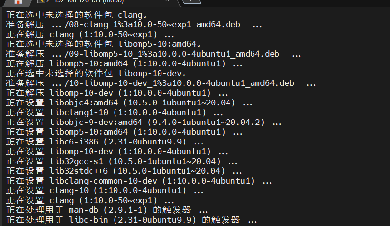

```sh
root@k8smaster:/home/mobb/eBPF_test# clang -v
clang version 10.0.0-4ubuntu1
Target: x86_64-pc-linux-gnu
Thread model: posix
InstalledDir: /usr/bin
Found candidate GCC installation: /usr/bin/../lib/gcc/x86_64-linux-gnu/9
Found candidate GCC installation: /usr/lib/gcc/x86_64-linux-gnu/9
Selected GCC installation: /usr/bin/../lib/gcc/x86_64-linux-gnu/9
Candidate multilib: .;@m64
Candidate multilib: 32;@m32
Candidate multilib: x32;@mx32
Selected multilib: .;@m64

```


依次安装下面这些依赖

```sh
sudo apt install llvm
sudo apt install pkg-config
sudo apt install m4
sudo apt install libelf-dev
sudo apt install libpcap-dev
```

全部安装成功后，将二进制安装包clone下来并解压

然后进入解压目录

```sh
cd src

make
```


```sh
root@k8smaster:/home/mobb/libbpf-1.2.2/src# make
  MKDIR    staticobjs
  CC       staticobjs/bpf.o
  CC       staticobjs/btf.o
  CC       staticobjs/libbpf.o
  CC       staticobjs/libbpf_errno.o
  CC       staticobjs/netlink.o
  CC       staticobjs/nlattr.o
  CC       staticobjs/str_error.o
  CC       staticobjs/libbpf_probes.o
  CC       staticobjs/bpf_prog_linfo.o
  CC       staticobjs/btf_dump.o
  CC       staticobjs/hashmap.o
  CC       staticobjs/ringbuf.o
  CC       staticobjs/strset.o
  CC       staticobjs/linker.o
  CC       staticobjs/gen_loader.o
  CC       staticobjs/relo_core.o
  CC       staticobjs/usdt.o
  CC       staticobjs/zip.o
  AR       libbpf.a
  MKDIR    sharedobjs
  CC       sharedobjs/bpf.o
  CC       sharedobjs/btf.o
  CC       sharedobjs/libbpf.o
  CC       sharedobjs/libbpf_errno.o
  CC       sharedobjs/netlink.o
  CC       sharedobjs/nlattr.o
  CC       sharedobjs/str_error.o
  CC       sharedobjs/libbpf_probes.o
  CC       sharedobjs/bpf_prog_linfo.o
  CC       sharedobjs/btf_dump.o
  CC       sharedobjs/hashmap.o
  CC       sharedobjs/ringbuf.o
  CC       sharedobjs/strset.o
  CC       sharedobjs/linker.o
  CC       sharedobjs/gen_loader.o
  CC       sharedobjs/relo_core.o
  CC       sharedobjs/usdt.o
  CC       sharedobjs/zip.o
  CC       libbpf.so.1.2.2
```


```sh
sudo make install
```

虽然这里安装成功了，但是跑代码的时候还是报错，再次尝试了一下这个命令

```sh
root@k8smaster:/home/mobb# sudo apt-get install -y make clang llvm libelf-dev libbpf-dev bpfcc-tools libbpfcc-dev linux-tools-$(uname -r) linux-headers-$(uname -r)
正在读取软件包列表... 完成
正在分析软件包的依赖关系树
正在读取状态信息... 完成
make 已经是最新版 (4.2.1-1.2)。
make 已设置为手动安装。
linux-headers-5.15.0-79-generic 已经是最新版 (5.15.0-79.86~20.04.2)。
linux-headers-5.15.0-79-generic 已设置为手动安装。
下列软件包是自动安装的并且现在不需要了：
  libcbor0.6 libfido2-1
使用'sudo apt autoremove'来卸载它(它们)。
将会同时安装下列软件：
  binfmt-support clang-10 ieee-data lib32gcc-s1 lib32stdc++6 libbpf0 libbpfcc libc6-i386
  libclang-common-10-dev libclang-cpp10 libclang1-10 libdw1 libelf1 libelf1:i386
  libllvm10 libncurses-dev libobjc-9-dev libobjc4 libomp-10-dev libomp5-10 libpfm4
  libtinfo-dev libz3-4 libz3-dev linux-hwe-5.15-tools-5.15.0-79 linux-tools-common
  llvm-10 llvm-10-dev llvm-10-runtime llvm-10-tools llvm-runtime python3-bpfcc
  python3-netaddr python3-pygments
建议安装：
  clang-10-doc ncurses-doc libomp-10-doc llvm-10-doc ipython3 python-netaddr-docs
  python-pygments-doc ttf-bitstream-vera
下列【新】软件包将被安装：
  binfmt-support bpfcc-tools clang clang-10 ieee-data lib32gcc-s1 lib32stdc++6 libbpf-dev
  libbpf0 libbpfcc libbpfcc-dev libc6-i386 libclang-common-10-dev libclang-cpp10
  libclang1-10 libelf-dev libllvm10 libncurses-dev libobjc-9-dev libobjc4 libomp-10-dev
  libomp5-10 libpfm4 libtinfo-dev libz3-4 libz3-dev linux-hwe-5.15-tools-5.15.0-79
  linux-tools-5.15.0-79-generic linux-tools-common llvm llvm-10 llvm-10-dev
  llvm-10-runtime llvm-10-tools llvm-runtime python3-bpfcc python3-netaddr
  python3-pygments
下列软件包将被升级：
  libdw1 libelf1 libelf1:i386
升级了 3 个软件包，新安装了 38 个软件包，要卸载 0 个软件包，有 156 个软件包未被升级。
需要下载 107 MB/107 MB 的归档。
解压缩后会消耗 602 MB 的额外空间。
获取:1 http://mirrors.tuna.tsinghua.edu.cn/ubuntu focal/universe amd64 binfmt-support amd64 2.2.0-2 [58.2 kB]
获取:2 http://mirrors.tuna.tsinghua.edu.cn/ubuntu focal/universe amd64 libbpfcc amd64 0.12.0-2 [14.9 MB]
获取:7 http://security.ubuntu.com/ubuntu focal-security/universe amd64 libobjc4 amd64 10.5.0-1ubuntu1~20.04 [42.8 kB]
获取:29 http://security.ubuntu.com/ubuntu focal-security/universe amd64 libobjc-9-dev amd64 9.4.0-1ubuntu1~20.04.2 [225 kB]
获取:3 http://mirrors.tuna.tsinghua.edu.cn/ubuntu focal/universe amd64 python3-bpfcc all 0.12.0-2 [31.3 kB]
获取:4 http://mirrors.tuna.tsinghua.edu.cn/ubuntu focal/main amd64 ieee-data all 20180805.1 [1,589 kB]
获取:5 http://mirrors.tuna.tsinghua.edu.cn/ubuntu focal-updates/main amd64 python3-netaddr all 0.7.19-3ubuntu1 [236 kB]
获取:6 http://mirrors.tuna.tsinghua.edu.cn/ubuntu focal/universe amd64 bpfcc-tools all 0.12.0-2 [579 kB]
获取:8 http://mirrors.tuna.tsinghua.edu.cn/ubuntu focal/main amd64 libllvm10 amd64 1:10.0.0-4ubuntu1 [15.3 MB]
获取:30 http://security.ubuntu.com/ubuntu focal-security/main amd64 lib32gcc-s1 amd64 10.5.0-1ubuntu1~20.04 [49.1 kB]
获取:31 http://security.ubuntu.com/ubuntu focal-security/main amd64 lib32stdc++6 amd64 10.5.0-1ubuntu1~20.04 [522 kB]
获取:9 http://mirrors.tuna.tsinghua.edu.cn/ubuntu focal/universe amd64 libclang-cpp10 amd64 1:10.0.0-4ubuntu1 [9,944 kB]
获取:32 http://security.ubuntu.com/ubuntu focal-security/main amd64 libelf-dev amd64 0.176-1.1ubuntu0.1 [57.1 kB]
获取:33 http://security.ubuntu.com/ubuntu focal-security/main amd64 libncurses-dev amd64 6.2-0ubuntu2.1 [340 kB]
获取:10 http://mirrors.tuna.tsinghua.edu.cn/ubuntu focal-updates/main amd64 libc6-i386 amd64 2.31-0ubuntu9.9 [2,730 kB]
获取:11 http://mirrors.tuna.tsinghua.edu.cn/ubuntu focal/universe amd64 libclang-common-10-dev amd64 1:10.0.0-4ubuntu1 [5,012 kB]
获取:34 http://security.ubuntu.com/ubuntu focal-security/main amd64 libtinfo-dev amd64 6.2-0ubuntu2.1 [972 B]
获取:35 http://security.ubuntu.com/ubuntu focal-security/main amd64 linux-tools-common all 5.4.0-163.180 [197 kB]
获取:12 http://mirrors.tuna.tsinghua.edu.cn/ubuntu focal/universe amd64 libclang1-10 amd64 1:10.0.0-4ubuntu1 [7,571 kB]
获取:36 http://security.ubuntu.com/ubuntu focal-security/main amd64 linux-hwe-5.15-tools-5.15.0-79 amd64 5.15.0-79.86~20.04.2 [7,296 kB]
获取:13 http://mirrors.tuna.tsinghua.edu.cn/ubuntu focal/universe amd64 clang-10 amd64 1:10.0.0-4ubuntu1 [66.9 kB]
获取:14 http://mirrors.tuna.tsinghua.edu.cn/ubuntu focal/universe amd64 clang amd64 1:10.0-50~exp1 [3,276 B]
获取:15 http://mirrors.tuna.tsinghua.edu.cn/ubuntu focal-updates/universe amd64 libbpf0 amd64 1:0.5.0-1~ubuntu20.04.1 [128 kB]
获取:16 http://mirrors.tuna.tsinghua.edu.cn/ubuntu focal-updates/universe amd64 libbpf-dev amd64 1:0.5.0-1~ubuntu20.04.1 [188 kB]
获取:17 http://mirrors.tuna.tsinghua.edu.cn/ubuntu focal/universe amd64 libbpfcc-dev amd64 0.12.0-2 [16.4 kB]
获取:18 http://mirrors.tuna.tsinghua.edu.cn/ubuntu focal/universe amd64 libomp5-10 amd64 1:10.0.0-4ubuntu1 [300 kB]
获取:19 http://mirrors.tuna.tsinghua.edu.cn/ubuntu focal/universe amd64 libomp-10-dev amd64 1:10.0.0-4ubuntu1 [47.7 kB]
获取:20 http://mirrors.tuna.tsinghua.edu.cn/ubuntu focal/universe amd64 llvm-10-runtime amd64 1:10.0.0-4ubuntu1 [180 kB]
获取:21 http://mirrors.tuna.tsinghua.edu.cn/ubuntu focal/universe amd64 llvm-runtime amd64 1:10.0-50~exp1 [2,916 B]
获取:22 http://mirrors.tuna.tsinghua.edu.cn/ubuntu focal/main amd64 libpfm4 amd64 4.10.1+git20-g7700f49-2 [266 kB]
获取:23 http://mirrors.tuna.tsinghua.edu.cn/ubuntu focal/universe amd64 llvm-10 amd64 1:10.0.0-4ubuntu1 [5,214 kB]
获取:24 http://mirrors.tuna.tsinghua.edu.cn/ubuntu focal/universe amd64 llvm amd64 1:10.0-50~exp1 [3,880 B]
获取:25 http://mirrors.tuna.tsinghua.edu.cn/ubuntu focal/universe amd64 llvm-10-tools amd64 1:10.0.0-4ubuntu1 [317 kB]
获取:26 http://mirrors.tuna.tsinghua.edu.cn/ubuntu focal/universe amd64 libz3-4 amd64 4.8.7-4build1 [6,792 kB]
获取:27 http://mirrors.tuna.tsinghua.edu.cn/ubuntu focal/universe amd64 libz3-dev amd64 4.8.7-4build1 [67.5 kB]
获取:28 http://mirrors.tuna.tsinghua.edu.cn/ubuntu focal/universe amd64 llvm-10-dev amd64 1:10.0.0-4ubuntu1 [26.0 MB]
获取:37 http://security.ubuntu.com/ubuntu focal-security/main amd64 linux-tools-5.15.0-79-generic amd64 5.15.0-79.86~20.04.2 [2,008 B]
获取:38 http://security.ubuntu.com/ubuntu focal-security/main amd64 python3-pygments all 2.3.1+dfsg-1ubuntu2.2 [579 kB]
已下载 107 MB，耗时 14秒 (7,800 kB/s)
正在从软件包中解出模板：100%
(正在读取数据库 ... 系统当前共安装有 208477 个文件和目录。)
准备解压 .../00-libdw1_0.176-1.1ubuntu0.1_amd64.deb  ...
正在解压 libdw1:amd64 (0.176-1.1ubuntu0.1) 并覆盖 (0.176-1.1build1) ...
准备解压 .../01-libelf1_0.176-1.1ubuntu0.1_i386.deb  ...
正在反配置 libelf1:amd64 (0.176-1.1build1) ...
正在解压 libelf1:i386 (0.176-1.1ubuntu0.1) 并覆盖 (0.176-1.1build1) ...
准备解压 .../02-libelf1_0.176-1.1ubuntu0.1_amd64.deb  ...
正在解压 libelf1:amd64 (0.176-1.1ubuntu0.1) 并覆盖 (0.176-1.1build1) ...
正在选中未选择的软件包 binfmt-support。
准备解压 .../03-binfmt-support_2.2.0-2_amd64.deb  ...
正在解压 binfmt-support (2.2.0-2) ...
正在选中未选择的软件包 libbpfcc。
准备解压 .../04-libbpfcc_0.12.0-2_amd64.deb  ...
正在解压 libbpfcc (0.12.0-2) ...
正在选中未选择的软件包 python3-bpfcc。
准备解压 .../05-python3-bpfcc_0.12.0-2_all.deb  ...
正在解压 python3-bpfcc (0.12.0-2) ...
正在选中未选择的软件包 ieee-data。
准备解压 .../06-ieee-data_20180805.1_all.deb  ...
正在解压 ieee-data (20180805.1) ...
正在选中未选择的软件包 python3-netaddr。
准备解压 .../07-python3-netaddr_0.7.19-3ubuntu1_all.deb  ...
正在解压 python3-netaddr (0.7.19-3ubuntu1) ...
正在选中未选择的软件包 bpfcc-tools。
准备解压 .../08-bpfcc-tools_0.12.0-2_all.deb  ...
正在解压 bpfcc-tools (0.12.0-2) ...
正在选中未选择的软件包 libllvm10:amd64。
准备解压 .../09-libllvm10_1%3a10.0.0-4ubuntu1_amd64.deb  ...
正在解压 libllvm10:amd64 (1:10.0.0-4ubuntu1) ...
正在选中未选择的软件包 libclang-cpp10。
准备解压 .../10-libclang-cpp10_1%3a10.0.0-4ubuntu1_amd64.deb  ...
正在解压 libclang-cpp10 (1:10.0.0-4ubuntu1) ...
正在选中未选择的软件包 libobjc4:amd64。
准备解压 .../11-libobjc4_10.5.0-1ubuntu1~20.04_amd64.deb  ...
正在解压 libobjc4:amd64 (10.5.0-1ubuntu1~20.04) ...
正在选中未选择的软件包 libobjc-9-dev:amd64。
准备解压 .../12-libobjc-9-dev_9.4.0-1ubuntu1~20.04.2_amd64.deb  ...
正在解压 libobjc-9-dev:amd64 (9.4.0-1ubuntu1~20.04.2) ...
正在选中未选择的软件包 libc6-i386。
准备解压 .../13-libc6-i386_2.31-0ubuntu9.9_amd64.deb  ...
正在解压 libc6-i386 (2.31-0ubuntu9.9) ...
被已安装的软件包 libc6:i386 (2.31-0ubuntu9.9) 中的文件替换了...
正在选中未选择的软件包 lib32gcc-s1。
准备解压 .../14-lib32gcc-s1_10.5.0-1ubuntu1~20.04_amd64.deb  ...
正在解压 lib32gcc-s1 (10.5.0-1ubuntu1~20.04) ...
正在选中未选择的软件包 lib32stdc++6。
准备解压 .../15-lib32stdc++6_10.5.0-1ubuntu1~20.04_amd64.deb  ...
正在解压 lib32stdc++6 (10.5.0-1ubuntu1~20.04) ...
正在选中未选择的软件包 libclang-common-10-dev。
准备解压 .../16-libclang-common-10-dev_1%3a10.0.0-4ubuntu1_amd64.deb  ...
正在解压 libclang-common-10-dev (1:10.0.0-4ubuntu1) ...
正在选中未选择的软件包 libclang1-10。
准备解压 .../17-libclang1-10_1%3a10.0.0-4ubuntu1_amd64.deb  ...
正在解压 libclang1-10 (1:10.0.0-4ubuntu1) ...
正在选中未选择的软件包 clang-10。
准备解压 .../18-clang-10_1%3a10.0.0-4ubuntu1_amd64.deb  ...
正在解压 clang-10 (1:10.0.0-4ubuntu1) ...
正在选中未选择的软件包 clang。
准备解压 .../19-clang_1%3a10.0-50~exp1_amd64.deb  ...
正在解压 clang (1:10.0-50~exp1) ...
正在选中未选择的软件包 libbpf0:amd64。
准备解压 .../20-libbpf0_1%3a0.5.0-1~ubuntu20.04.1_amd64.deb  ...
正在解压 libbpf0:amd64 (1:0.5.0-1~ubuntu20.04.1) ...
正在选中未选择的软件包 libelf-dev:amd64。
准备解压 .../21-libelf-dev_0.176-1.1ubuntu0.1_amd64.deb  ...
正在解压 libelf-dev:amd64 (0.176-1.1ubuntu0.1) ...
正在选中未选择的软件包 libbpf-dev:amd64。
准备解压 .../22-libbpf-dev_1%3a0.5.0-1~ubuntu20.04.1_amd64.deb  ...
正在解压 libbpf-dev:amd64 (1:0.5.0-1~ubuntu20.04.1) ...
正在选中未选择的软件包 libbpfcc-dev。
准备解压 .../23-libbpfcc-dev_0.12.0-2_amd64.deb  ...
正在解压 libbpfcc-dev (0.12.0-2) ...
正在选中未选择的软件包 libncurses-dev:amd64。
准备解压 .../24-libncurses-dev_6.2-0ubuntu2.1_amd64.deb  ...
正在解压 libncurses-dev:amd64 (6.2-0ubuntu2.1) ...
正在选中未选择的软件包 libomp5-10:amd64。
准备解压 .../25-libomp5-10_1%3a10.0.0-4ubuntu1_amd64.deb  ...
正在解压 libomp5-10:amd64 (1:10.0.0-4ubuntu1) ...
正在选中未选择的软件包 libomp-10-dev。
准备解压 .../26-libomp-10-dev_1%3a10.0.0-4ubuntu1_amd64.deb  ...
正在解压 libomp-10-dev (1:10.0.0-4ubuntu1) ...
正在选中未选择的软件包 libtinfo-dev:amd64。
准备解压 .../27-libtinfo-dev_6.2-0ubuntu2.1_amd64.deb  ...
正在解压 libtinfo-dev:amd64 (6.2-0ubuntu2.1) ...
正在选中未选择的软件包 linux-tools-common。
准备解压 .../28-linux-tools-common_5.4.0-163.180_all.deb  ...
正在解压 linux-tools-common (5.4.0-163.180) ...
正在选中未选择的软件包 linux-hwe-5.15-tools-5.15.0-79。
准备解压 .../29-linux-hwe-5.15-tools-5.15.0-79_5.15.0-79.86~20.04.2_amd64.deb  ...
正在解压 linux-hwe-5.15-tools-5.15.0-79 (5.15.0-79.86~20.04.2) ...
正在选中未选择的软件包 linux-tools-5.15.0-79-generic。
准备解压 .../30-linux-tools-5.15.0-79-generic_5.15.0-79.86~20.04.2_amd64.deb  ...
正在解压 linux-tools-5.15.0-79-generic (5.15.0-79.86~20.04.2) ...
正在选中未选择的软件包 llvm-10-runtime。
准备解压 .../31-llvm-10-runtime_1%3a10.0.0-4ubuntu1_amd64.deb  ...
正在解压 llvm-10-runtime (1:10.0.0-4ubuntu1) ...
正在选中未选择的软件包 llvm-runtime。
准备解压 .../32-llvm-runtime_1%3a10.0-50~exp1_amd64.deb  ...
正在解压 llvm-runtime (1:10.0-50~exp1) ...
正在选中未选择的软件包 libpfm4:amd64。
准备解压 .../33-libpfm4_4.10.1+git20-g7700f49-2_amd64.deb  ...
正在解压 libpfm4:amd64 (4.10.1+git20-g7700f49-2) ...
正在选中未选择的软件包 llvm-10。
准备解压 .../34-llvm-10_1%3a10.0.0-4ubuntu1_amd64.deb  ...
正在解压 llvm-10 (1:10.0.0-4ubuntu1) ...
正在选中未选择的软件包 llvm。
准备解压 .../35-llvm_1%3a10.0-50~exp1_amd64.deb  ...
正在解压 llvm (1:10.0-50~exp1) ...
正在选中未选择的软件包 python3-pygments。
准备解压 .../36-python3-pygments_2.3.1+dfsg-1ubuntu2.2_all.deb  ...
正在解压 python3-pygments (2.3.1+dfsg-1ubuntu2.2) ...
正在选中未选择的软件包 llvm-10-tools。
准备解压 .../37-llvm-10-tools_1%3a10.0.0-4ubuntu1_amd64.deb  ...
正在解压 llvm-10-tools (1:10.0.0-4ubuntu1) ...
正在选中未选择的软件包 libz3-4:amd64。
准备解压 .../38-libz3-4_4.8.7-4build1_amd64.deb  ...
正在解压 libz3-4:amd64 (4.8.7-4build1) ...
正在选中未选择的软件包 libz3-dev:amd64。
准备解压 .../39-libz3-dev_4.8.7-4build1_amd64.deb  ...
正在解压 libz3-dev:amd64 (4.8.7-4build1) ...
正在选中未选择的软件包 llvm-10-dev。
准备解压 .../40-llvm-10-dev_1%3a10.0.0-4ubuntu1_amd64.deb  ...
正在解压 llvm-10-dev (1:10.0.0-4ubuntu1) ...
正在设置 libncurses-dev:amd64 (6.2-0ubuntu2.1) ...
正在设置 libobjc4:amd64 (10.5.0-1ubuntu1~20.04) ...
正在设置 libllvm10:amd64 (1:10.0.0-4ubuntu1) ...
正在设置 python3-pygments (2.3.1+dfsg-1ubuntu2.2) ...
正在设置 libz3-4:amd64 (4.8.7-4build1) ...
正在设置 libpfm4:amd64 (4.10.1+git20-g7700f49-2) ...
正在设置 libclang1-10 (1:10.0.0-4ubuntu1) ...
正在设置 binfmt-support (2.2.0-2) ...
Created symlink /etc/systemd/system/multi-user.target.wants/binfmt-support.service → /lib/systemd/system/binfmt-support.service.
正在设置 libobjc-9-dev:amd64 (9.4.0-1ubuntu1~20.04.2) ...
正在设置 ieee-data (20180805.1) ...
正在设置 libomp5-10:amd64 (1:10.0.0-4ubuntu1) ...
正在设置 libc6-i386 (2.31-0ubuntu9.9) ...
正在设置 libelf1:amd64 (0.176-1.1ubuntu0.1) ...
正在设置 libelf1:i386 (0.176-1.1ubuntu0.1) ...
正在设置 linux-tools-common (5.4.0-163.180) ...
正在设置 libtinfo-dev:amd64 (6.2-0ubuntu2.1) ...
正在设置 libz3-dev:amd64 (4.8.7-4build1) ...
正在设置 libdw1:amd64 (0.176-1.1ubuntu0.1) ...
正在设置 llvm-10-tools (1:10.0.0-4ubuntu1) ...
正在设置 libomp-10-dev (1:10.0.0-4ubuntu1) ...
正在设置 libclang-cpp10 (1:10.0.0-4ubuntu1) ...
正在设置 llvm-10-runtime (1:10.0.0-4ubuntu1) ...
正在设置 lib32gcc-s1 (10.5.0-1ubuntu1~20.04) ...
正在设置 lib32stdc++6 (10.5.0-1ubuntu1~20.04) ...
正在设置 llvm-runtime (1:10.0-50~exp1) ...
正在设置 libelf-dev:amd64 (0.176-1.1ubuntu0.1) ...
正在设置 python3-netaddr (0.7.19-3ubuntu1) ...
正在设置 libbpf0:amd64 (1:0.5.0-1~ubuntu20.04.1) ...
正在设置 libbpfcc (0.12.0-2) ...
正在设置 python3-bpfcc (0.12.0-2) ...
正在设置 linux-hwe-5.15-tools-5.15.0-79 (5.15.0-79.86~20.04.2) ...
正在设置 libbpf-dev:amd64 (1:0.5.0-1~ubuntu20.04.1) ...
正在设置 libclang-common-10-dev (1:10.0.0-4ubuntu1) ...
正在设置 linux-tools-5.15.0-79-generic (5.15.0-79.86~20.04.2) ...
正在设置 llvm-10 (1:10.0.0-4ubuntu1) ...
正在设置 llvm-10-dev (1:10.0.0-4ubuntu1) ...
正在设置 bpfcc-tools (0.12.0-2) ...
正在设置 libbpfcc-dev (0.12.0-2) ...
正在设置 llvm (1:10.0-50~exp1) ...
正在设置 clang-10 (1:10.0.0-4ubuntu1) ...
正在设置 clang (1:10.0-50~exp1) ...
正在处理用于 systemd (245.4-4ubuntu3.20) 的触发器 ...
正在处理用于 man-db (2.9.1-1) 的触发器 ...
正在处理用于 libc-bin (2.31-0ubuntu9.9) 的触发器 ...

```

查看文件是否已安装

```sh
 cat /boot/config-5.15.0-79-generic |grep BPF
CONFIG_BPF=y
CONFIG_HAVE_EBPF_JIT=y
CONFIG_ARCH_WANT_DEFAULT_BPF_JIT=y
# BPF subsystem
CONFIG_BPF_SYSCALL=y
CONFIG_BPF_JIT=y
CONFIG_BPF_JIT_ALWAYS_ON=y
CONFIG_BPF_JIT_DEFAULT_ON=y
CONFIG_BPF_UNPRIV_DEFAULT_OFF=y
# CONFIG_BPF_PRELOAD is not set
CONFIG_BPF_LSM=y
# end of BPF subsystem
CONFIG_CGROUP_BPF=y
CONFIG_IPV6_SEG6_BPF=y
CONFIG_NETFILTER_XT_MATCH_BPF=m
CONFIG_BPFILTER=y
CONFIG_BPFILTER_UMH=m
CONFIG_NET_CLS_BPF=m
CONFIG_NET_ACT_BPF=m
CONFIG_BPF_STREAM_PARSER=y
CONFIG_LWTUNNEL_BPF=y
CONFIG_BPF_EVENTS=y
CONFIG_BPF_KPROBE_OVERRIDE=y
CONFIG_TEST_BPF=m

```

这里也有显示了，但是不知道为什么还是没能运行，报了这样的错

[ImportError: cannot import name BPF · Issue #2278 · iovisor/bcc (github.com)](https://github.com/iovisor/bcc/issues/2278)

最后重新再安装了一遍

```sh
root@k8smaster:/home/mobb# sudo apt-get install -y make clang llvm libelf-dev libbpf-dev bpfcc-tools libbpfcc-dev linux-tools-$(uname -r) linux-headers-$(uname -r)
正在读取软件包列表... 完成
正在分析软件包的依赖关系树
正在读取状态信息... 完成
make 已经是最新版 (4.2.1-1.2)。
make 已设置为手动安装。
linux-headers-5.15.0-79-generic 已经是最新版 (5.15.0-79.86~20.04.2)。
linux-headers-5.15.0-79-generic 已设置为手动安装。
下列软件包是自动安装的并且现在不需要了：
  libcbor0.6 libfido2-1
使用'sudo apt autoremove'来卸载它(它们)。
将会同时安装下列软件：
  binfmt-support clang-10 ieee-data lib32gcc-s1 lib32stdc++6 libbpf0 libbpfcc libc6-i386
  libclang-common-10-dev libclang-cpp10 libclang1-10 libdw1 libelf1 libelf1:i386
  libllvm10 libncurses-dev libobjc-9-dev libobjc4 libomp-10-dev libomp5-10 libpfm4
  libtinfo-dev libz3-4 libz3-dev linux-hwe-5.15-tools-5.15.0-79 linux-tools-common
  llvm-10 llvm-10-dev llvm-10-runtime llvm-10-tools llvm-runtime python3-bpfcc
  python3-netaddr python3-pygments
建议安装：
  clang-10-doc ncurses-doc libomp-10-doc llvm-10-doc ipython3 python-netaddr-docs
  python-pygments-doc ttf-bitstream-vera
下列【新】软件包将被安装：
  binfmt-support bpfcc-tools clang clang-10 ieee-data lib32gcc-s1 lib32stdc++6 libbpf-dev
  libbpf0 libbpfcc libbpfcc-dev libc6-i386 libclang-common-10-dev libclang-cpp10
  libclang1-10 libelf-dev libllvm10 libncurses-dev libobjc-9-dev libobjc4 libomp-10-dev
  libomp5-10 libpfm4 libtinfo-dev libz3-4 libz3-dev linux-hwe-5.15-tools-5.15.0-79
  linux-tools-5.15.0-79-generic linux-tools-common llvm llvm-10 llvm-10-dev
  llvm-10-runtime llvm-10-tools llvm-runtime python3-bpfcc python3-netaddr
  python3-pygments
下列软件包将被升级：
  libdw1 libelf1 libelf1:i386
升级了 3 个软件包，新安装了 38 个软件包，要卸载 0 个软件包，有 156 个软件包未被升级。
需要下载 107 MB/107 MB 的归档。
解压缩后会消耗 602 MB 的额外空间。
获取:1 http://mirrors.tuna.tsinghua.edu.cn/ubuntu focal/universe amd64 binfmt-support amd64 2.2.0-2 [58.2 kB]
获取:2 http://mirrors.tuna.tsinghua.edu.cn/ubuntu focal/universe amd64 libbpfcc amd64 0.12.0-2 [14.9 MB]
获取:7 http://security.ubuntu.com/ubuntu focal-security/universe amd64 libobjc4 amd64 10.5.0-1ubuntu1~20.04 [42.8 kB]
获取:29 http://security.ubuntu.com/ubuntu focal-security/universe amd64 libobjc-9-dev amd64 9.4.0-1ubuntu1~20.04.2 [225 kB]
获取:3 http://mirrors.tuna.tsinghua.edu.cn/ubuntu focal/universe amd64 python3-bpfcc all 0.12.0-2 [31.3 kB]
获取:4 http://mirrors.tuna.tsinghua.edu.cn/ubuntu focal/main amd64 ieee-data all 20180805.1 [1,589 kB]
获取:5 http://mirrors.tuna.tsinghua.edu.cn/ubuntu focal-updates/main amd64 python3-netaddr all 0.7.19-3ubuntu1 [236 kB]
获取:6 http://mirrors.tuna.tsinghua.edu.cn/ubuntu focal/universe amd64 bpfcc-tools all 0.12.0-2 [579 kB]
获取:8 http://mirrors.tuna.tsinghua.edu.cn/ubuntu focal/main amd64 libllvm10 amd64 1:10.0.0-4ubuntu1 [15.3 MB]
获取:30 http://security.ubuntu.com/ubuntu focal-security/main amd64 lib32gcc-s1 amd64 10.5.0-1ubuntu1~20.04 [49.1 kB]
获取:31 http://security.ubuntu.com/ubuntu focal-security/main amd64 lib32stdc++6 amd64 10.5.0-1ubuntu1~20.04 [522 kB]
获取:9 http://mirrors.tuna.tsinghua.edu.cn/ubuntu focal/universe amd64 libclang-cpp10 amd64 1:10.0.0-4ubuntu1 [9,944 kB]
获取:32 http://security.ubuntu.com/ubuntu focal-security/main amd64 libelf-dev amd64 0.176-1.1ubuntu0.1 [57.1 kB]
获取:33 http://security.ubuntu.com/ubuntu focal-security/main amd64 libncurses-dev amd64 6.2-0ubuntu2.1 [340 kB]
获取:10 http://mirrors.tuna.tsinghua.edu.cn/ubuntu focal-updates/main amd64 libc6-i386 amd64 2.31-0ubuntu9.9 [2,730 kB]
获取:11 http://mirrors.tuna.tsinghua.edu.cn/ubuntu focal/universe amd64 libclang-common-10-dev amd64 1:10.0.0-4ubuntu1 [5,012 kB]
获取:34 http://security.ubuntu.com/ubuntu focal-security/main amd64 libtinfo-dev amd64 6.2-0ubuntu2.1 [972 B]
获取:35 http://security.ubuntu.com/ubuntu focal-security/main amd64 linux-tools-common all 5.4.0-163.180 [197 kB]
获取:12 http://mirrors.tuna.tsinghua.edu.cn/ubuntu focal/universe amd64 libclang1-10 amd64 1:10.0.0-4ubuntu1 [7,571 kB]
获取:36 http://security.ubuntu.com/ubuntu focal-security/main amd64 linux-hwe-5.15-tools-5.15.0-79 amd64 5.15.0-79.86~20.04.2 [7,296 kB]
获取:13 http://mirrors.tuna.tsinghua.edu.cn/ubuntu focal/universe amd64 clang-10 amd64 1:10.0.0-4ubuntu1 [66.9 kB]
获取:14 http://mirrors.tuna.tsinghua.edu.cn/ubuntu focal/universe amd64 clang amd64 1:10.0-50~exp1 [3,276 B]
获取:15 http://mirrors.tuna.tsinghua.edu.cn/ubuntu focal-updates/universe amd64 libbpf0 amd64 1:0.5.0-1~ubuntu20.04.1 [128 kB]
获取:16 http://mirrors.tuna.tsinghua.edu.cn/ubuntu focal-updates/universe amd64 libbpf-dev amd64 1:0.5.0-1~ubuntu20.04.1 [188 kB]
获取:17 http://mirrors.tuna.tsinghua.edu.cn/ubuntu focal/universe amd64 libbpfcc-dev amd64 0.12.0-2 [16.4 kB]
获取:18 http://mirrors.tuna.tsinghua.edu.cn/ubuntu focal/universe amd64 libomp5-10 amd64 1:10.0.0-4ubuntu1 [300 kB]
获取:19 http://mirrors.tuna.tsinghua.edu.cn/ubuntu focal/universe amd64 libomp-10-dev amd64 1:10.0.0-4ubuntu1 [47.7 kB]
获取:20 http://mirrors.tuna.tsinghua.edu.cn/ubuntu focal/universe amd64 llvm-10-runtime amd64 1:10.0.0-4ubuntu1 [180 kB]
获取:21 http://mirrors.tuna.tsinghua.edu.cn/ubuntu focal/universe amd64 llvm-runtime amd64 1:10.0-50~exp1 [2,916 B]
获取:22 http://mirrors.tuna.tsinghua.edu.cn/ubuntu focal/main amd64 libpfm4 amd64 4.10.1+git20-g7700f49-2 [266 kB]
获取:23 http://mirrors.tuna.tsinghua.edu.cn/ubuntu focal/universe amd64 llvm-10 amd64 1:10.0.0-4ubuntu1 [5,214 kB]
获取:24 http://mirrors.tuna.tsinghua.edu.cn/ubuntu focal/universe amd64 llvm amd64 1:10.0-50~exp1 [3,880 B]
获取:25 http://mirrors.tuna.tsinghua.edu.cn/ubuntu focal/universe amd64 llvm-10-tools amd64 1:10.0.0-4ubuntu1 [317 kB]
获取:26 http://mirrors.tuna.tsinghua.edu.cn/ubuntu focal/universe amd64 libz3-4 amd64 4.8.7-4build1 [6,792 kB]
获取:27 http://mirrors.tuna.tsinghua.edu.cn/ubuntu focal/universe amd64 libz3-dev amd64 4.8.7-4build1 [67.5 kB]
获取:28 http://mirrors.tuna.tsinghua.edu.cn/ubuntu focal/universe amd64 llvm-10-dev amd64 1:10.0.0-4ubuntu1 [26.0 MB]
获取:37 http://security.ubuntu.com/ubuntu focal-security/main amd64 linux-tools-5.15.0-79-generic amd64 5.15.0-79.86~20.04.2 [2,008 B]
获取:38 http://security.ubuntu.com/ubuntu focal-security/main amd64 python3-pygments all 2.3.1+dfsg-1ubuntu2.2 [579 kB]
已下载 107 MB，耗时 14秒 (7,800 kB/s)
正在从软件包中解出模板：100%
(正在读取数据库 ... 系统当前共安装有 208477 个文件和目录。)
准备解压 .../00-libdw1_0.176-1.1ubuntu0.1_amd64.deb  ...
正在解压 libdw1:amd64 (0.176-1.1ubuntu0.1) 并覆盖 (0.176-1.1build1) ...
准备解压 .../01-libelf1_0.176-1.1ubuntu0.1_i386.deb  ...
正在反配置 libelf1:amd64 (0.176-1.1build1) ...
正在解压 libelf1:i386 (0.176-1.1ubuntu0.1) 并覆盖 (0.176-1.1build1) ...
准备解压 .../02-libelf1_0.176-1.1ubuntu0.1_amd64.deb  ...
正在解压 libelf1:amd64 (0.176-1.1ubuntu0.1) 并覆盖 (0.176-1.1build1) ...
正在选中未选择的软件包 binfmt-support。
准备解压 .../03-binfmt-support_2.2.0-2_amd64.deb  ...
正在解压 binfmt-support (2.2.0-2) ...
正在选中未选择的软件包 libbpfcc。
准备解压 .../04-libbpfcc_0.12.0-2_amd64.deb  ...
正在解压 libbpfcc (0.12.0-2) ...
正在选中未选择的软件包 python3-bpfcc。
准备解压 .../05-python3-bpfcc_0.12.0-2_all.deb  ...
正在解压 python3-bpfcc (0.12.0-2) ...
正在选中未选择的软件包 ieee-data。
准备解压 .../06-ieee-data_20180805.1_all.deb  ...
正在解压 ieee-data (20180805.1) ...
正在选中未选择的软件包 python3-netaddr。
准备解压 .../07-python3-netaddr_0.7.19-3ubuntu1_all.deb  ...
正在解压 python3-netaddr (0.7.19-3ubuntu1) ...
正在选中未选择的软件包 bpfcc-tools。
准备解压 .../08-bpfcc-tools_0.12.0-2_all.deb  ...
正在解压 bpfcc-tools (0.12.0-2) ...
正在选中未选择的软件包 libllvm10:amd64。
准备解压 .../09-libllvm10_1%3a10.0.0-4ubuntu1_amd64.deb  ...
正在解压 libllvm10:amd64 (1:10.0.0-4ubuntu1) ...
正在选中未选择的软件包 libclang-cpp10。
准备解压 .../10-libclang-cpp10_1%3a10.0.0-4ubuntu1_amd64.deb  ...
正在解压 libclang-cpp10 (1:10.0.0-4ubuntu1) ...
正在选中未选择的软件包 libobjc4:amd64。
准备解压 .../11-libobjc4_10.5.0-1ubuntu1~20.04_amd64.deb  ...
正在解压 libobjc4:amd64 (10.5.0-1ubuntu1~20.04) ...
正在选中未选择的软件包 libobjc-9-dev:amd64。
准备解压 .../12-libobjc-9-dev_9.4.0-1ubuntu1~20.04.2_amd64.deb  ...
正在解压 libobjc-9-dev:amd64 (9.4.0-1ubuntu1~20.04.2) ...
正在选中未选择的软件包 libc6-i386。
准备解压 .../13-libc6-i386_2.31-0ubuntu9.9_amd64.deb  ...
正在解压 libc6-i386 (2.31-0ubuntu9.9) ...
被已安装的软件包 libc6:i386 (2.31-0ubuntu9.9) 中的文件替换了...
正在选中未选择的软件包 lib32gcc-s1。
准备解压 .../14-lib32gcc-s1_10.5.0-1ubuntu1~20.04_amd64.deb  ...
正在解压 lib32gcc-s1 (10.5.0-1ubuntu1~20.04) ...
正在选中未选择的软件包 lib32stdc++6。
准备解压 .../15-lib32stdc++6_10.5.0-1ubuntu1~20.04_amd64.deb  ...
正在解压 lib32stdc++6 (10.5.0-1ubuntu1~20.04) ...
正在选中未选择的软件包 libclang-common-10-dev。
准备解压 .../16-libclang-common-10-dev_1%3a10.0.0-4ubuntu1_amd64.deb  ...
正在解压 libclang-common-10-dev (1:10.0.0-4ubuntu1) ...
正在选中未选择的软件包 libclang1-10。
准备解压 .../17-libclang1-10_1%3a10.0.0-4ubuntu1_amd64.deb  ...
正在解压 libclang1-10 (1:10.0.0-4ubuntu1) ...
正在选中未选择的软件包 clang-10。
准备解压 .../18-clang-10_1%3a10.0.0-4ubuntu1_amd64.deb  ...
正在解压 clang-10 (1:10.0.0-4ubuntu1) ...
正在选中未选择的软件包 clang。
准备解压 .../19-clang_1%3a10.0-50~exp1_amd64.deb  ...
正在解压 clang (1:10.0-50~exp1) ...
正在选中未选择的软件包 libbpf0:amd64。
准备解压 .../20-libbpf0_1%3a0.5.0-1~ubuntu20.04.1_amd64.deb  ...
正在解压 libbpf0:amd64 (1:0.5.0-1~ubuntu20.04.1) ...
正在选中未选择的软件包 libelf-dev:amd64。
准备解压 .../21-libelf-dev_0.176-1.1ubuntu0.1_amd64.deb  ...
正在解压 libelf-dev:amd64 (0.176-1.1ubuntu0.1) ...
正在选中未选择的软件包 libbpf-dev:amd64。
准备解压 .../22-libbpf-dev_1%3a0.5.0-1~ubuntu20.04.1_amd64.deb  ...
正在解压 libbpf-dev:amd64 (1:0.5.0-1~ubuntu20.04.1) ...
正在选中未选择的软件包 libbpfcc-dev。
准备解压 .../23-libbpfcc-dev_0.12.0-2_amd64.deb  ...
正在解压 libbpfcc-dev (0.12.0-2) ...
正在选中未选择的软件包 libncurses-dev:amd64。
准备解压 .../24-libncurses-dev_6.2-0ubuntu2.1_amd64.deb  ...
正在解压 libncurses-dev:amd64 (6.2-0ubuntu2.1) ...
正在选中未选择的软件包 libomp5-10:amd64。
准备解压 .../25-libomp5-10_1%3a10.0.0-4ubuntu1_amd64.deb  ...
正在解压 libomp5-10:amd64 (1:10.0.0-4ubuntu1) ...
正在选中未选择的软件包 libomp-10-dev。
准备解压 .../26-libomp-10-dev_1%3a10.0.0-4ubuntu1_amd64.deb  ...
正在解压 libomp-10-dev (1:10.0.0-4ubuntu1) ...
正在选中未选择的软件包 libtinfo-dev:amd64。
准备解压 .../27-libtinfo-dev_6.2-0ubuntu2.1_amd64.deb  ...
正在解压 libtinfo-dev:amd64 (6.2-0ubuntu2.1) ...
正在选中未选择的软件包 linux-tools-common。
准备解压 .../28-linux-tools-common_5.4.0-163.180_all.deb  ...
正在解压 linux-tools-common (5.4.0-163.180) ...
正在选中未选择的软件包 linux-hwe-5.15-tools-5.15.0-79。
准备解压 .../29-linux-hwe-5.15-tools-5.15.0-79_5.15.0-79.86~20.04.2_amd64.deb  ...
正在解压 linux-hwe-5.15-tools-5.15.0-79 (5.15.0-79.86~20.04.2) ...
正在选中未选择的软件包 linux-tools-5.15.0-79-generic。
准备解压 .../30-linux-tools-5.15.0-79-generic_5.15.0-79.86~20.04.2_amd64.deb  ...
正在解压 linux-tools-5.15.0-79-generic (5.15.0-79.86~20.04.2) ...
正在选中未选择的软件包 llvm-10-runtime。
准备解压 .../31-llvm-10-runtime_1%3a10.0.0-4ubuntu1_amd64.deb  ...
正在解压 llvm-10-runtime (1:10.0.0-4ubuntu1) ...
正在选中未选择的软件包 llvm-runtime。
准备解压 .../32-llvm-runtime_1%3a10.0-50~exp1_amd64.deb  ...
正在解压 llvm-runtime (1:10.0-50~exp1) ...
正在选中未选择的软件包 libpfm4:amd64。
准备解压 .../33-libpfm4_4.10.1+git20-g7700f49-2_amd64.deb  ...
正在解压 libpfm4:amd64 (4.10.1+git20-g7700f49-2) ...
正在选中未选择的软件包 llvm-10。
准备解压 .../34-llvm-10_1%3a10.0.0-4ubuntu1_amd64.deb  ...
正在解压 llvm-10 (1:10.0.0-4ubuntu1) ...
正在选中未选择的软件包 llvm。
准备解压 .../35-llvm_1%3a10.0-50~exp1_amd64.deb  ...
正在解压 llvm (1:10.0-50~exp1) ...
正在选中未选择的软件包 python3-pygments。
准备解压 .../36-python3-pygments_2.3.1+dfsg-1ubuntu2.2_all.deb  ...
正在解压 python3-pygments (2.3.1+dfsg-1ubuntu2.2) ...
正在选中未选择的软件包 llvm-10-tools。
准备解压 .../37-llvm-10-tools_1%3a10.0.0-4ubuntu1_amd64.deb  ...
正在解压 llvm-10-tools (1:10.0.0-4ubuntu1) ...
正在选中未选择的软件包 libz3-4:amd64。
准备解压 .../38-libz3-4_4.8.7-4build1_amd64.deb  ...
正在解压 libz3-4:amd64 (4.8.7-4build1) ...
正在选中未选择的软件包 libz3-dev:amd64。
准备解压 .../39-libz3-dev_4.8.7-4build1_amd64.deb  ...
正在解压 libz3-dev:amd64 (4.8.7-4build1) ...
正在选中未选择的软件包 llvm-10-dev。
准备解压 .../40-llvm-10-dev_1%3a10.0.0-4ubuntu1_amd64.deb  ...
正在解压 llvm-10-dev (1:10.0.0-4ubuntu1) ...
正在设置 libncurses-dev:amd64 (6.2-0ubuntu2.1) ...
正在设置 libobjc4:amd64 (10.5.0-1ubuntu1~20.04) ...
正在设置 libllvm10:amd64 (1:10.0.0-4ubuntu1) ...
正在设置 python3-pygments (2.3.1+dfsg-1ubuntu2.2) ...
正在设置 libz3-4:amd64 (4.8.7-4build1) ...
正在设置 libpfm4:amd64 (4.10.1+git20-g7700f49-2) ...
正在设置 libclang1-10 (1:10.0.0-4ubuntu1) ...
正在设置 binfmt-support (2.2.0-2) ...
Created symlink /etc/systemd/system/multi-user.target.wants/binfmt-support.service → /lib/systemd/system/binfmt-support.service.
正在设置 libobjc-9-dev:amd64 (9.4.0-1ubuntu1~20.04.2) ...
正在设置 ieee-data (20180805.1) ...
正在设置 libomp5-10:amd64 (1:10.0.0-4ubuntu1) ...
正在设置 libc6-i386 (2.31-0ubuntu9.9) ...
正在设置 libelf1:amd64 (0.176-1.1ubuntu0.1) ...
正在设置 libelf1:i386 (0.176-1.1ubuntu0.1) ...
正在设置 linux-tools-common (5.4.0-163.180) ...
正在设置 libtinfo-dev:amd64 (6.2-0ubuntu2.1) ...
正在设置 libz3-dev:amd64 (4.8.7-4build1) ...
正在设置 libdw1:amd64 (0.176-1.1ubuntu0.1) ...
正在设置 llvm-10-tools (1:10.0.0-4ubuntu1) ...
正在设置 libomp-10-dev (1:10.0.0-4ubuntu1) ...
正在设置 libclang-cpp10 (1:10.0.0-4ubuntu1) ...
正在设置 llvm-10-runtime (1:10.0.0-4ubuntu1) ...
正在设置 lib32gcc-s1 (10.5.0-1ubuntu1~20.04) ...
正在设置 lib32stdc++6 (10.5.0-1ubuntu1~20.04) ...
正在设置 llvm-runtime (1:10.0-50~exp1) ...
正在设置 libelf-dev:amd64 (0.176-1.1ubuntu0.1) ...
正在设置 python3-netaddr (0.7.19-3ubuntu1) ...
正在设置 libbpf0:amd64 (1:0.5.0-1~ubuntu20.04.1) ...
正在设置 libbpfcc (0.12.0-2) ...
正在设置 python3-bpfcc (0.12.0-2) ...
正在设置 linux-hwe-5.15-tools-5.15.0-79 (5.15.0-79.86~20.04.2) ...
正在设置 libbpf-dev:amd64 (1:0.5.0-1~ubuntu20.04.1) ...
正在设置 libclang-common-10-dev (1:10.0.0-4ubuntu1) ...
正在设置 linux-tools-5.15.0-79-generic (5.15.0-79.86~20.04.2) ...
正在设置 llvm-10 (1:10.0.0-4ubuntu1) ...
正在设置 llvm-10-dev (1:10.0.0-4ubuntu1) ...
正在设置 bpfcc-tools (0.12.0-2) ...
正在设置 libbpfcc-dev (0.12.0-2) ...
正在设置 llvm (1:10.0-50~exp1) ...
正在设置 clang-10 (1:10.0.0-4ubuntu1) ...
正在设置 clang (1:10.0-50~exp1) ...
正在处理用于 systemd (245.4-4ubuntu3.20) 的触发器 ...
正在处理用于 man-db (2.9.1-1) 的触发器 ...
正在处理用于 libc-bin (2.31-0ubuntu9.9) 的触发器 ...
root@k8smaster:/home/mobb# mkdir eBPF_test
root@k8smaster:/home/mobb# cd eBPF_test
root@k8smaster:/home/mobb/eBPF_test# vim hello.py
root@k8smaster:/home/mobb/eBPF_test# python3 hello.py
Traceback (most recent call last):
  File "hello.py", line 11, in <module>
    b = BPF(src_file="hello.c")
  File "/usr/lib/python3/dist-packages/bcc/__init__.py", line 317, in __init__
    src_file = BPF._find_file(src_file)
  File "/usr/lib/python3/dist-packages/bcc/__init__.py", line 246, in _find_file
    raise Exception("Could not find file %s" % filename)
Exception: Could not find file b'hello.c'
root@k8smaster:/home/mobb/eBPF_test#  cat /boot/config-5.15.0-79-generic |grep BPF
CONFIG_BPF=y
CONFIG_HAVE_EBPF_JIT=y
CONFIG_ARCH_WANT_DEFAULT_BPF_JIT=y
# BPF subsystem
CONFIG_BPF_SYSCALL=y
CONFIG_BPF_JIT=y
CONFIG_BPF_JIT_ALWAYS_ON=y
CONFIG_BPF_JIT_DEFAULT_ON=y
CONFIG_BPF_UNPRIV_DEFAULT_OFF=y
# CONFIG_BPF_PRELOAD is not set
CONFIG_BPF_LSM=y
# end of BPF subsystem
CONFIG_CGROUP_BPF=y
CONFIG_IPV6_SEG6_BPF=y
CONFIG_NETFILTER_XT_MATCH_BPF=m
CONFIG_BPFILTER=y
CONFIG_BPFILTER_UMH=m
CONFIG_NET_CLS_BPF=m
CONFIG_NET_ACT_BPF=m
CONFIG_BPF_STREAM_PARSER=y
CONFIG_LWTUNNEL_BPF=y
CONFIG_BPF_EVENTS=y
CONFIG_BPF_KPROBE_OVERRIDE=y
CONFIG_TEST_BPF=m
root@k8smaster:/home/mobb/eBPF_test# apt install python3-bpfcc
正在读取软件包列表... 完成
正在分析软件包的依赖关系树
正在读取状态信息... 完成
python3-bpfcc 已经是最新版 (0.12.0-2)。
python3-bpfcc 已设置为手动安装。
下列软件包是自动安装的并且现在不需要了：
  libcbor0.6 libfido2-1
使用'apt autoremove'来卸载它(它们)。
升级了 0 个软件包，新安装了 0 个软件包，要卸载 0 个软件包，有 156 个软件包未被升级。
root@k8smaster:/home/mobb/eBPF_test# python3 hello.py
Traceback (most recent call last):
  File "hello.py", line 11, in <module>
    b = BPF(src_file="hello.c")
  File "/usr/lib/python3/dist-packages/bcc/__init__.py", line 317, in __init__
    src_file = BPF._find_file(src_file)
  File "/usr/lib/python3/dist-packages/bcc/__init__.py", line 246, in _find_file
    raise Exception("Could not find file %s" % filename)
Exception: Could not find file b'hello.c'
root@k8smaster:/home/mobb/eBPF_test# export PYTHONPATH=$(dirname `find /usr/lib -name bcc`):$PYTHONPATH
root@k8smaster:/home/mobb/eBPF_test# python3 hello.py
Traceback (most recent call last):
  File "hello.py", line 11, in <module>
    b = BPF(src_file="hello.c")
  File "/usr/lib/python3/dist-packages/bcc/__init__.py", line 317, in __init__
    src_file = BPF._find_file(src_file)
  File "/usr/lib/python3/dist-packages/bcc/__init__.py", line 246, in _find_file
    raise Exception("Could not find file %s" % filename)
Exception: Could not find file b'hello.c'
root@k8smaster:/home/mobb/eBPF_test# cd ..
root@k8smaster:/home/mobb# git clone https://github.com/libbpf/libbpf.git
正克隆到 'libbpf'...
remote: Enumerating objects: 11028, done.
remote: Counting objects: 100% (2406/2406), done.
remote: Compressing objects: 100% (539/539), done.
remote: Total 11028 (delta 1858), reused 1918 (delta 1836), pack-reused 8622
接收对象中: 100% (11028/11028), 8.16 MiB | 4.65 MiB/s, 完成.
处理 delta 中: 100% (7421/7421), 完成.
root@k8smaster:/home/mobb# ls
公共的  音乐                        dashboard-svc.yaml  pwndbg
模板    桌面                        deepflow_pv.yaml    recommended.yaml
视频    components.yaml             eBPF_test           sealos_4.3.2_linux_amd64.tar.gz
图片    components.yaml.1           ingress-controller  sealos_4.3.2_linux_amd64.tar.gz.1
文档    config.yaml                 libbpf
下载    dashboard-svc-account.yaml  metrics-server
root@k8smaster:/home/mobb# cd libbpf
root@k8smaster:/home/mobb/libbpf# ls
assets                 ci    include               LICENSE.LGPL-2.1  src
BPF-CHECKPOINT-COMMIT  docs  LICENSE               README.md         SYNC.md
CHECKPOINT-COMMIT      fuzz  LICENSE.BSD-2-Clause  scripts
root@k8smaster:/home/mobb/libbpf# cd src
root@k8smaster:/home/mobb/libbpf/src# ls
bpf.c               btf.c            libbpf_errno.c      Makefile         str_error.h
bpf_core_read.h     btf_dump.c       libbpf.h            netlink.c        strset.c
bpf_endian.h        btf.h            libbpf_internal.h   nlattr.c         strset.h
bpf_gen_internal.h  elf.c            libbpf_legacy.h     nlattr.h         usdt.bpf.h
bpf.h               gen_loader.c     libbpf.map          relo_core.c      usdt.c
bpf_helper_defs.h   hashmap.c        libbpf.pc.template  relo_core.h      zip.c
bpf_helpers.h       hashmap.h        libbpf_probes.c     ringbuf.c        zip.h
bpf_prog_linfo.c    libbpf.c         libbpf_version.h    skel_internal.h
bpf_tracing.h       libbpf_common.h  linker.c            str_error.c
root@k8smaster:/home/mobb/libbpf/src# make
  MKDIR    staticobjs
  CC       staticobjs/bpf.o
  CC       staticobjs/btf.o
  CC       staticobjs/libbpf.o
  CC       staticobjs/libbpf_errno.o
  CC       staticobjs/netlink.o
  CC       staticobjs/nlattr.o
  CC       staticobjs/str_error.o
  CC       staticobjs/libbpf_probes.o
  CC       staticobjs/bpf_prog_linfo.o
  CC       staticobjs/btf_dump.o
  CC       staticobjs/hashmap.o
  CC       staticobjs/ringbuf.o
  CC       staticobjs/strset.o
  CC       staticobjs/linker.o
  CC       staticobjs/gen_loader.o
  CC       staticobjs/relo_core.o
  CC       staticobjs/usdt.o
  CC       staticobjs/zip.o
  CC       staticobjs/elf.o
  AR       libbpf.a
  MKDIR    sharedobjs
  CC       sharedobjs/bpf.o
  CC       sharedobjs/btf.o
  CC       sharedobjs/libbpf.o
  CC       sharedobjs/libbpf_errno.o
  CC       sharedobjs/netlink.o
  CC       sharedobjs/nlattr.o
  CC       sharedobjs/str_error.o
  CC       sharedobjs/libbpf_probes.o
  CC       sharedobjs/bpf_prog_linfo.o
  CC       sharedobjs/btf_dump.o
  CC       sharedobjs/hashmap.o
  CC       sharedobjs/ringbuf.o
  CC       sharedobjs/strset.o
  CC       sharedobjs/linker.o
  CC       sharedobjs/gen_loader.o
  CC       sharedobjs/relo_core.o
  CC       sharedobjs/usdt.o
  CC       sharedobjs/zip.o
  CC       sharedobjs/elf.o
  CC       libbpf.so.1.3.0
```

然后再编译这里的样例代码

[初窥门径：开发并运行你的第一个 eBPF 程序-火焰兔 (zadmei.com)](https://www.zadmei.com/ckmjkfby.html)

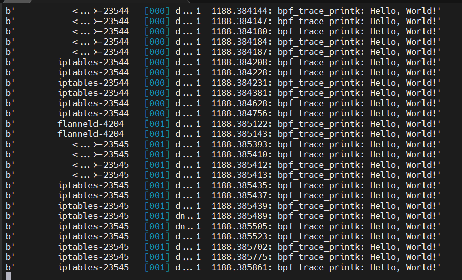

应该是可以了

### 我是分割线

## 真正的eBPF开发环境搭建

经过漫长的试错和研究，我发现了之前的问题所在，在拉取镜像之后的CMAKE环节这里是没什么问题的，但是在make的时候，总是会在百分之38左右的位置，直接报错，然后显示失败，查看了CMakeCache.txt文件后，发现了一个问题：`每次编译都会调用LLVM10`，而报错内容会显示：
```sh
In file included from /usr/lib/llvm-10/include/clang/AST/RecursiveASTVisitor.h:16,
                 from /home/mobb/bcc/src/cc/frontends/clang/b_frontend_action.h:23,
                 from /home/mobb/bcc/src/cc/frontends/clang/b_frontend_action.cc:31:
/usr/lib/llvm-10/include/clang/AST/Attr.h: In static member function ‘static clang::ParamIdx clang::ParamIdx::deserialize(clang::ParamIdx::SerialType)’:
/usr/lib/llvm-10/include/clang/AST/Attr.h:261:17: warning: dereferencing type-punned pointer will break strict-aliasing rules [-Wstrict-aliasing]
  261 |     ParamIdx P(*reinterpret_cast<ParamIdx *>(&S));
      |                 ^~~~~~~~~~~~~~~~~~~~~~~~~~~~~~~~
/usr/lib/llvm-10/include/clang/AST/Attr.h:261:17: warning: dereferencing type-punned pointer will break strict-aliasing rules [-Wstrict-aliasing]

/usr/bin/ld: /usr/lib/llvm-10/lib/libclangCodeGen.a(BackendUtil.cpp.o): in function `(anonymous namespace)::EmitAssemblyHelper::EmitAssemblyWithNewPassManager(clang::BackendAction, std::unique_ptr<llvm::raw_pwrite_stream, std::default_delete<llvm::raw_pwrite_stream> >)':
(.text._ZN12_GLOBAL__N_118EmitAssemblyHelper30EmitAssemblyWithNewPassManagerEN5clang13BackendActionESt10unique_ptrIN4llvm17raw_pwrite_streamESt14default_deleteIS5_EE+0x1f15): undefined reference to `getPollyPluginInfo()'
collect2: error: ld returned 1 exit status
make[2]: *** [examples/cpp/CMakeFiles/CGroupTest.dir/build.make:158：examples/cpp/CGroupTest] 错误 1
make[1]: *** [CMakeFiles/Makefile2:1146：examples/cpp/CMakeFiles/CGroupTest.dir/all] 错误 2
make: *** [Makefile:141：all] 错误 2
```

总之会指向一个问题，在LLVM里面找不到getPollyPluginInfo()这个函数，我之前以为我是我安装的LLVM12的问题，但是查阅了相关信息，LLVM12是有相关的函数的，所以实际上是没有把LLVM10卸载，然后还需要把LLVM12添加到PATH环境当中。

接下来开始进行环境的安装

参考文档

[ubuntu20.04安装bcc_JD怕秃头的博客-CSDN博客](https://blog.csdn.net/weixin_43966076/article/details/132618984)


```sh
sudo apt install -y g++ libmicrohttpd-dev libsqlite3-dev libarchive-dev libcurl4-openssl-dev gettext libzstd-dev pkg-config
sudo apt install make
```

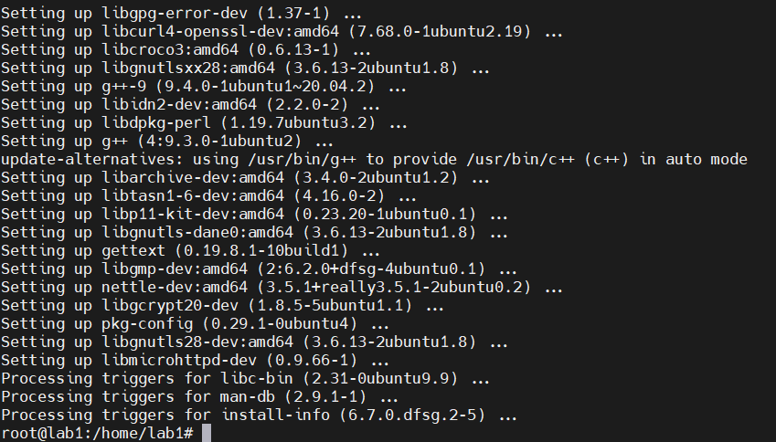

```sh
sudo apt install zlib1g-dev
sudo apt-get install libbz2-dev
```

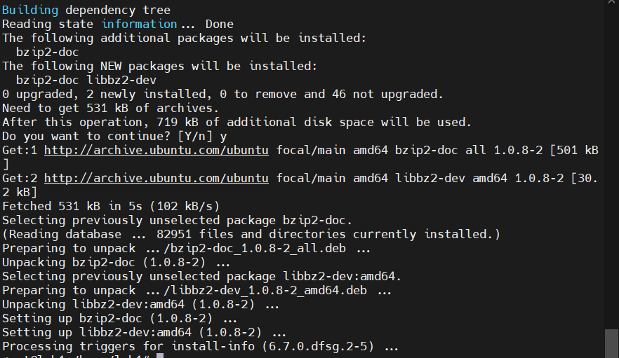

```sh
sudo apt install -y bison build-essential cmake flex git libedit-dev liblzma-dev \
libllvm12 llvm-12-dev libclang-12-dev zlib1g-dev libelf-dev libfl-dev python3-distutils
```

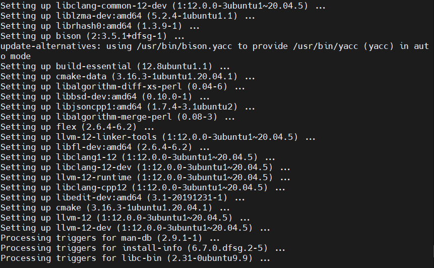

```sh
sudo apt install arping netperf iperf
sudo apt install libbpfcc
sudo apt install python3-bpfcc
```

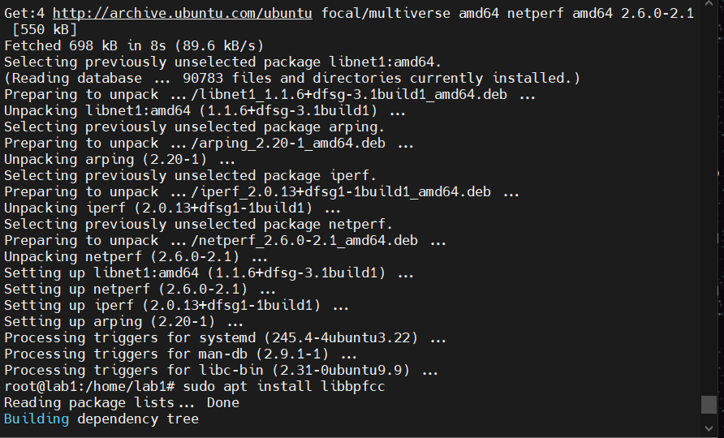

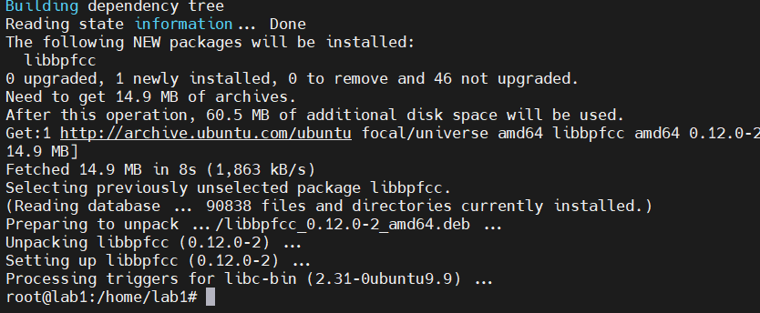

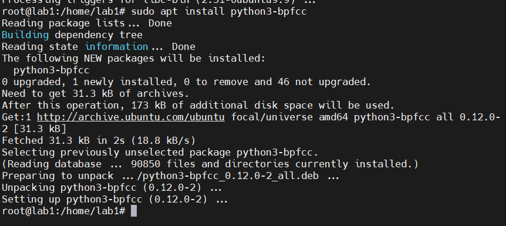

**安装elfutils**
elfutils可以生成bcc需要的动态库

```sh
wget https://sourceware.org/elfutils/ftp/0.188/elfutils-0.188.tar.bz2
tar xvf elfutils-0.188.tar.bz2
mkdir elfutils-0.188/build 
cd elfutils-0.188/build/ 
../configure
```

记得要让这里的`should all be yes`全都是yes

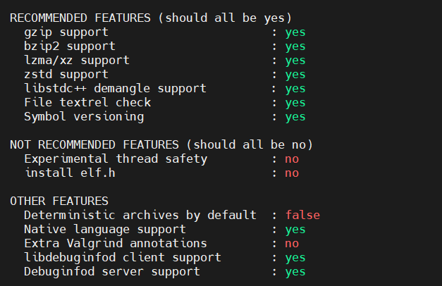

```sh
make
sudo make install
```

这里出了点错误，因为我在检验我是否安装成功的时候看到了报错

```sh
root@lab1:/home/lab1/elfutils-0.188/build# /usr/local/bin/eu-readelf --version
/usr/local/bin/eu-readelf: /lib/x86_64-linux-gnu/libdw.so.1: version `ELFUTILS_0.177' not found (required by /usr/local/bin/eu-readelf)
```

`eu-readelf` 版本与 `libdw` 库版本不匹配。`eu-readelf` 需要的 `libdw` 库版本是 `ELFUTILS_0.177`，但实际安装的 `libdw` 版本不符合要求。

这可能是系统中同时存在多个版本的 `libdw` 库导致的

所以找一下系统中的libdw库

```sh
root@lab1:/home/lab1/elfutils-0.188/build# find / -name libdw.so*
/home/lab1/elfutils-0.188/build/libdw/libdw.so.1
/home/lab1/elfutils-0.188/build/libdw/libdw.so
/var/lib/docker/overlay2/6310b69a4afce7b65b94f0a38b6aab25057152455ddd5f1134537a7bd75474b9/diff/usr/lib64/libdw.so.1
/usr/local/lib/libdw.so.1
/usr/local/lib/libdw.so
/usr/lib/x86_64-linux-gnu/libdw.so.1
```

**移除旧版本的 libdw 库**：移除以下路径的库：

- `/usr/lib/x86_64-linux-gnu/libdw.so.1`
- `/var/lib/docker/overlay2/6310b69a4afce7b65b94f0a38b6aab25057152455ddd5f1134537a7bd75474b9/diff/usr/lib64/libdw.so.1`

然后再重新安装，从解压那一部分重新开始。重新安装之后依然遇到了问题

```sh
root@lab1:/home/lab1/elfutils-0.188/build# /usr/local/bin/eu-readelf --version
/usr/local/bin/eu-readelf: error while loading shared libraries: libdw.so.1: cannot open shared object file: No such file or directory
```

这个错误表明 `eu-readelf` 程序在运行时无法找到所需的共享库文件 `libdw.so.1`。这通常是因为系统没有正确配置共享库搜索路径

添加共享库搜索路径：

打开文件 `/etc/ld.so.conf` 以编辑共享库的搜索路径。使用以下命令以 root 用户编辑该文件：

```sh
sudo vim /etc/ld.so.conf
```

在文件中添加一行，指向 elfutils 的安装目录，通常是 `/usr/local/lib`，然后保存并退出编辑器

```sh
/usr/local/lib
```

更新共享库缓存：

运行以下命令来更新共享库缓存：

```sh
sudo ldconfig
```

```sh
/usr/local/bin/eu-readelf --version
```

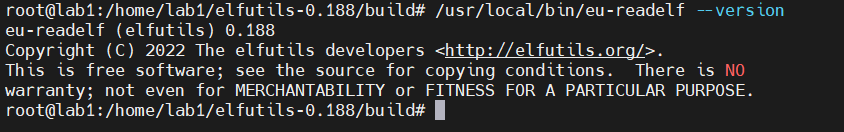

只要这样就是成功了

接下来安装bcc

```sh
git clone https://github.com/iovisor/bcc.git
mkdir bcc/build; cd bcc/build
```

这里要先看看有没有安装的llvm

```sh
llvm-config --version
```

这里没有输出不代表就没有安装

```sh
sudo find /usr -name llvm-config
```

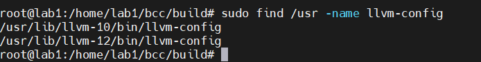

这里要删掉llvm-10

```sh
sudo apt-get remove llvm-10
```

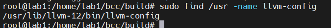

删除之后还需要吧llvm12添加到path中

```sh
vim ~/.bashrc
```

添加这个到文件最后一行

```sh
export PATH=/usr/lib/llvm-12/bin:$PATH
```

重新加载 shell 配置文件以使更改生效

```sh
source ~/.bashrc
```

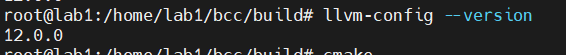

这样就行了

接下来在bcc/build目录下进行

```sh
cmake ..
make
```

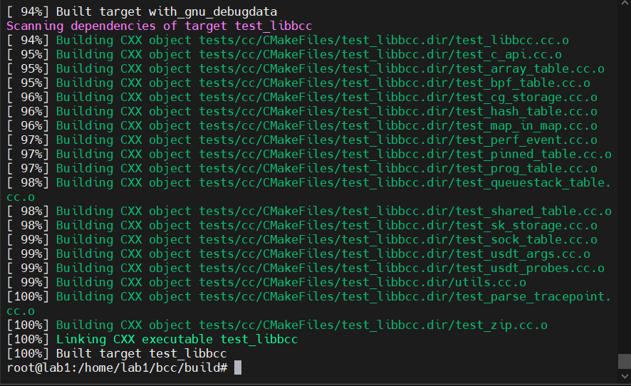

```sh
sudo make install
```

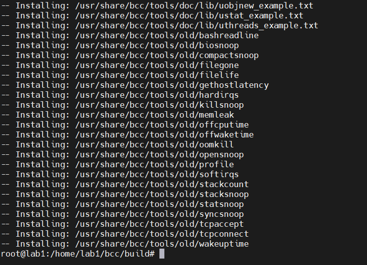

```sh
cmake -DPYTHON_CMD=python3 .. # build python3 binding
```

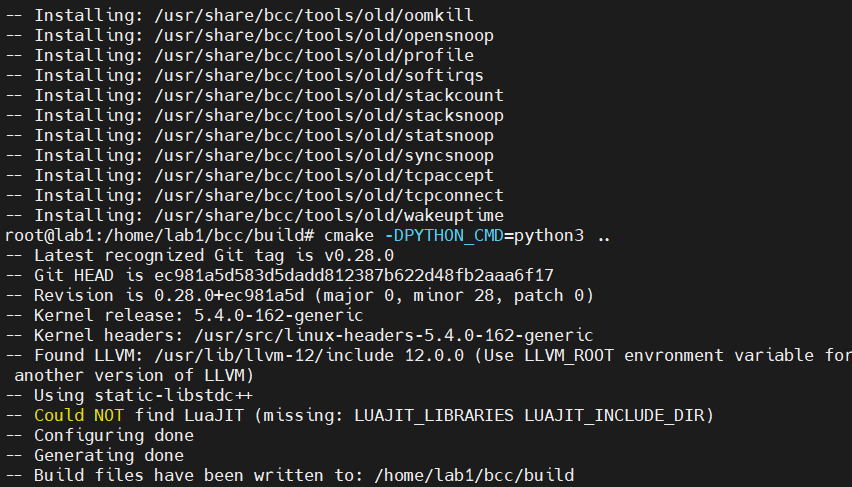

```sh
pushd src/python/
make
sudo make install
popd
```

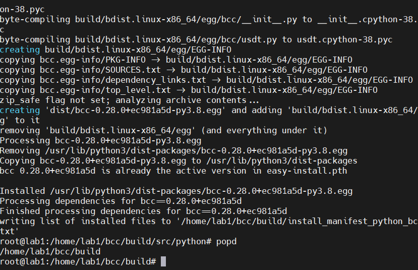

进入/usr/share/bcc/tools中进行测试

```sh
python3 ./tcptop
```

然后就一直报这样的错，明明在安装的时候是没有任何错误的。

搜寻了好久，最后直接进官网的issues上找到了相同的问题

[AttributeError: /lib/x86_64-linux-gnu/libbcc.so.0: undefined symbol: bpf_module_create_b · Issue #4583 · iovisor/bcc (github.com)](https://github.com/iovisor/bcc/issues/4583)


感谢这位大哥的建议，很可能之前有冗杂的bcc安装。

所以需要删掉`/usr/lib/python3/dist-packages/bcc`这个目录

```sh
sudo apt-get remove --purge bpfcc-tools python3-bpfcc
```

接着删除

```sh
sudo rm -rf /usr/lib/python3/dist-packages/bcc
```

然后重新安装一次，就可以了

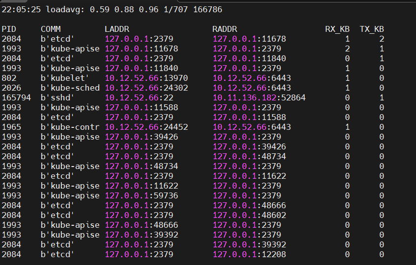


## bpftool

在使用bpftool的时候有个报错

```sh
root@k8smaster:/home/mobb/eBPF_test# sudo bpftool prog list
WARNING: bpftool not found for kernel 5.15.0-84

  You may need to install the following packages for this specific kernel:
    linux-tools-5.15.0-84-generic
    linux-cloud-tools-5.15.0-84-generic

  You may also want to install one of the following packages to keep up to date:
    linux-tools-generic
    linux-cloud-tools-generic

```

按照提示安装这些：

```sh
sudo apt update

 sudo apt install linux-tools-5.15.0-84-generic linux-cloud-tools-5.15.0-84-generic
```

安装完之后就可以使用了

```sh
sudo bpftool prog list
```

查看系统中正在运行的ebpf程序

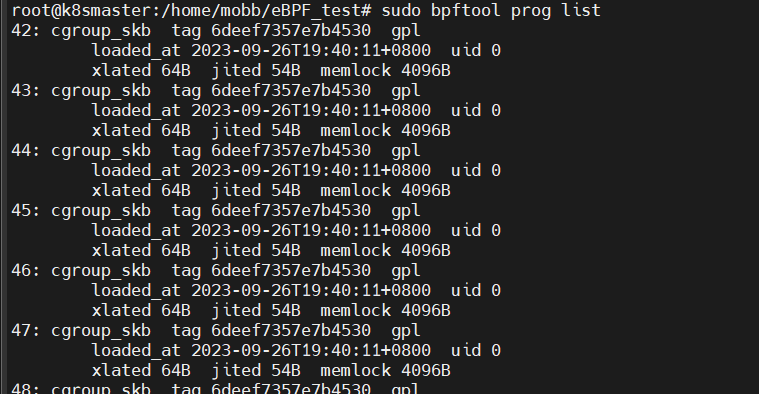

输出中，45是这个 eBPF 程序的编号，kprobe 是程序的类型，而 memlock是程序的名字。

有了 eBPF 程序编号之后，执行下面的命令就可以导出这个 eBPF 程序的指令（注意把 45替换成你查询到的编号）：

```sh
sudo bpftool prog dump xlated id 45
```

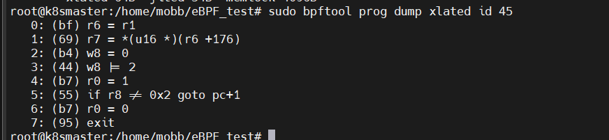

```c
#include <linux/bpf.h>

int bpf(int cmd, union bpf_attr *attr, unsigned int size);
```

BPF 系统调用接受三个参数：

第一个，cmd ，代表操作命令，比如上一讲中我们看到的 BPF_PROG_LOAD 就是加载 eBPF 程序；

第二个，attr，代表 bpf_attr 类型的 eBPF 属性指针，不同类型的操作命令需要传入不同的属性参数；

第三个，size ，代表属性的大小。

# Agent调试

因为在使用官方调试环境时出现了报错

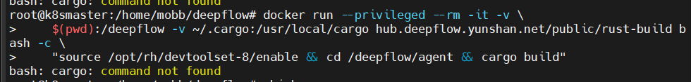

```sh
git clone --recursive https://github.com/deepflowio/deepflow.git 
cd deepflow 
docker run --privileged --rm -it -v \
    $(pwd):/deepflow -v ~/.cargo:/usr/local/cargo hub.deepflow.yunshan.net/public/rust-build bash -c \
    "source /opt/rh/devtoolset-8/enable && cd /deepflow/agent && cargo build"

# binary file directory: ./agent/target/debug/deepflow-agent
```

这是关于cargo

```sh
[root@5e338fc61771 cargo]# find / -name cargo 2>/dev/null /usr/local/cargo /usr/local/rustup/toolchains/stable-x86_64-unknown-linux-gnu/etc/bash_completion.d/cargo /usr/local/rustup/toolchains/stable-x86_64-unknown-linux-gnu/bin/cargo /usr/local/rustup/toolchains/stable-x86_64-unknown-linux-gnu/share/doc/cargo /usr/local/rustup/toolchains/stable-x86_64-unknown-linux-gnu/share/doc/rust/html/cargo /usr/local/rustup/toolchains/stable-x86_64-unknown-linux-gnu/share/doc/rust/html/rust-by-example/cargo

```

从输出来看，`cargo` 可执行文件位于 `/usr/local/rustup/toolchains/stable-x86_64-unknown-linux-gnu/bin/` 目录中。

你可以尝试以下操作来使用 `cargo`：

1. **直接使用完整路径**：

   ```sh
   /usr/local/rustup/toolchains/stable-x86_64-unknown-linux-gnu/bin/cargo --version
   ```

```sh
docker run --privileged --rm -it -v     $(pwd):/deepflow -v /usr/local/cargo hub.deepflow.yunshan.net/public/rust-build bash

```

1. **将其添加到 `PATH` 环境变量中**：

   ```sh
   PATH=$PATH:/usr/local/rustup/toolchains/stable-x86_64-unknown-linux-gnu/bin/
   cargo --version
   ```

将其添加到 `PATH` 后，应该可以在该会话中直接使用 `cargo` 命令。如果打算经常这样做，可能需要考虑在 Docker 镜像的启动脚本或 `bash` 配置文件中添加此 `PATH` 更新，以便每次启动容器时都能自动设置。

## 源码编译

这里虽然cargo build成功了，但是却运行不了

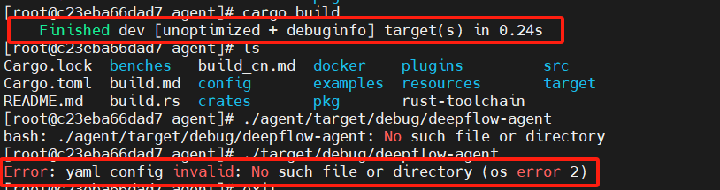

更新！！！此时其实已经构建好了编译环境，但是不能直接运行deepflow-agent，这需要加上一些命令选项，具体可以直接运行对应的程序，按照他那个命令来构建环境是可以的

进入容器内部

```sh
docker run --privileged --rm -it -v \
    $(pwd):/deepflow -v ~/.cargo:/usr/local/cargo hub.deepflow.yunshan.net/public/rust-build bash
```


命令执行

```sh
source /opt/rh/devtoolset-8/enable
cd /deepflow/agent
cargo build
```


## 分析/agent/benches文件夹

总的来说，这个文件夹是用来进行测试代码性能的，使用的是Criterion库来进行测试。

构建好编译环境之后，可以在benches文件夹下执行

```sh
cargo bench
```

来测试代码

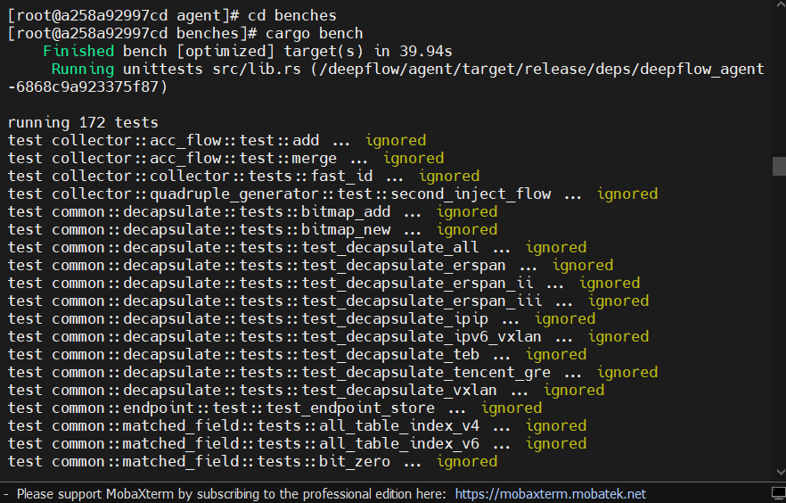

## 安装Go以及TinyGo

下载go的二进制包

[All releases - The Go Programming Language (google.cn)](https://golang.google.cn/dl/)

然后解压

```sh
tar -C /usr/local -xzf go1.21.3.linux-amd64.tar.gz
```

-C 选项解压文件到 /usr/local 目录，查看 /usr/local/go 目录的内容

```sh
ls /usr/local/go
```

将 Go 二进制文件添加到 $PATH 环境变量中

打开 .bashrc 或者 .bash_profile 文件

```text
vim ~/.bashrc
```

粘贴如下行

```sh
export PATH=$PATH:/usr/local/go/bin
```

保存更改并退出文件

重新加载 .bashrc 或者 .bash_profile 文件

```sh
source ~/.bashrc
```

使用 go version 命令查看版本号

```sh
go version
```

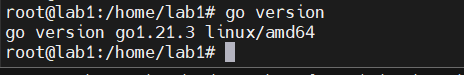

安装Tinygo

```sh
wget https://github.com/tinygo-org/tinygo/releases/download/v0.30.0/tinygo_0.30.0_amd64.deb
sudo dpkg -i tinygo_0.30.0_amd64.deb
```


```sh
export PATH=$PATH:/usr/local/bin
```

查看是否安装成功

```sh
tinygo version
```


## 上传wasm插件测试

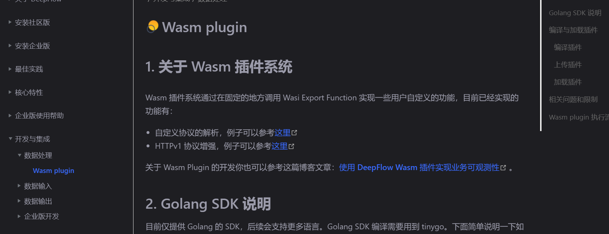

这次测试的是官网的HTTPv1协议增强，点击链接进入，然后把整个项目压缩包下下来，放入自己选定的文件夹里面。用`unzip`命令解压之后进入目录。

这时要先移除这里的go.mod

```sh
rm go.mod
```

然后重新初始化

```sh
go mod init <你对应的目录>
```

这时它会提示你要添加一些requirement

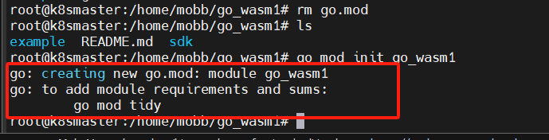

按着他给的命令执行

```sh
root@k8smaster:/home/mobb/go_wasm1# go mod init go_wasm1
go: creating new go.mod: module go_wasm1
go: to add module requirements and sums:
        go mod tidy
root@k8smaster:/home/mobb/go_wasm1# go mod tidy
go: finding module for package github.com/deepflowio/deepflow-wasm-go-sdk/sdk
go: finding module for package golang.org/x/net/dns/dnsmessage
go: finding module for package github.com/deepflowio/deepflow-wasm-go-sdk/example/go_http2_uprobe/pb
go: finding module for package github.com/valyala/fastjson
go: finding module for package github.com/deepflowio/deepflow-wasm-go-sdk/example/krpc/pb
go: finding module for package google.golang.org/protobuf/reflect/protoreflect
go: finding module for package google.golang.org/protobuf/runtime/protoimpl
go: go_wasm1/example/dns imports
        github.com/deepflowio/deepflow-wasm-go-sdk/sdk: module github.com/deepflowio/deepflow-wasm-go-sdk/sdk: Get "https://proxy.golang.org/github.com/deepflowio/deepflow-wasm-go-sdk/sdk/@v/list": dial tcp 142.251.43.17:443: connect: connection refused
go: go_wasm1/example/dns imports
        golang.org/x/net/dns/dnsmessage: module golang.org/x/net/dns/dnsmessage: Get "https://proxy.golang.org/golang.org/x/net/dns/dnsmessage/@v/list": dial tcp 142.251.43.17:443: connect: connection refused
go: go_wasm1/example/go_http2_uprobe imports
        github.com/deepflowio/deepflow-wasm-go-sdk/example/go_http2_uprobe/pb: module github.com/deepflowio/deepflow-wasm-go-sdk/example/go_http2_uprobe/pb: Get "https://proxy.golang.org/github.com/deepflowio/deepflow-wasm-go-sdk/example/go_http2_uprobe/pb/@v/list": dial tcp 142.251.42.241:443: connect: connection refused

```

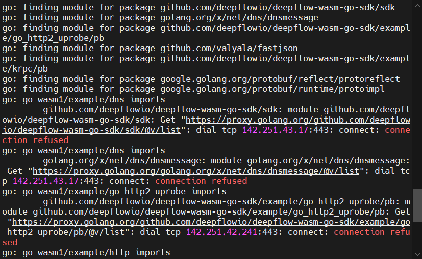

查看一下go.mod是否有生成

```sh
ls
```

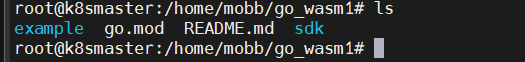

`cd`到example目录下的http目录

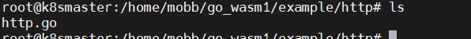

运行一下它官网给的编译命令

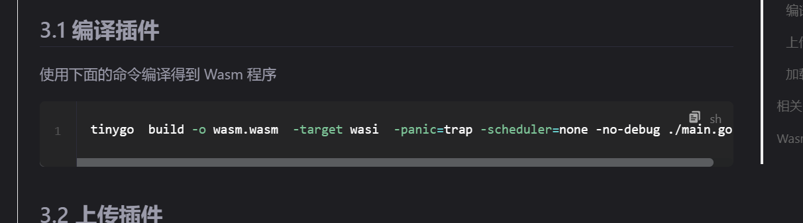

修改后如下：

```sh
tinygo  build -o wasm.wasm  -target wasi  -panic=trap -scheduler=none -no-debug ./http.go
```

然后他又会告诉你缺少条件依赖，还是按他给的命令去执行

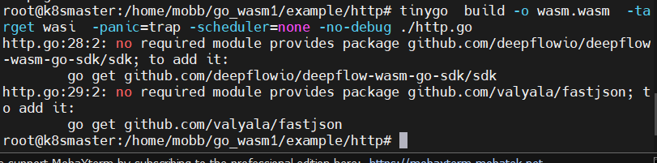

```sh
go get github.com/deepflowio/deepflow-wasm-go-sdk/sdk
```

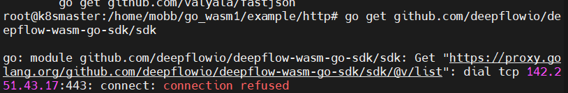

遇到了网络问题，这里开一下梯子吧

```sh
root@k8smaster:/home/mobb/go_wasm1/example/http# systemctl start clash
root@k8smaster:/home/mobb/go_wasm1/example/http# export https_proxy=http://127.0.0.1:7890 http_proxy=http://127.0.0.1:7890 all_proxy=socks5://127.0.0.1:7890
```

再次执行，这样应该就是成功了


还有一个依赖

```sh
go get github.com/valyala/fastjson
```

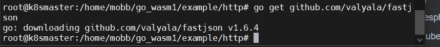

再次执行一下编译命令

```sh
tinygo  build -o wasm.wasm  -target wasi  -panic=trap -scheduler=none -no-debug ./http.go
```

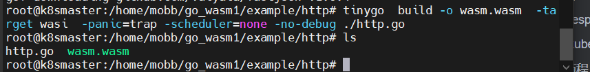


### lab1的编译

```sh
root@lab1:/home/lab1/wasm_plugin/deepflow-wasm-go-sdk-main/example/http# systemctl start clash
root@lab1:/home/lab1/wasm_plugin/deepflow-wasm-go-sdk-main/example/http# export https_proxy=http://127.0.0.1:7890 http_proxy=http://127.0.0.1:7890 all_proxy=socks5://127.0.0.1:7890
root@lab1:/home/lab1/wasm_plugin/deepflow-wasm-go-sdk-main/example/http# cd ..
root@lab1:/home/lab1/wasm_plugin/deepflow-wasm-go-sdk-main/example# cd ..
root@lab1:/home/lab1/wasm_plugin/deepflow-wasm-go-sdk-main# go mod init deepflow-wasm-go-sdk-main
go: creating new go.mod: module deepflow-wasm-go-sdk-main
go: to add module requirements and sums:
        go mod tidy
root@lab1:/home/lab1/wasm_plugin/deepflow-wasm-go-sdk-main# go mod tidy
go: finding module for package github.com/deepflowio/deepflow-wasm-go-sdk/sdk
go: finding module for package github.com/deepflowio/deepflow-wasm-go-sdk/example/go_http2_uprobe/pb
go: finding module for package golang.org/x/net/dns/dnsmessage
go: finding module for package github.com/valyala/fastjson
go: downloading golang.org/x/net v0.17.0
go: downloading github.com/deepflowio/deepflow-wasm-go-sdk v0.0.0-20231016072110-be61afa15717
go: downloading github.com/valyala/fastjson v1.6.4
go: finding module for package github.com/deepflowio/deepflow-wasm-go-sdk/example/krpc/pb
go: finding module for package google.golang.org/protobuf/reflect/protoreflect
go: finding module for package google.golang.org/protobuf/runtime/protoimpl
go: downloading google.golang.org/protobuf v1.31.0
go: found github.com/deepflowio/deepflow-wasm-go-sdk/sdk in github.com/deepflowio/deepflow-wasm-go-sdk v0.0.0-20231016072110-be61afa15717
go: found golang.org/x/net/dns/dnsmessage in golang.org/x/net v0.17.0
go: found github.com/valyala/fastjson in github.com/valyala/fastjson v1.6.4
go: found github.com/deepflowio/deepflow-wasm-go-sdk/example/krpc/pb in github.com/deepflowio/deepflow-wasm-go-sdk v0.0.0-20231016072110-be61afa15717
go: found google.golang.org/protobuf/reflect/protoreflect in google.golang.org/protobuf v1.31.0
go: found google.golang.org/protobuf/runtime/protoimpl in google.golang.org/protobuf v1.31.0
go: downloading github.com/google/go-cmp v0.5.5
go: downloading golang.org/x/xerrors v0.0.0-20191204190536-9bdfabe68543
go: finding module for package github.com/deepflowio/deepflow-wasm-go-sdk/example/go_http2_uprobe/pb
go: deepflow-wasm-go-sdk-main/example/go_http2_uprobe imports
        github.com/deepflowio/deepflow-wasm-go-sdk/example/go_http2_uprobe/pb: module github.com/deepflowio/deepflow-wasm-go-sdk@latest found (v0.0.0-20231016072110-be61afa15717), but does not contain package github.com/deepflowio/deepflow-wasm-go-sdk/example/go_http2_uprobe/pb

```


```sh
root@lab1:/home/lab1/wasm_plugin/deepflow-wasm-go-sdk-main/example/http# tinygo  build -o wasm.wasm  -target wasi  -panic=trap -scheduler=none -no-debug ./http.go
http.go:28:2: no required module provides package github.com/deepflowio/deepflow-wasm-go-sdk/sdk; to add it:
        go get github.com/deepflowio/deepflow-wasm-go-sdk/sdk
http.go:29:2: no required module provides package github.com/valyala/fastjson; to add it:
        go get github.com/valyala/fastjson
root@lab1:/home/lab1/wasm_plugin/deepflow-wasm-go-sdk-main/example/http# go get github.com/deepflowio/deepflow-wasm-go-sdk/sdk
go: added github.com/deepflowio/deepflow-wasm-go-sdk v0.0.0-20231016072110-be61afa15717
root@lab1:/home/lab1/wasm_plugin/deepflow-wasm-go-sdk-main/example/http# go get github.com/valyala/fastjson
```

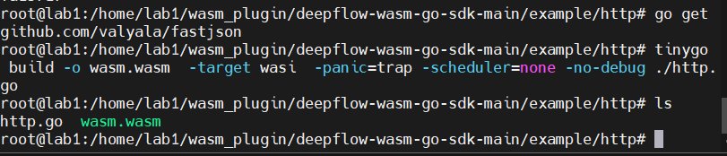

```sh
root@lab1:/home/lab1/wasm_plugin/deepflow-wasm-go-sdk-main/example/http# tinygo  build -o wasm.wasm  -target wasi  -panic=trap -scheduler=none -no-debug ./http.go
root@lab1:/home/lab1/wasm_plugin/deepflow-wasm-go-sdk-main/example/http# ls
http.go  wasm.wasm
```

#### 插件上传摸索

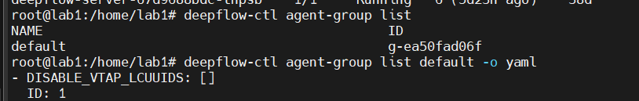

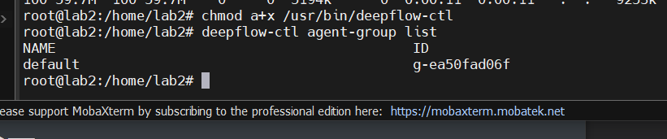

这里可以看到lab1和lab2的agent-group是同一个ID，那么我觉得

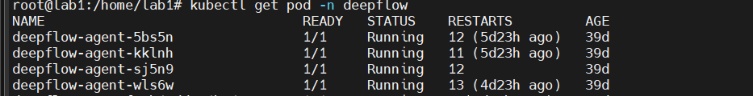

这四个agent pod都是由同一个agent-group管理的

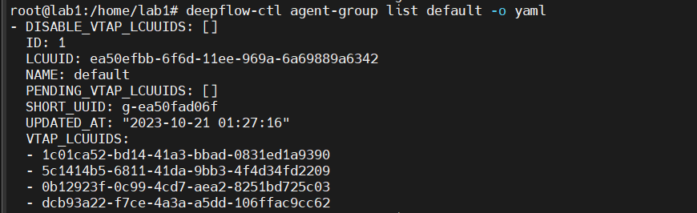

这里查看的信息，有个字段VTAP_LCUUIDS，搜到的解释如下：

- `VTAP_LCUUIDS`：这是一个列表，其中包含了多个虚拟交换机代理（VTAP）的唯一标识符（LCUUID）。每个 VTAP 都有一个唯一的 LCUUID，用于标识该 VTAP。在这个特定的代理组 "default" 中，有多个 VTAP，它们的 LCUUID 被列在这个列表中。

虚拟交换机代理（VTAP）通常用于虚拟化网络和安全操作。在您的情况下，这个代理组 "default" 可能与一组虚拟交换机代理相关联，这些代理在网络配置和操作中发挥重要作用。这个字段列出了该代理组所使用的 VTAP 的唯一标识符，以便进行配置和管理，不知道是否跟那四个pod相对应。

看了一下官网，应该是需要自己先创建一个配置文件，然后再通过ID关联

```sh
deepflow-ctl agent-group-config example
```

这个命令可以查看配置文件的默认配置有哪些

```sh
deepflow-ctl agent-group-config example > xxxx.yaml
```

直接给他导到一个yaml文件方便更改

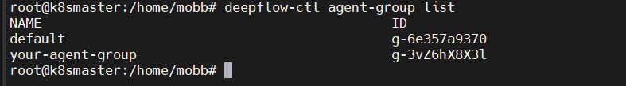

这里我直接用default试一下吧，我现在还存在疑问，既然一个组管理了所有的agent，那么应该不需要其他的组才对。或许其他的组是需要用到多个server的情况？

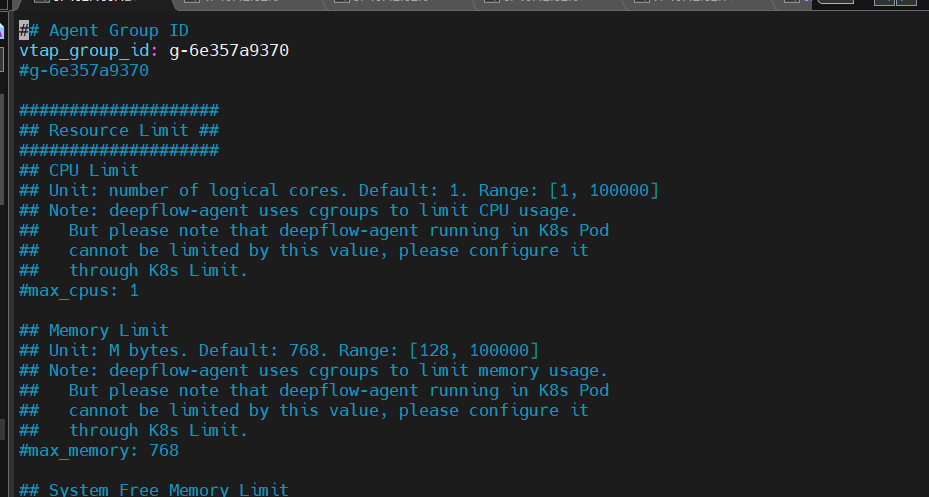

这里修改一下ID，然后直接创建

```sh
deepflow-ctl agent-group-config create -f agent-group-test1.yaml
```


```sh
deepflow-ctl agent-group-config list
```

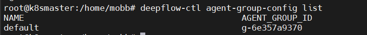

然后就能看到配置文件列表了

```sh
deepflow-ctl agent-group-config list g-6e357a9370 -o yaml
```

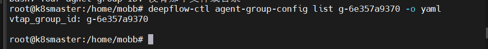

这个命令也能看到效果了

但是有时候会有这种错误

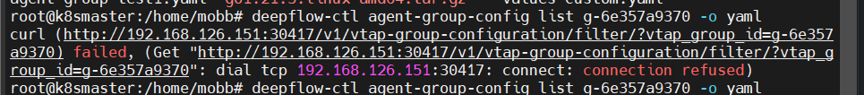

在浏览器打开grafana界面或者重启就好了，因为有时候有些pod莫名其妙就不行了，也不知道什么原因，可能是虚拟机的问题


这里就直接上传插件试一下

```sh
deepflow-ctl plugin create  --type wasm --image wasm.wasm --name wasm1
```

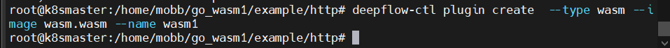

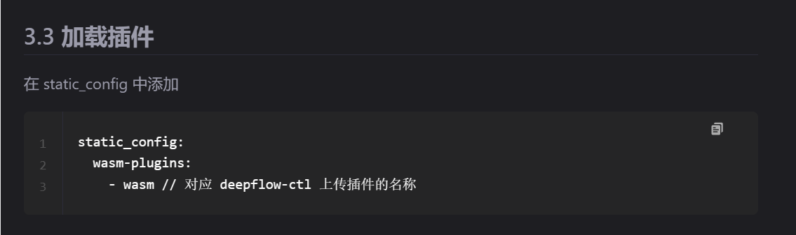

然后需要更改一下那个配置文件

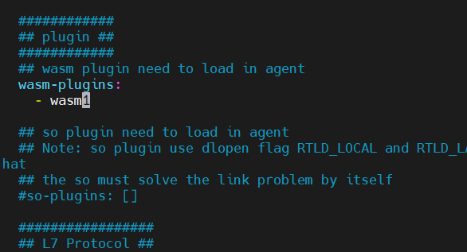

```sh
deepflow-ctl agent-group-config update -f your-agent-group-config.yaml
```

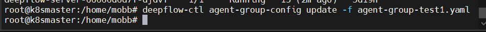

然后再查看一下配置

```sh
deepflow-ctl agent-group-config list g-6e357a9370 -o yaml
```

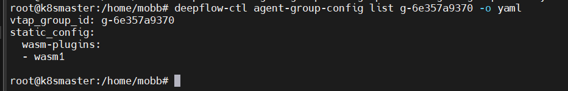

查看一下插件是否加载成功

```sh
root@k8smaster:/home/mobb# kubectl -n deepflow logs -f deepflow-agent-dqkzv | grep -i plugin
```

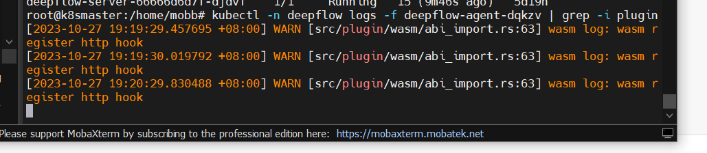

看起来似乎成功了，去页面看看

#### lab1插件上传

```sh
root@lab1:/home/lab1/wasm_plugin/deepflow-wasm-go-sdk-main/example/http# deepflow-ctl agent-group list
NAME                                            ID
default                                         g-ea50fad06f
```


```sh
root@lab1:/home/lab1# deepflow-ctl agent-group-config list
NAME                                           AGENT_GROUP_ID
default                                        g-ea50fad06f
```

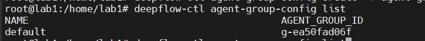

上传插件

```sh
root@lab1:/home/lab1/wasm_plugin/deepflow-wasm-go-sdk-main/example/http# ls
http.go  wasm1.wasm
root@lab1:/home/lab1/wasm_plugin/deepflow-wasm-go-sdk-main/example/http# deepflow-ctl plugin create  --type wasm --image wasm1.wasm --name wasm1

```

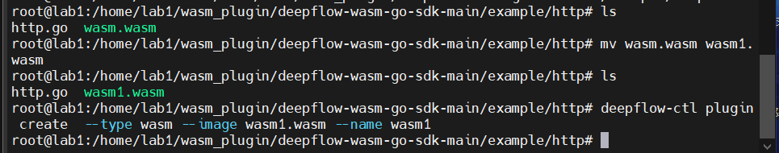

更改插件配置

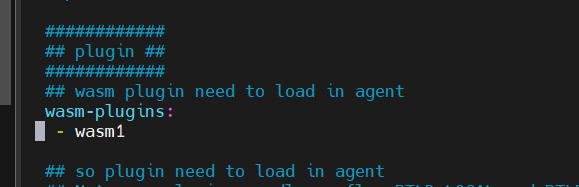

更新文件

```sh
deepflow-ctl agent-group-config update -f agent-group-config.yaml
```

再查看一下配置

```sh
deepflow-ctl agent-group-config list g-ea50fad06f -o yaml
```

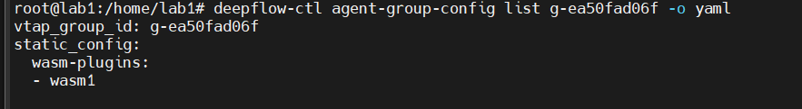

然后看一下日志，这里运行的agent pod有这几个

```sh
root@lab1:/home/lab1# kubectl get pod -n deepflow
NAME                                READY   STATUS    RESTARTS       AGE
deepflow-agent-5bs5n                1/1     Running   13 (19m ago)   45d
deepflow-agent-kklnh                1/1     Running   12 (19m ago)   45d
deepflow-agent-sj5n9                1/1     Running   13 (19m ago)   45d
deepflow-agent-wls6w                1/1     Running   14 (19m ago)   45d
deepflow-app-7f69b47dd6-4hv47       1/1     Running   2 (11d ago)    39d
deepflow-clickhouse-0               1/1     Running   12 (11d ago)   45d
deepflow-grafana-84cdcdf594-8n4rd   1/1     Running   14 (11d ago)   11d
deepflow-mysql-6c97f94d8f-pkdsk     1/1     Running   0              11d
deepflow-server-67d9688bdc-tnpsb    1/1     Running   6 (11d ago)    44d

```

随便挑一个都是有个，但是这里有报错

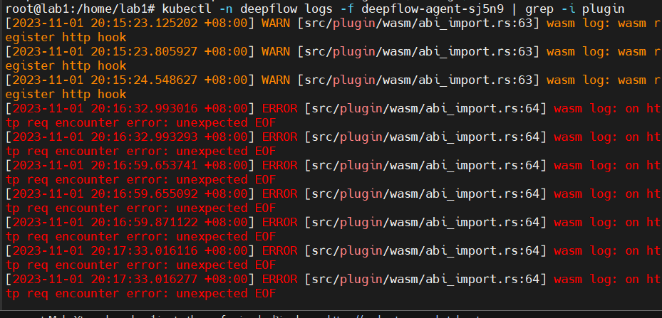


# clash启动教程（已部署）

```sh
#需要切换root权限
systemctl start clash

#设置代理
export https_proxy=http://127.0.0.1:7890 http_proxy=http://127.0.0.1:7890 all_proxy=socks5://127.0.0.1:7890

#查看是否设置成功
echo $http_proxy

echo $https_proxy
#有127.0.0.1:7890就是设置成功了
```

# 微服务部署

## 部署kubesphere

参考文档：

[k8s创建默认storageclass，解决pvc一直pending问题_k8s pvc pending_阿文_ing的博客-CSDN博客](https://blog.csdn.net/qq_41793064/article/details/123111934)

报错，一开始没有默认的storageclashh，所以进行nfs安装

[部署kubesphere时需要默认 StorageClass_storageclass default-CSDN博客](https://blog.csdn.net/Entity_G/article/details/125513819)

参考的这个文档，但是这个博主使用的是Centos，需要把其中的换成Ubuntu的指令

1.安装NFS服务器

```sh
sudo apt update
sudo apt install nfs-kernel-server
```

2.创建一个要共享的目录

```sh
sudo mkdir -p nfs_share
```

3.给目录增加权限

```sh
sudo chmod 777 /home/lab1/nfs_share
```

4.配置 NFS 共享

```sh
sudo vim /etc/exports
```

添加以下内容

```sh
/home/lab1/nfs_share *(rw,sync,no_root_squash,no_subtree_check)
```

5.重新启动NFS服务器

```sh
sudo systemctl restart nfs-kernel-server
```

6.创建一个连接nfs服务器的客户端

+ 配置文件nfs-client.yaml

  ```yaml
  kind: Deployment
  apiVersion: apps/v1
  metadata:
    name: nfs-client-provisioner
  spec:
    replicas: 1
    selector:
      matchLabels:
        app: nfs-client-provisioner
    strategy:
      type: Recreate
    template:
      metadata:
        labels:
          app: nfs-client-provisioner
      spec:
        serviceAccountName: nfs-client-provisioner
        containers:
          - name: nfs-client-provisioner
            image: quay.io/external_storage/nfs-client-provisioner:latest
            volumeMounts:
              - name: nfs-client-root
                mountPath: /persistentvolumes
            env:
              - name: PROVISIONER_NAME
                value: fuseim.pri/ifs
              - name: NFS_SERVER
                value: 192.168.52.51
              - name: NFS_PATH
                value: /home/lab1/nfs_share
        volumes:
          - name: nfs-client-root
            nfs:
              server: 192.168.52.51
              path: /home/lab1/nfs_share
  
  ```

  - 绑定nfs权限的配置文件（nfs-client-sa.yaml）可以对下面的verbs中列表中参数进行修改来修改权限

    ```yaml
    apiVersion: v1
    kind: ServiceAccount
    metadata:
      name: nfs-client-provisioner
    
    ---
    kind: ClusterRole
    apiVersion: rbac.authorization.k8s.io/v1
    metadata:
      name: nfs-client-provisioner-runner
    rules:
      - apiGroups: [""]
        resources: ["persistentvolumes"]
        verbs: ["get", "list", "watch", "create", "delete"]
      - apiGroups: [""]
        resources: ["persistentvolumeclaims"]
        verbs: ["get", "list", "watch", "update"]
      - apiGroups: ["storage.k8s.io"]
        resources: ["storageclasses"]
        verbs: ["get", "list", "watch"]
      - apiGroups: [""]
        resources: ["events"]
        verbs: ["list", "watch", "create", "update", "patch"]
      - apiGroups: [""]
        resources: ["endpoints"]
        verbs: ["create", "delete", "get", "list", "watch", "patch", "update"]
    
    ---
    kind: ClusterRoleBinding
    apiVersion: rbac.authorization.k8s.io/v1
    metadata:
      name: run-nfs-client-provisioner
    subjects:
      - kind: ServiceAccount
        name: nfs-client-provisioner
        namespace: default
    roleRef:
      kind: ClusterRole
      name: nfs-client-provisioner-runner
      apiGroup: rbac.authorization.k8s.io
    
    
    ```

  - 创建storegeclass对象配置文件（nfs-client-class.yaml）

    ```yaml
    apiVersion: storage.k8s.io/v1
    kind: StorageClass
    metadata:
      name: course-nfs-storage
    provisioner: fuseim.pri/ifs # 和上图配置文件中PROVISIONER_NAME的一致
    ```

    

记住其他四台也需要安装NFS，**以下操作四台都需要进行**

```sh
sudo apt update
sudo apt install nfs-common
```

创建挂载的文件

```sh
mkdir /mnt/test_mount
```

将这个文件挂载到lab1的nfs_share上

```sh
sudo mount -t nfs 192.168.52.51:/home/lab1/nfs_share /mnt/test_mount
```

**lab1**进行然后创建资源对象

```sh
kubectl create -f nfs-client.yaml
kubectl create -f nfs-client-sa.yaml
kubectl create -f nfs-client-class.yaml
```

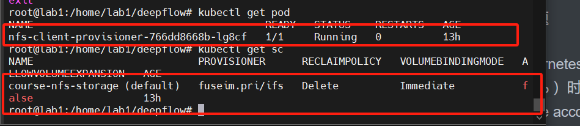

pod和sc都成功了就行了

之后重新部署，此时发生了权限问题

[概述 (kubesphere.io)](https://www.kubesphere.io/zh/docs/v3.3/installing-on-kubernetes/introduction/overview/)

这个错误信息指出，当尝试应用某些 Kubernetes 对象（特别是 `globalrulegroups.alerting.kubesphere.io`）时，遇到了权限问题。具体来说，`ks-installer` 这个 service account 没有足够的权限来获取或修改集群范围内的 `globalrulegroups` 资源。

错误消息部分为：

```
sqlCopy code
globalrulegroups.alerting.kubesphere.io "prometheus-operator" is forbidden: User "system:serviceaccount:kubesphere-system:ks-installer" cannot get resource "globalrulegroups" in API group "alerting.kubesphere.io" at the cluster scope
```

这意味着需要为 `ks-installer` 这个 service account 授予所需的权限。通常，这是通过 `ClusterRole` 和 `ClusterRoleBinding` 来实现的。

这里是一个简化的步骤，以授予 `ks-installer` 所需的权限：

1. 创建一个 `ClusterRole`，它允许在 `alerting.kubesphere.io` API 组中的 `globalrulegroups` 资源上执行所需的操作：

```yaml
yamlCopy codeapiVersion: rbac.authorization.k8s.io/v1
kind: ClusterRole
metadata:
  name: globalrulegroups-access
rules:
- apiGroups:
  - alerting.kubesphere.io
  resources:
  - globalrulegroups
  verbs:
  - get
  - list
  - watch
  - create
  - update
  - patch
  - delete
```

1. 创建一个 `ClusterRoleBinding`，将上面创建的 `ClusterRole` 绑定到 `ks-installer` 这个 service account 上：

```yaml
yamlCopy codeapiVersion: rbac.authorization.k8s.io/v1
kind: ClusterRoleBinding
metadata:
  name: ks-installer-globalrulegroups-access
roleRef:
  apiGroup: rbac.authorization.k8s.io
  kind: ClusterRole
  name: globalrulegroups-access
subjects:
- kind: ServiceAccount
  name: ks-installer
  namespace: kubesphere-system
```

然后进行资源部署

```sh
kubectl apply -f ClusterRole.yaml

kubectl apply -f ClusterRoleBinding.yaml
```

之后再次重新部署，然后查看日志

注：如果发现安装还是找不到默认的storageclass

可以尝试一下执行这个命令，把部署的nfs打上默认的标签

```sh
kubectl patch storageclass course-nfs-storage -p '{"metadata": {"annotations":{"storageclass.kubernetes.io/is-default-class":"true"}}}'
```


```sh
kubectl logs -n kubesphere-system $(kubectl get pod -n kubesphere-system -l 'app in (ks-install, ks-installer)' -o jsonpath='{.items[0].metadata.name}') -f
```

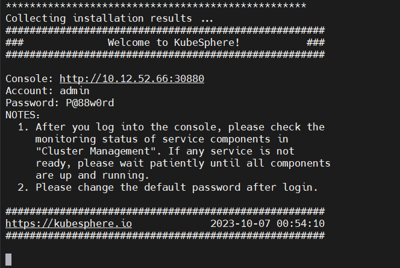

这样就是成功了，可以通过http://10.12.52.66:30880访问，现在用户名和密码是admin，123456.,Aa

## 真·部署kubesphere

### 心路历程

因为上面的只是最小化All-in-one安装，所以并没有什么作用，本来想直接修改cluster-configuration.yaml，但是之后发生了一堆问题，于是干脆删了重装，卸载需要用到官方给的卸载脚本

[ks-installer/scripts/kubesphere-delete.sh at release-3.1 · kubesphere/ks-installer (github.com)](https://github.com/kubesphere/ks-installer/blob/release-3.1/scripts/kubesphere-delete.sh)

把这个复制然后新建一个sh文件就好了，运行结束后就可以删除了，但是过程相当的漫长，之后

[参照这个]: https://www.yuque.com/leifengyang/oncloud/gz1sls

过了一遍安装，但是在deploying minio的时候一直卡住

```sh
 TASK [common : KubeSphere | Checking minio] ************************************ changed: [localhost] TASK [common : KubeSphere | Deploying minio] *********************************** 
```


在官方的issues也看到了许多有同样问题的人

[Ubuntu 2204 Arm64 安装 v3.3.0 启用插件 一直卡在 Deploying minio · Issue #5273 · kubesphere/kubesphere (github.com)](https://github.com/kubesphere/kubesphere/issues/5273)

比如这个，但是看到这些全部的问题是因为官方提供的minio镜像是RELEASE.2019-08-07T01-59-21Z ，这个镜像不支持arm架构，这里我就感到奇怪了，Ubuntu20.04不是amd64架构吗（下图所示），但是实在没找到其他解决办法了，就尝试着按照他们的方法来重新搭建，果不其然，不能解决。于是弄了许久，没能解决。

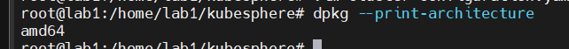

[KubeSphere 应用商店](https://kubesphere.io/zh/docs/v3.4/pluggable-components/app-store/)

最后直接又进行了默认安装，但是这里把一些插件打开了，然后搭建成功之后进入平台查看原因，当然也可以通过kubectl describe来看原因，但是用平台比较无脑一点，发现还是说因为没找到默认的pvc，跟

[这个的人]: https://ask.kubesphere.io/forum/d/6209-k8sdevops-deploying-minio/2

遇到的原因差不多，于是就去搜索找不到pvc怎么办，估计是nfs不够用的原因，后来发现了openEBS，这个可以构建k8s默认的sc，安装完之后，的确是安装成功了，但是监控部分的pod还是没能跑起来，导致还是个空壳服务，甚至于还碰到了controller-manager找不到endpoint(b比如在kube-system下找不到calico之类的，可能是我又设置成localhost了），但是明明我已经改成了master（lab1）的ip了，就是下面的问题

```
Internal error occurred: failed calling webhook "users.iam.kubesphere.io": failed to call webhook: Post "https://ks-controller-manager.kubesphere-system.svc:443/validate-email-iam-kubesphere-io-v1alpha2?timeout=30s": no endpoints available for service "ks-controller-manager"
```

所以还是应该把endpointIps改成10.12.52.66，可能是webhook的原因，（……又是新词汇出现了）

[这里]: https://wghdr.top/archives/3476

看到了说要删除webhook，我先查询了一下现有的webhook，当然还有个这个网页

[访问控制和帐户管理 - 帐号无法登录 - 《KubeSphere v3.1 使用手册》 - 书栈网 · BookStack](https://www.bookstack.cn/read/kubesphere-3.1-zh/385388)，他给的解决办法是一个issue

[not working well with Kubernetes 1.19 · Issue #2928 · kubesphere/kubesphere (github.com)](https://github.com/kubesphere/kubesphere/issues/2928)

```sh

root@lab1:/home/lab1#  kubectl get validatingwebhookconfigurations
NAME                                          WEBHOOKS   AGE
istio-validator-1-11-2-istio-system           2          10h
ks-events-admission-validate                  1          97m
network.kubesphere.io                         1          100m
notification-manager-validating-webhook       2          94m
resourcesquotas.quota.kubesphere.io           1          100m
storageclass-accessor.storage.kubesphere.io   1          100m
users.iam.kubesphere.io                       1          100m
validating-webhook-configuration              3          63m

```


然后那个教程说要删除掉遗留的webhook，那我还不如直接又卸载服务重装，免得删错了，卸载之后发现就剩下了这么个东西，也不知道是干嘛的，总之应该没什么用，然后又开始了重装，这回莫名其妙，就好了？我真的是，不理解计算机这种东西在搞什么东西，这回没有遇到webhook的问题了，怀着忐忑的心情进入页面，期望看到有数据出现，好，结果是令人失望的。那没办法，只能再看看哪里出了问题，发现是prometheus出了问题，那肯定没数据了，kubesphere主要就是用prometheus来做监控，所以看看什么问题

```sh
root@lab1:/home/lab1/kubesphere# kubectl get validatingwebhookconfigurations
NAME                                  WEBHOOKS   AGE
istio-validator-1-11-2-istio-system   2          8h
```

问题如下：

```sh
MountVolume.SetUp failed for volume "secret-kube-etcd-client-certs" : secret "kube-etcd-client-certs" not found
```

[kubesphere解决etcd监控证书找不到问题-CSDN博客](https://blog.csdn.net/a772304419/article/details/113179297)

[02、安装kubesphere v3.0.0 (yuque.com)](https://www.yuque.com/leifengyang/kubesphere/qcvhx3#rsyTi)

[MountVolume.SetUp failed for volume "secret-kube-etcd-client-certs" : secret "kube-etcd-client-certs - 知乎 (zhihu.com)](https://zhuanlan.zhihu.com/p/648148640#:~:text=解决方法： kubectl -n kubesphere-monitoring-system create secret generic kube-etcd-client-certs,--from-file%3Detcd-client.crt%3D%2Fetc%2Fkubernetes%2Fpki%2Fetcd%2Fhealthcheck-client.crt  --from-file%3Detcd-client.key%3D%2Fetc%2Fkubernetes%2Fpki%2Fetcd%2Fhealthcheck-client.key 发布于 2023-08-04 20%3A07 ・IP 属地河南)

用的知乎的命令，然后接着等待一会，就好了，真不容易，完整的历时两天的部署。接下来是完整的部署命令：

### 拉取配置文件

```sh
wget https://github.com/kubesphere/ks-installer/releases/download/v3.3.1/cluster-configuration.yaml

wget https://github.com/kubesphere/ks-installer/releases/download/v3.3.1/kubesphere-installer.yaml
```

### 配置metric-server

```yaml
apiVersion: v1
kind: ServiceAccount
metadata:
  labels:
    k8s-app: metrics-server
  name: metrics-server
  namespace: kube-system
---
apiVersion: rbac.authorization.k8s.io/v1
kind: ClusterRole
metadata:
  labels:
    k8s-app: metrics-server
    rbac.authorization.k8s.io/aggregate-to-admin: "true"
    rbac.authorization.k8s.io/aggregate-to-edit: "true"
    rbac.authorization.k8s.io/aggregate-to-view: "true"
  name: system:aggregated-metrics-reader
rules:
- apiGroups:
  - metrics.k8s.io
  resources:
  - pods
  - nodes
  verbs:
  - get
  - list
  - watch
---
apiVersion: rbac.authorization.k8s.io/v1
kind: ClusterRole
metadata:
  labels:
    k8s-app: metrics-server
  name: system:metrics-server
rules:
- apiGroups:
  - ""
  resources:
  - pods
  - nodes
  - nodes/stats
  - namespaces
  - configmaps
  verbs:
  - get
  - list
  - watch
---
apiVersion: rbac.authorization.k8s.io/v1
kind: RoleBinding
metadata:
  labels:
    k8s-app: metrics-server
  name: metrics-server-auth-reader
  namespace: kube-system
roleRef:
  apiGroup: rbac.authorization.k8s.io
  kind: Role
  name: extension-apiserver-authentication-reader
subjects:
- kind: ServiceAccount
  name: metrics-server
  namespace: kube-system
---
apiVersion: rbac.authorization.k8s.io/v1
kind: ClusterRoleBinding
metadata:
  labels:
    k8s-app: metrics-server
  name: metrics-server:system:auth-delegator
roleRef:
  apiGroup: rbac.authorization.k8s.io
  kind: ClusterRole
  name: system:auth-delegator
subjects:
- kind: ServiceAccount
  name: metrics-server
  namespace: kube-system
---
apiVersion: rbac.authorization.k8s.io/v1
kind: ClusterRoleBinding
metadata:
  labels:
    k8s-app: metrics-server
  name: system:metrics-server
roleRef:
  apiGroup: rbac.authorization.k8s.io
  kind: ClusterRole
  name: system:metrics-server
subjects:
- kind: ServiceAccount
  name: metrics-server
  namespace: kube-system
---
apiVersion: v1
kind: Service
metadata:
  labels:
    k8s-app: metrics-server
  name: metrics-server
  namespace: kube-system
spec:
  ports:
  - name: https
    port: 443
    protocol: TCP
    targetPort: https
  selector:
    k8s-app: metrics-server
---
apiVersion: apps/v1
kind: Deployment
metadata:
  labels:
    k8s-app: metrics-server
  name: metrics-server
  namespace: kube-system
spec:
  selector:
    matchLabels:
      k8s-app: metrics-server
  strategy:
    rollingUpdate:
      maxUnavailable: 0
  template:
    metadata:
      labels:
        k8s-app: metrics-server
    spec:
      containers:
      - args:
        - --cert-dir=/tmp
        - --kubelet-insecure-tls
        - --secure-port=4443
        - --kubelet-preferred-address-types=InternalIP,ExternalIP,Hostname
        - --kubelet-use-node-status-port
        image: registry.cn-hangzhou.aliyuncs.com/lfy_k8s_images/metrics-server:v0.4.3
        imagePullPolicy: IfNotPresent
        livenessProbe:
          failureThreshold: 3
          httpGet:
            path: /livez
            port: https
            scheme: HTTPS
          periodSeconds: 10
        name: metrics-server
        ports:
        - containerPort: 4443
          name: https
          protocol: TCP
        readinessProbe:
          failureThreshold: 3
          httpGet:
            path: /readyz
            port: https
            scheme: HTTPS
          periodSeconds: 10
        securityContext:
          readOnlyRootFilesystem: true
          runAsNonRoot: true
          runAsUser: 1000
        volumeMounts:
        - mountPath: /tmp
          name: tmp-dir
      nodeSelector:
        kubernetes.io/os: linux
      priorityClassName: system-cluster-critical
      serviceAccountName: metrics-server
      volumes:
      - emptyDir: {}
        name: tmp-dir
---
apiVersion: apiregistration.k8s.io/v1
kind: APIService
metadata:
  labels:
    k8s-app: metrics-server
  name: v1beta1.metrics.k8s.io
spec:
  group: metrics.k8s.io
  groupPriorityMinimum: 100
  insecureSkipTLSVerify: true
  service:
    name: metrics-server
    namespace: kube-system
  version: v1beta1
  versionPriority: 100
```

```sh
kubectl apply -f metrics-server.yaml
```

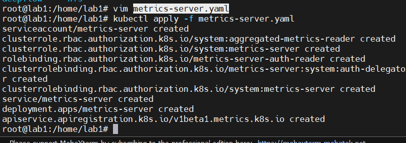

### 安装OpenEBS

[安装OpenEBS (timd.cn)](http://timd.cn/k8s/openebs-installation/)

```sh
kubectl describe node master | grep Taint
```

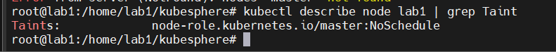

这里我应该是没有删除掉lab1的Taint（因为lab1的Taint好像就是none，所以应该还是要先删掉），但是后续安装没有碰到什么问题。

```sh
helm repo add openebs https://openebs.github.io/charts
helm repo update
helm install openebs --namespace openebs openebs/openebs --create-namespace
```


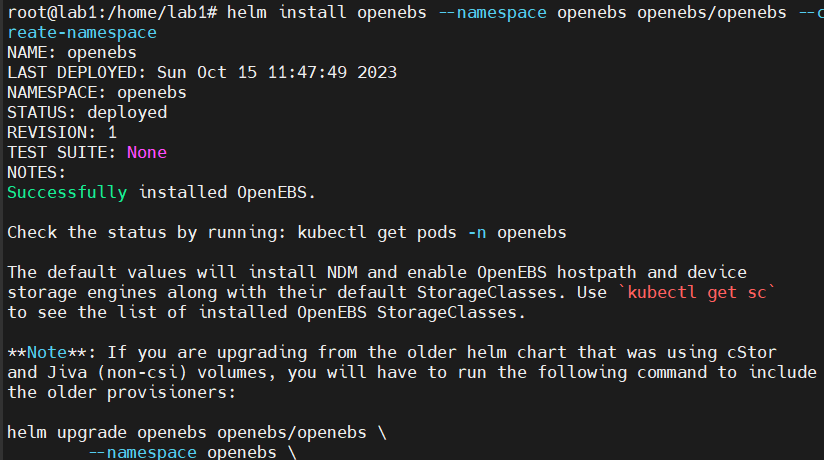

把 `openebs-hostpath` 设置为默认的 StorageClass

```sh
kubectl patch storageclass openebs-hostpath -p '{"metadata": {"annotations":{"storageclass.kubernetes.io/is-default-class":"true"}}}'
```

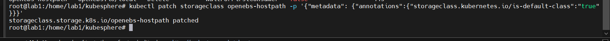

验证

```sh
kubectl get sc
```

### 修改cluster-configuration.yaml

```yaml
---
apiVersion: installer.kubesphere.io/v1alpha1
kind: ClusterConfiguration
metadata:
  name: ks-installer
  namespace: kubesphere-system
  labels:
    version: v3.3.1
spec:
  persistence:
    storageClass: ""        # If there is no default StorageClass in your cluster, you need to specify an existing StorageClass here.
  authentication:
    # adminPassword: ""     # Custom password of the admin user. If the parameter exists but the value is empty, a random password is generated. If the parameter does not exist, P@88w0rd is used.
    jwtSecret: ""           # Keep the jwtSecret consistent with the Host Cluster. Retrieve the jwtSecret by executing "kubectl -n kubesphere-system get cm kubesphere-config -o yaml | grep -v "apiVersion" | grep jwtSecret" on the Host Cluster.
  local_registry: ""        # Add your private registry address if it is needed.
  # dev_tag: ""               # Add your kubesphere image tag you want to install, by default it's same as ks-installer release version.
  etcd:
    monitoring: true       # Enable or disable etcd monitoring dashboard installation. You have to create a Secret for etcd before you enable it.
    endpointIps: 10.12.52.66 # etcd cluster EndpointIps. It can be a bunch of IPs here.
    port: 2379              # etcd port.
    tlsEnable: true
  common:
    core:
      console:
        enableMultiLogin: true  # Enable or disable simultaneous logins. It allows different users to log in with the same account at the same time.
        port: 30880
        type: NodePort

    # apiserver:            # Enlarge the apiserver and controller manager's resource requests and limits for the large cluster
    #  resources: {}
    # controllerManager:
    #  resources: {}
    redis:
      enabled: true
      enableHA: true
      volumeSize: 2Gi # Redis PVC size.
    openldap:
      enabled: true
      volumeSize: 2Gi   # openldap PVC size.
    minio:
      volumeSize: 20Gi # Minio PVC size.
    monitoring:
      # type: external   # Whether to specify the external prometheus stack, and need to modify the endpoint at the next line.
      endpoint: http://prometheus-operated.kubesphere-monitoring-system.svc:9090 # Prometheus endpoint to get metrics data.
      GPUMonitoring:     # Enable or disable the GPU-related metrics. If you enable this switch but have no GPU resources, Kubesphere will set it to zero.
        enabled: false
    gpu:                 # Install GPUKinds. The default GPU kind is nvidia.com/gpu. Other GPU kinds can be added here according to your needs.
      kinds:
      - resourceName: "nvidia.com/gpu"
        resourceType: "GPU"
        default: true
    es:   # Storage backend for logging, events and auditing.
      # master:
      #   volumeSize: 4Gi  # The volume size of Elasticsearch master nodes.
      #   replicas: 1      # The total number of master nodes. Even numbers are not allowed.
      #   resources: {}
      # data:
      #   volumeSize: 20Gi  # The volume size of Elasticsearch data nodes.
      #   replicas: 1       # The total number of data nodes.
      #   resources: {}
      logMaxAge: 7             # Log retention time in built-in Elasticsearch. It is 7 days by default.
      elkPrefix: logstash      # The string making up index names. The index name will be formatted as ks-<elk_prefix>-log.
      basicAuth:
        enabled: false
        username: ""
        password: ""
      externalElasticsearchHost: ""
      externalElasticsearchPort: ""
  alerting:                # (CPU: 0.1 Core, Memory: 100 MiB) It enables users to customize alerting policies to send messages to receivers in time with different time intervals and alerting levels to choose from.
    enabled: true         # Enable or disable the KubeSphere Alerting System.
    # thanosruler:
    #   replicas: 1
    #   resources: {}
  auditing:                # Provide a security-relevant chronological set of records，recording the sequence of activities happening on the platform, initiated by different tenants.
    enabled: true         # Enable or disable the KubeSphere Auditing Log System.
    # operator:
    #   resources: {}
    # webhook:
    #   resources: {}
  devops:                  # (CPU: 0.47 Core, Memory: 8.6 G) Provide an out-of-the-box CI/CD system based on Jenkins, and automated workflow tools including Source-to-Image & Binary-to-Image.
    enabled: false # Enable or disable the KubeSphere DevOps System.
    # resources: {}
    jenkinsMemoryLim: 8Gi      # Jenkins memory limit.
    jenkinsMemoryReq: 4Gi   # Jenkins memory request.
    jenkinsVolumeSize: 8Gi     # Jenkins volume size.
  events:                  # Provide a graphical web console for Kubernetes Events exporting, filtering and alerting in multi-tenant Kubernetes clusters.
    enabled: true         # Enable or disable the KubeSphere Events System.
    # operator:
    #   resources: {}
    # exporter:
    #   resources: {}
    # ruler:
    #   enabled: true
    #   replicas: 2
    #   resources: {}
  logging:                 # (CPU: 57 m, Memory: 2.76 G) Flexible logging functions are provided for log query, collection and management in a unified console. Additional log collectors can be added, such as Elasticsearch, Kafka and Fluentd.
    enabled: true # Enable or disable the KubeSphere Logging System.
    logsidecar:
      enabled: true
      replicas: 2
      # resources: {}
  metrics_server:                    # (CPU: 56 m, Memory: 44.35 MiB) It enables HPA (Horizontal Pod Autoscaler).
    enabled: false                   # Enable or disable metrics-server.
  monitoring:
    storageClass: ""                 # If there is an independent StorageClass you need for Prometheus, you can specify it here. The default StorageClass is used by default.
    node_exporter:
      port: 9100
      # resources: {}
    # kube_rbac_proxy:
    #   resources: {}
    # kube_state_metrics:
    #   resources: {}
    # prometheus:
    #   replicas: 1  # Prometheus replicas are responsible for monitoring different segments of data source and providing high availability.
    #   volumeSize: 20Gi  # Prometheus PVC size.
    #   resources: {}
    #   operator:
    #     resources: {}
    # alertmanager:
    #   replicas: 1          # AlertManager Replicas.
    #   resources: {}
    # notification_manager:
    #   resources: {}
    #   operator:
    #     resources: {}
    #   proxy:
    #     resources: {}
    gpu:                           # GPU monitoring-related plug-in installation.
      nvidia_dcgm_exporter:        # Ensure that gpu resources on your hosts can be used normally, otherwise this plug-in will not work properly.
        enabled: false             # Check whether the labels on the GPU hosts contain "nvidia.com/gpu.present=true" to ensure that the DCGM pod is scheduled to these nodes.
        # resources: {}
  multicluster:
    clusterRole: none  # host | member | none  # You can install a solo cluster, or specify it as the Host or Member Cluster.
  network:
    networkpolicy: # Network policies allow network isolation within the same cluster, which means firewalls can be set up between certain instances (Pods).
      # Make sure that the CNI network plugin used by the cluster supports NetworkPolicy. There are a number of CNI network plugins that support NetworkPolicy, including Calico, Cilium, Kube-router, Romana and Weave Net.
      enabled: true # Enable or disable network policies.
    ippool: # Use Pod IP Pools to manage the Pod network address space. Pods to be created can be assigned IP addresses from a Pod IP Pool.
      type: none # Specify "calico" for this field if Calico is used as your CNI plugin. "none" means that Pod IP Pools are disabled.
    topology: # Use Service Topology to view Service-to-Service communication based on Weave Scope.
      type: none # Specify "weave-scope" for this field to enable Service Topology. "none" means that Service Topology is disabled.
  openpitrix: # An App Store that is accessible to all platform tenants. You can use it to manage apps across their entire lifecycle.
    store:
      enabled: true # Enable or disable the KubeSphere App Store.
  servicemesh:         # (0.3 Core, 300 MiB) Provide fine-grained traffic management, observability and tracing, and visualized traffic topology.
    enabled: true     # Base component (pilot). Enable or disable KubeSphere Service Mesh (Istio-based).
    istio:  # Customizing the istio installation configuration, refer to https://istio.io/latest/docs/setup/additional-setup/customize-installation/
      components:
        ingressGateways:
        - name: istio-ingressgateway
          enabled: false
        cni:
          enabled: false
  edgeruntime:          # Add edge nodes to your cluster and deploy workloads on edge nodes.
    enabled: false
    kubeedge:        # kubeedge configurations
      enabled: false
      cloudCore:
        cloudHub:
          advertiseAddress: # At least a public IP address or an IP address which can be accessed by edge nodes must be provided.
            - ""            # Note that once KubeEdge is enabled, CloudCore will malfunction if the address is not provided.
        service:
          cloudhubNodePort: "30000"
          cloudhubQuicNodePort: "30001"
          cloudhubHttpsNodePort: "30002"
          cloudstreamNodePort: "30003"
          tunnelNodePort: "30004"
        # resources: {}
        # hostNetWork: false
      iptables-manager:
        enabled: true 
        mode: "external"
        # resources: {}
      # edgeService:
      #   resources: {}
  gatekeeper:        # Provide admission policy and rule management, A validating (mutating TBA) webhook that enforces CRD-based policies executed by Open Policy Agent.
    enabled: false   # Enable or disable Gatekeeper.
    # controller_manager:
    #   resources: {}
    # audit:
    #   resources: {}
  terminal:
    # image: 'alpine:3.15' # There must be an nsenter program in the image
    timeout: 600         # Container timeout, if set to 0, no timeout will be used. The unit is seconds

```

### kubesphere-installer.yaml

这个文件是不用改的

```yaml
---
apiVersion: apiextensions.k8s.io/v1
kind: CustomResourceDefinition
metadata:
  name: clusterconfigurations.installer.kubesphere.io
spec:
  group: installer.kubesphere.io
  versions:
    - name: v1alpha1
      served: true
      storage: true
      schema:
        openAPIV3Schema:
          type: object
          properties:
            spec:
              type: object
              x-kubernetes-preserve-unknown-fields: true
            status:
              type: object
              x-kubernetes-preserve-unknown-fields: true
  scope: Namespaced
  names:
    plural: clusterconfigurations
    singular: clusterconfiguration
    kind: ClusterConfiguration
    shortNames:
      - cc

---
apiVersion: v1
kind: Namespace
metadata:
  name: kubesphere-system

---
apiVersion: v1
kind: ServiceAccount
metadata:
  name: ks-installer
  namespace: kubesphere-system

---
apiVersion: rbac.authorization.k8s.io/v1
kind: ClusterRole
metadata:
  name: ks-installer
rules:
- apiGroups:
  - ""
  resources:
  - '*'
  verbs:
  - '*'
- apiGroups:
  - apps
  resources:
  - '*'
  verbs:
  - '*'
- apiGroups:
  - extensions
  resources:
  - '*'
  verbs:
  - '*'
- apiGroups:
  - batch
  resources:
  - '*'
  verbs:
  - '*'
- apiGroups:
  - rbac.authorization.k8s.io
  resources:
  - '*'
  verbs:
  - '*'
- apiGroups:
  - apiregistration.k8s.io
  resources:
  - '*'
  verbs:
  - '*'
- apiGroups:
  - apiextensions.k8s.io
  resources:
  - '*'
  verbs:
  - '*'
- apiGroups:
  - tenant.kubesphere.io
  resources:
  - '*'
  verbs:
  - '*'
- apiGroups:
  - certificates.k8s.io
  resources:
  - '*'
  verbs:
  - '*'
- apiGroups:
  - devops.kubesphere.io
  resources:
  - '*'
  verbs:
  - '*'
- apiGroups:
  - monitoring.coreos.com
  resources:
  - '*'
  verbs:
  - '*'
- apiGroups:
  - logging.kubesphere.io
  resources:
  - '*'
  verbs:
  - '*'
- apiGroups:
  - jaegertracing.io
  resources:
  - '*'
  verbs:
  - '*'
- apiGroups:
  - storage.k8s.io
  resources:
  - '*'
  verbs:
  - '*'
- apiGroups:
  - admissionregistration.k8s.io
  resources:
  - '*'
  verbs:
  - '*'
- apiGroups:
  - policy
  resources:
  - '*'
  verbs:
  - '*'
- apiGroups:
  - autoscaling
  resources:
  - '*'
  verbs:
  - '*'
- apiGroups:
  - networking.istio.io
  resources:
  - '*'
  verbs:
  - '*'
- apiGroups:
  - config.istio.io
  resources:
  - '*'
  verbs:
  - '*'
- apiGroups:
  - iam.kubesphere.io
  resources:
  - '*'
  verbs:
  - '*'
- apiGroups:
  - notification.kubesphere.io
  resources:
  - '*'
  verbs:
  - '*'
- apiGroups:
  - auditing.kubesphere.io
  resources:
  - '*'
  verbs:
  - '*'
- apiGroups:
  - events.kubesphere.io
  resources:
  - '*'
  verbs:
  - '*'
- apiGroups:
  - core.kubefed.io
  resources:
  - '*'
  verbs:
  - '*'
- apiGroups:
  - installer.kubesphere.io
  resources:
  - '*'
  verbs:
  - '*'
- apiGroups:
  - storage.kubesphere.io
  resources:
  - '*'
  verbs:
  - '*'
- apiGroups:
  - security.istio.io
  resources:
  - '*'
  verbs:
  - '*'
- apiGroups:
  - monitoring.kiali.io
  resources:
  - '*'
  verbs:
  - '*'
- apiGroups:
  - kiali.io
  resources:
  - '*'
  verbs:
  - '*'
- apiGroups:
  - networking.k8s.io
  resources:
  - '*'
  verbs:
  - '*'
- apiGroups:
  - edgeruntime.kubesphere.io
  resources:
  - '*'
  verbs:
  - '*'
- apiGroups:
  - types.kubefed.io
  resources:
  - '*'
  verbs:
  - '*'
- apiGroups:
  - monitoring.kubesphere.io
  resources:
  - '*'
  verbs:
  - '*'
- apiGroups:
  - application.kubesphere.io
  resources:
  - '*'
  verbs:
  - '*'


---
kind: ClusterRoleBinding
apiVersion: rbac.authorization.k8s.io/v1
metadata:
  name: ks-installer
subjects:
- kind: ServiceAccount
  name: ks-installer
  namespace: kubesphere-system
roleRef:
  kind: ClusterRole
  name: ks-installer
  apiGroup: rbac.authorization.k8s.io

---
apiVersion: apps/v1
kind: Deployment
metadata:
  name: ks-installer
  namespace: kubesphere-system
  labels:
    app: ks-installer
spec:
  replicas: 1
  selector:
    matchLabels:
      app: ks-installer
  template:
    metadata:
      labels:
        app: ks-installer
    spec:
      serviceAccountName: ks-installer
      containers:
      - name: installer
        image: kubesphere/ks-installer:v3.3.1
        imagePullPolicy: "Always"
        resources:
          limits:
            cpu: "1"
            memory: 1Gi
          requests:
            cpu: 20m
            memory: 100Mi
        volumeMounts:
        - mountPath: /etc/localtime
          name: host-time
          readOnly: true
      volumes:
      - hostPath:
          path: /etc/localtime
          type: ""
        name: host-time

```

然后进行安装

```sh
kubectl apply -f kubesphere-installer.yaml
```

```sh
kubectl apply -f cluster-configuration.yaml
```

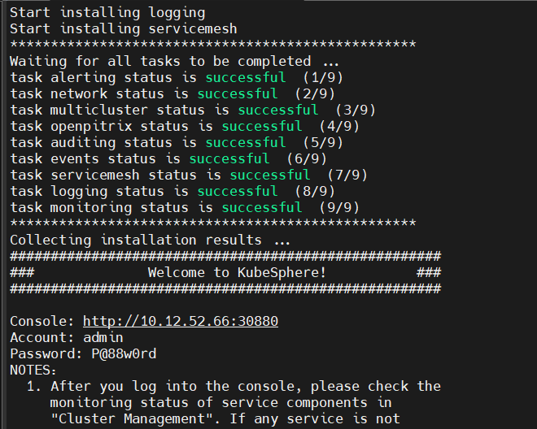

成功之后给kube-etcd-client-certs 添加证书

```sh
kubectl -n kubesphere-monitoring-system create secret generic kube-etcd-client-certs \
 --from-file=etcd-client-ca.crt=/etc/kubernetes/pki/etcd/ca.crt \
 --from-file=etcd-client.crt=/etc/kubernetes/pki/etcd/healthcheck-client.crt \
 --from-file=etcd-client.key=/etc/kubernetes/pki/etcd/healthcheck-client.key
```

查看证书

```sh
ps -ef|grep kube-apiserver
```

至此安装完成

## 部署metarget

参考18.04的部署步骤

要先安装pip3

```sh
apt install python3-pip
```

```sh
git clone https://github.com/brant-ruan/metarget.git
cd metarget/
pip3 install -r requirements.txt
```


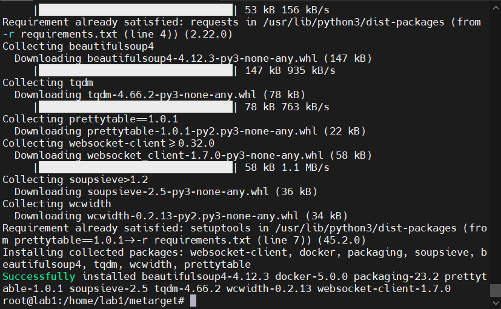

## 部署dvwa

```sh
./metarget appv install dvwa --external
```

## 部署prometheus

```sh
root@lab1:/home/lab1# helm install prometheus prometheus-community/prometheus -n deepflow-prometheus-demo --create-namespace
NAME: prometheus
LAST DEPLOYED: Fri Mar 15 07:37:40 2024
NAMESPACE: deepflow-prometheus-demo
STATUS: deployed
REVISION: 1
TEST SUITE: None
NOTES:
The Prometheus server can be accessed via port 80 on the following DNS name from within your cluster:
prometheus-server.deepflow-prometheus-demo.svc.cluster.local


Get the Prometheus server URL by running these commands in the same shell:
  export POD_NAME=$(kubectl get pods --namespace deepflow-prometheus-demo -l "app.kubernetes.io/name=prometheus,app.kubernetes.io/instance=prometheus" -o jsonpath="{.items[0].metadata.name}")
  kubectl --namespace deepflow-prometheus-demo port-forward $POD_NAME 9090


The Prometheus alertmanager can be accessed via port 9093 on the following DNS name from within your cluster:
prometheus-alertmanager.deepflow-prometheus-demo.svc.cluster.local


Get the Alertmanager URL by running these commands in the same shell:
  export POD_NAME=$(kubectl get pods --namespace deepflow-prometheus-demo -l "app.kubernetes.io/name=alertmanager,app.kubernetes.io/instance=prometheus" -o jsonpath="{.items[0].metadata.name}")
  kubectl --namespace deepflow-prometheus-demo port-forward $POD_NAME 9093
#################################################################################
######   WARNING: Pod Security Policy has been disabled by default since    #####
######            it deprecated after k8s 1.25+. use                        #####
######            (index .Values "prometheus-node-exporter" "rbac"          #####
###### .          "pspEnabled") with (index .Values                         #####
######            "prometheus-node-exporter" "rbac" "pspAnnotations")       #####
######            in case you still need it.                                #####
#################################################################################


The Prometheus PushGateway can be accessed via port 9091 on the following DNS name from within your cluster:
prometheus-prometheus-pushgateway.deepflow-prometheus-demo.svc.cluster.local


Get the PushGateway URL by running these commands in the same shell:
  export POD_NAME=$(kubectl get pods --namespace deepflow-prometheus-demo -l "app=prometheus-pushgateway,component=pushgateway" -o jsonpath="{.items[0].metadata.name}")
  kubectl --namespace deepflow-prometheus-demo port-forward $POD_NAME 9091

For more information on running Prometheus, visit:
https://prometheus.io/

```

### 配置 remote_write

```sh
root@lab1:/home/lab1# kubectl get svc ${DEEPFLOW_AGENT_SVC} -n deepflow
NAME                           TYPE        CLUSTER-IP    EXTERNAL-IP   PORT(S)                                                                                                                           AGE
deepflow-agent                 ClusterIP   10.96.1.42    <none>        80/TCP                                                                                                                            110d
deepflow-app                   ClusterIP   10.96.2.146   <none>        20418/TCP                                                                                                                         110d
deepflow-clickhouse            ClusterIP   10.96.1.0     <none>        8123/TCP,9000/TCP,9009/TCP                                                                                                        110d
deepflow-clickhouse-headless   ClusterIP   None          <none>        8123/TCP,9000/TCP,9009/TCP                                                                                                        110d
deepflow-grafana               NodePort    10.96.2.138   <none>        80:31841/TCP                                                                                                                      110d
deepflow-mysql                 ClusterIP   10.96.1.26    <none>        30130/TCP                                                                                                                         110d
deepflow-server                NodePort    10.96.0.58    <none>        20416:32103/TCP,20419:30121/TCP,20417:30417/TCP,20035:31693/TCP,30035:30035/TCP,20135:30171/TCP,20033:31855/TCP,30033:30033/TCP   110d
```

```
{DEEPFLOW_AGENT_SVC}` 对应的是 `deepflow-agent` 服务的 ClusterIP 地址，其 IP 地址为 `10.96.1.42
```

[Prometheus Agent模式和Remote Write配置说明 - 知乎 (zhihu.com)](https://zhuanlan.zhihu.com/p/629678684)

首先确定 DeepFlow Agent 启动的数据监听服务的地址。在[安装 DeepFlow Agent](https://deepflow.io/docs/zh/ce-install/single-k8s/) 后，会显示 DeepFlow Agent Service 地址，它的默认值是 `deepflow-agent.default`，请根据实际的服务名称与命名空间填写到配置中。

执行以下命令可修改 Prometheus 的默认配置（假设它在 `deepflow-prometheus-demo` 中）：

```bash
kubectl edit cm -n deepflow-prometheus-demo prometheus-server
```

配置 `remote_write` 地址（请修改 `DEEPFLOW_AGENT_SVC` 为 deepflow-agent 的服务名）：

```yaml
remote_write:
  - url: http://${DEEPFLOW_AGENT_SVC}/api/v1/prometheus
```

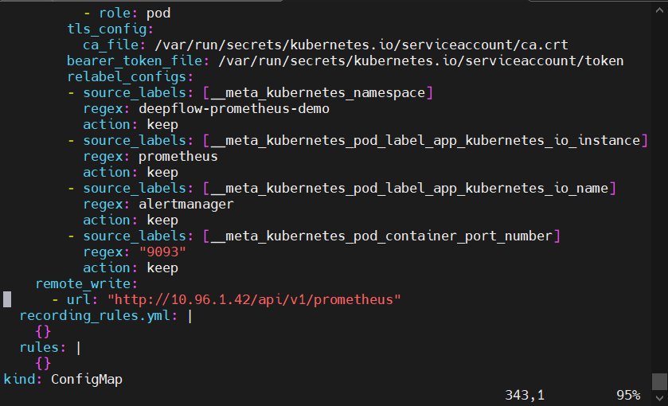

### 没有配置 remote_read

## 删除prometheus

```sh
helm uninstall prometheus -n deepflow-prometheus-demo
```


## 配置 DeepFlow

接下来我们需要开启 deepflow-agent 的数据接收服务。

首先我们确定 deepflow-agent 所在的采集器组 ID，一般为名为 default 的组的ID：

```bash
deepflow-ctl agent-group list
```


确认该采集器组是否已经有了配置：

```bash
deepflow-ctl agent-group-config list
```

若已有配置，将其导出至 yaml 文件中便于进行修改：

```bash
deepflow-ctl agent-group-config list <your-agent-group-id> -o yaml > your-agent-group-config.yaml
```

修改 yaml 文件，确认包含如下配置项：

```bash
vtap_group_id: <your-agent-group-id>
external_agent_http_proxy_enabled: 1   # required
external_agent_http_proxy_port: 38086  # optional, default 38086
```

更新采集器组的配置：

```sh
deepflow-ctl agent-group-config update g-4fbf91fb8c -f myagent-group-config.yaml
```

如果采集器组还没有配置，可使用如下命令基于 your-agent-group-config.yaml 文件新建配置：

```bash
deepflow-ctl agent-group-config create -f myagent-group-config.yaml
```

但是首先要获得模板

```sh
deepflow-ctl agent-group-config example > myagent-group-config.yaml
```

然后修改这几个地方

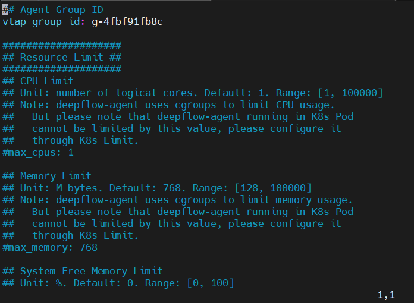

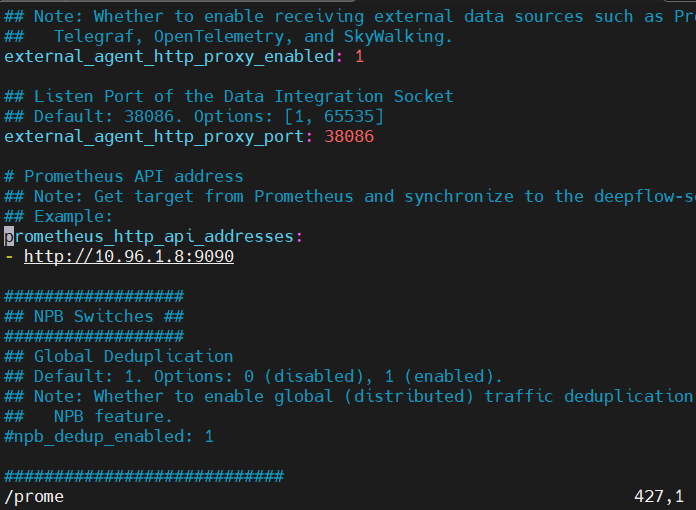

最后创建/更新配置

```sh
deepflow-ctl agent-group-config create -f myagent-group-config.yaml
```

```sh
deepflow-ctl agent-group-config update g-4fbf91fb8c -f myagent-group-config.yaml
```

拉取镜像失败

[k8s pod启动报错ErrImagePull-CSDN博客](https://blog.csdn.net/weixin_42182501/article/details/120023139)

[解决国内无法拉取 k8s.gcr.io 镜像的方法与思路 | 浅时光博客 (dqzboy.com)](https://www.dqzboy.com/5306.html)

查找那些仓库有对应的镜像

```sh
registry.k8s.io/kube-state-metrics/kube-state-metrics
```

```sh
docker search kube-state-metrics
```

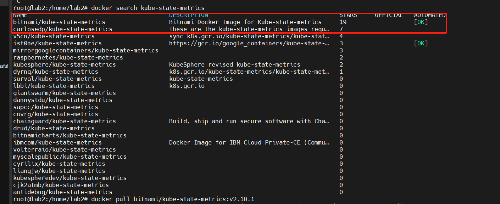

第一个星星最多，去dockerhub直接搜bitnami/kube-state-metrics，找到对应版本，然后复制命令拉取镜像

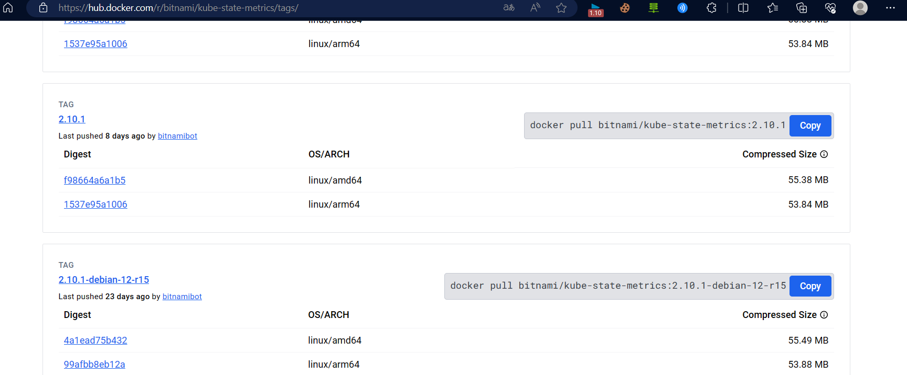

拉取是拉取成功了，但是还是不行，尝试改过helm-charts，但是还是不行

```sh
helm install prometheus prometheus-community/prometheus -n deepflow-prometheus-demo --create-namespace --set-string prometheus.kubeStateMetrics.image.repository=your-repository --set-string prometheus.kubeStateMetrics.image.tag=v2.10.1

#安装时通过 --set 参数覆盖 Helm Chart 中的镜像设置，指定使用手动拉取的镜像
```

获得配置

```sh
helm get values prometheus -n deepflow-prometheus-demo > prometheus-values.yaml

```

配置文件里的仓库已经替换了，但是安装的时候还是会显示从原来的仓库拉取镜像，暂时先放弃了

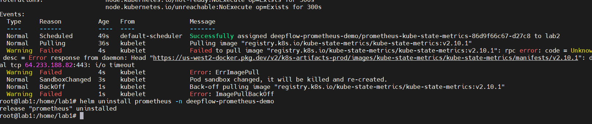

```yaml
prometheus:
  kubeStateMetrics:
    image:
      repository: your-repository
      tag: v2.10.1
```

## 进入clickhouse

```sh
 kubectl exec -it deepflow-clickhouse-0 -n deepflow -- /bin/bash
```

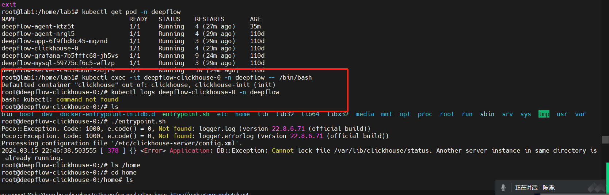

进入数据库

```mysql
clickhouse-client
```

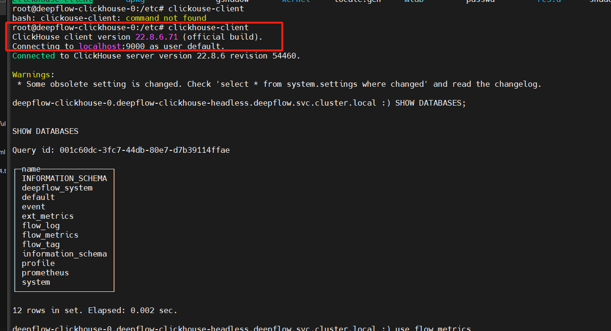

```sh
deepflow-clickhouse-0.deepflow-clickhouse-headless.deepflow.svc.cluster.local :) use flow_log

USE flow_log

Query id: a670da1c-a201-456f-95da-6ceb0dfb9baf

Ok.

0 rows in set. Elapsed: 0.001 sec.

deepflow-clickhouse-0.deepflow-clickhouse-headless.deepflow.svc.cluster.local :) use flow_log;

USE flow_log

Query id: cc59f4f3-90c6-4c43-8d09-8ab166189a01

Ok.

0 rows in set. Elapsed: 0.003 sec.

deepflow-clickhouse-0.deepflow-clickhouse-headless.deepflow.svc.cluster.local :) show tables;

SHOW TABLES

Query id: 45f29c8b-75d1-42af-a55e-7b53a5442a2b

┌─name──────────────┐
│ l4_flow_log       │
│ l4_flow_log_local │
│ l4_packet         │
│ l4_packet_local   │
│ l7_flow_log       │
│ l7_flow_log_local │
│ l7_packet         │
│ l7_packet_local   │
└───────────────────┘

8 rows in set. Elapsed: 0.002 sec.

deepflow-clickhouse-0.deepflow-clickhouse-headless.deepflow.svc.cluster.local :) describe l4_flow_log;

DESCRIBE TABLE l4_flow_log

Query id: 34f80e89-9b9b-4e94-94f0-d7bf99d537ae
```

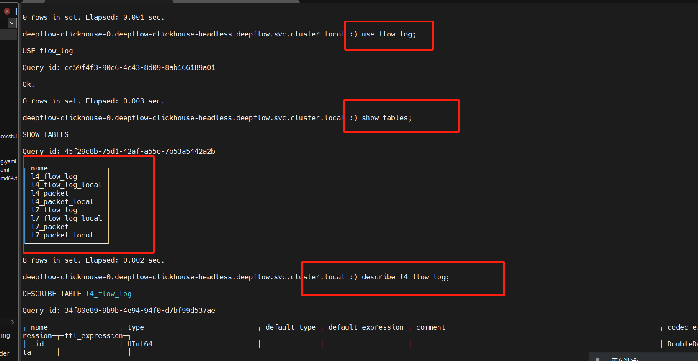

## deepflow升级

```sh
kubectl scale deploy -n deepflow deepflow-grafana --replicas=0
```

```sh
kubectl edit deploy -n deepflow deepflow-grafana
```

然后找到latest，反正就是一个init的部分，修改成v6.4就好了，然后再扩缩容成正常

**注：下面的都是不了解k8s知识导致的，真实的解决办法可以看上面的部分**

起因是发现deepflow template里面的很多graph不显示内容，询问了之后是因为grafana和init版本不一致的原因。

`kubectl describe pods -n deepflow deepflow-grafana-xxx | grep Image:`
过滤出目前使用的 init 容器镜像，查看对应版本是否和当前 deepflow 使用的 chart 包版本一致，例如当前 DeepFlow 版本为 v6.4 而使用的 init 容器镜像版本为 latest，则需要把 latest 替换为 v6.4

但是现在的版本是6.3.9的，所以还得重新更新deepflow的版本，这里先拉取的最新的6.4.9的版本，然后

```sh
helm fetch deepflow/deepflow --version 6.4.9
```


```sh
mkdir deepflow-6.4.9-chart && tar -zxvf deepflow-6.4.9.tgz -C deepflow-6.4.9-chart
```

然后进入deepflow的文件夹下，修改values.yaml，按理来讲应该是修改下面的部分

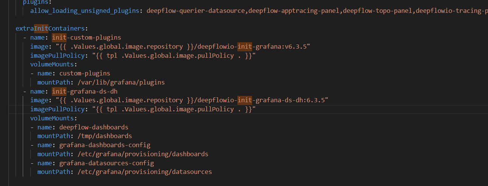

或者说把grafana的这一部分复制到values-custom.yaml里面，然后修改对应版本，但是这样失败了，具体看[[BUG\] Error: tag auto_service 未在application, flow_metrics中找到 · Issue #5785 · deepflowio/deepflow (github.com)](https://github.com/deepflowio/deepflow/issues/5785)

然后只能直接试下官网的升级

```sh
helm repo update deepflow # use `helm repo update` when helm < 3.7.0
helm upgrade deepflow -n deepflow deepflow/deepflow -f values-custom.yaml
```

然后这样成功了，但是遗留下了旧版本的grafana，虽然没有影响，因为那个旧版本的会显示ErrImagePull。但是这里出现了lab2的agent显示evicted的问题。

```sh
kubectl describe node lab2
```

这里显示磁盘空间是够的，可能是kubelet的检测出了问题

进到lab2里面查看

```sh
 ls /var/lib/kubelet/pods/
```

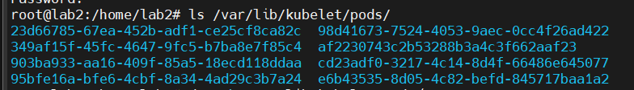

查看这些文件的大小

```sh
 du -sh /var/lib/kubelet/pods/*/
```

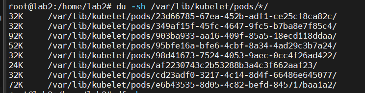

这些文件都很小，应该没什么问题，只能看看磁盘的情况了

```sh
root@lab2:/home/lab2# df -h
Filesystem                         Size  Used Avail Use% Mounted on
udev                                16G     0   16G   0% /dev
tmpfs                              3.2G  2.1M  3.2G   1% /run
/dev/mapper/ubuntu--vg-ubuntu--lv   11G  8.5G  1.8G  84% /
tmpfs                               16G     0   16G   0% /dev/shm
tmpfs                              5.0M     0  5.0M   0% /run/lock
tmpfs                               16G     0   16G   0% /sys/fs/cgroup
/dev/loop0                          92M   92M     0 100% /snap/lxd/24061
/dev/loop3                          41M   41M     0 100% /snap/snapd/20671
/dev/loop1                          64M   64M     0 100% /snap/core20/2105
/dev/loop2                          64M   64M     0 100% /snap/core20/2182
/dev/loop4                          40M   40M     0 100% /snap/snapd/21184
/dev/sda2                          2.0G  210M  1.6G  12% /boot
/dev/sda1                          1.1G  6.1M  1.1G   1% /boot/efi
overlay                             11G  8.5G  1.8G  84% /var/lib/docker/overlay2/d7fdd48c2ab0a7cfc9aa93274c8ed0ed9563fda1d87f68b5766d2f88a82c1ad2/merged
shm                                 64M     0   64M   0% /var/lib/docker/containers/dc51886418316ecff8f426050475db64aa79a0527234e07d64e40736face5643/mounts/shm
overlay                             11G  8.5G  1.8G  84% /var/lib/docker/overlay2/ea81ff6c3e0e92808b69ee47f4314daa1db4dff88bff4c42360b77ded4f96b07/merged
tmpfs                               32G  8.0K   32G   1% /var/lib/kubelet/pods/903ba933-aa16-409f-85a5-18ecd118ddaa/volumes/kubernetes.io~secret/node-certs
tmpfs                               32G   12K   32G   1% /var/lib/kubelet/pods/e6b43535-8d05-4c82-befd-845717baa1a2/volumes/kubernetes.io~projected/kube-api-access-w99hs
tmpfs                               32G   12K   32G   1% /var/lib/kubelet/pods/95bfe16a-bfe6-4cbf-8a34-4ad29c3b7a24/volumes/kubernetes.io~projected/kube-api-access-bpsqc
tmpfs                               32G   12K   32G   1% /var/lib/kubelet/pods/903ba933-aa16-409f-85a5-18ecd118ddaa/volumes/kubernetes.io~projected/kube-api-access-8fqvv
overlay                             11G  8.5G  1.8G  84% /var/lib/docker/overlay2/1fd7cabd4699cf7ef3db520edbd59bddb7d6ae52f5686efb804bcff2ffcd94d0/merged
shm                                 64M     0   64M   0% /var/lib/docker/containers/a3c2c57f316c31d42ef6a4afa22a94bba240642ebbcd3dea863f8a2fcb819719/mounts/shm
overlay                             11G  8.5G  1.8G  84% /var/lib/docker/overlay2/cada47d3b220d16b7267ae68251c1c50011d87fe682277d715527b02096ee33a/merged
shm                                 64M     0   64M   0% /var/lib/docker/containers/85328751ddd22c222cda023739457bcf5acd0b678dfbf0ef1292c0f6ff517cbe/mounts/shm
overlay                             11G  8.5G  1.8G  84% /var/lib/docker/overlay2/74b1aeba3c706c3806b65e196a1c7b94642f84ee9dc9f30b153cd4d8810d6aff/merged
overlay                             11G  8.5G  1.8G  84% /var/lib/docker/overlay2/d6f3ff96abd49b3ed9a5b7825b2c5ba1a84a35e1a86e783f6bb10f2474c6fb0c/merged
overlay                             11G  8.5G  1.8G  84% /var/lib/docker/overlay2/4eaab31c63033a56974e6fea3ade79d62a453ea9ba8d8adb3ec476d1f8b2de9d/merged
shm                                 64M     0   64M   0% /var/lib/docker/containers/51e189299a7daadce86cab9335732d1c0f20a03406245eee1594e6fa90d8b67d/mounts/shm
overlay                             11G  8.5G  1.8G  84% /var/lib/docker/overlay2/1b252ff4af7218107c09d008493f295b9a7adfbbd974817ca46d3212d1edc037/merged
overlay                             11G  8.5G  1.8G  84% /var/lib/docker/overlay2/f8904c072a6731c15765ee60acbcb8403aadd2028e86df2496a7917dfd5c6e01/merged
tmpfs                              3.2G     0  3.2G   0% /run/user/1000
```

- 主分区 `/`（`/dev/mapper/ubuntu--vg-ubuntu--lv`）的磁盘使用率达到了 84%，可用空间只有约 1.8G。
- 系统中有多个挂载在 `/var/lib/docker/overlay2/.../merged` 下的 Docker 容器层占用大量空间，它们总计也指向了主分区，这可能是导致磁盘压力的主要原因。

1. **清理未使用的 Docker 镜像**：

   ```bash
   docker image prune -a --force
   ```

2. **检查并清理没有被任何容器引用的 Docker 数据卷**：

   ```bash
   docker volume ls -qf dangling=true | xargs -r docker volume rm
   ```

3. **对正在运行的 Kubernetes Pods 进行资源优化**，确保每个 Pod 不过度使用存储资源。

然后再重启lab2的那个agent，暂时是running了

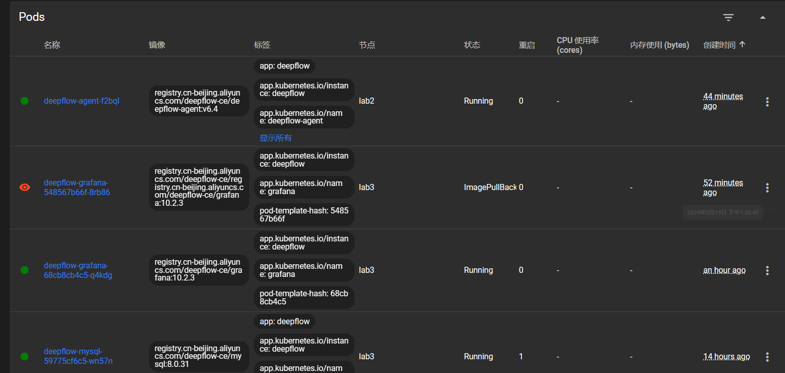

至于那个旧版的grafana，尝试过了很多办法，缩减了deployment中的pod数量，也还是不行，在不影响使用的情况下就先这样吧。

## 持久化grafana

**注：其实创建好pvc，然后edit deploy更改emptyDir就好了，但是因为当时升级没有停掉原来的pod，导致升级产生了两个pod，最后实际上绑定上了没running的pod**

[Grafana修改主题-腾讯云开发者社区-腾讯云 (tencent.com)](https://cloud.tencent.com/developer/article/1644106)

要想修改grafana的面板，要先做持久化数据，不然修改之后重启pod还是没有修改后的数据，这里要先安装nfs，安装nfs的步骤可以跳到部署kubesphere那里，先创建一个pvc

```yaml
apiVersion: v1
kind: PersistentVolumeClaim
metadata:
  name: grafana-data-pvc  # 修改为符合您需求的PVC名称
  namespace: deepflow  # 要与Pod所在的Namespace匹配
spec:
  accessModes:
    - ReadWriteMany  # 根据实际情况选择访问模式，ReadWriteOnce适合单节点读写
  storageClassName: "course-nfs-storage"  # 替换成实际可用的存储类名称
  resources:
    requests:
      storage: 8Gi  # 根据需求调整存储大小

```

然后apply一下

然后要修改grafana的deployment

先修改这部分

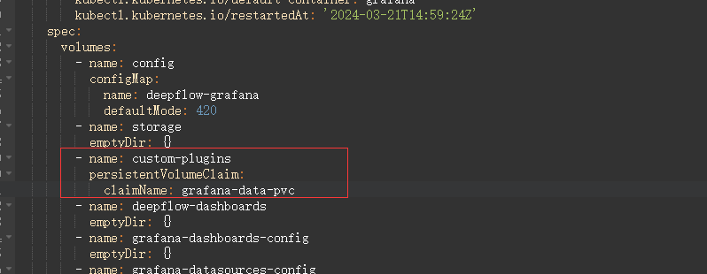


但是这里还是绑定不上，查看一下日志

```sh
kubectl describe pvc grafana-data-pvc -n deepflow
```

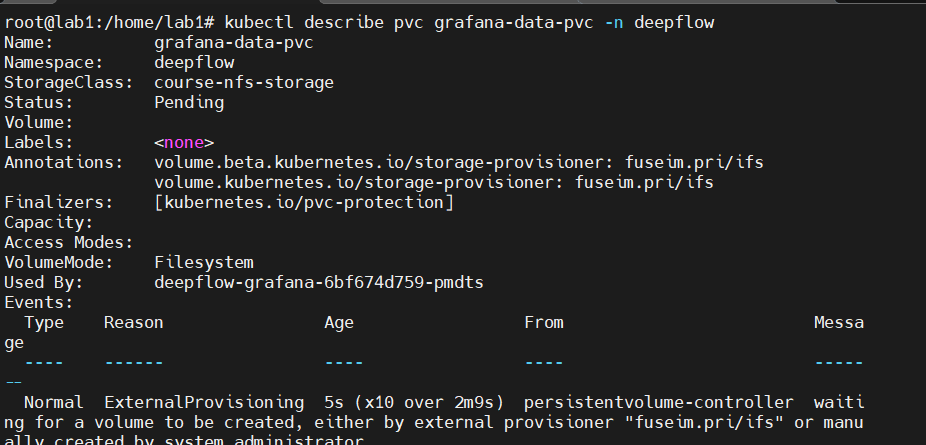

从结果来看，pvc应该是没有问题的，估计问题在nfs上面

```sh
 kubectl logs nfs-client-provisioner-6b9554ff8-s6tfc
```

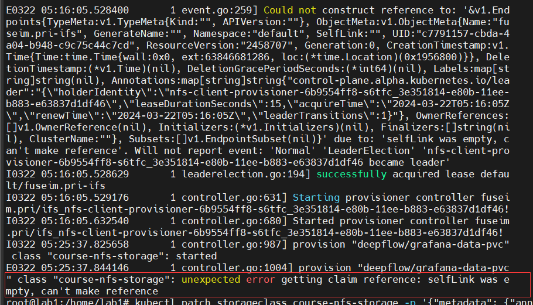

这里报错显示selflink为空，找到的解决方法如下

[selfLink was empty, can‘t make reference，pvc pending解决方式_selflink was empty, can't make reference-CSDN博客](https://blog.csdn.net/weixin_45969972/article/details/130390211)

- --feature-gates=RemoveSelfLink=false
- - --feature-gates=EphemeralContainers=true,TTLAfterFinished=true,RemoveSelfLink=false

按照这个解决办法，一开始kubectl用不了，然后又按照下面的方法去排查

[如何排查解决：The connection to the server :6443 was refused - did you specify the right host or port - 知乎 (zhihu.com)](https://zhuanlan.zhihu.com/p/646238661)

```sh
docker ps -a| grep kube-apiserver
```


在这一步发现kube-apiserver刚启动，所以再次尝试

```sh
kubectl apply -f /etc/kubernetes/manifests/kube-apiserver.yaml
```

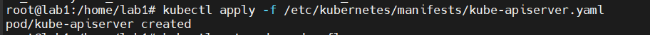

这里就创建成功了

然后再看看pvc的情况

```sh
root@lab1:/home/lab1# kubectl get pvc -n deepflow
NAME                      STATUS    VOLUME                                     CAPACITY   ACCESS MODES   STORAGECLASS         AGE
deepflow-mysql-data-pvc   Pending                                                                                             3d13h
grafana-data-pvc          Bound     pvc-2a33fe57-ab89-4983-a664-878401e698bd   8Gi        RWX            course-nfs-storage   19m
root@lab1:/home/lab1# kubectl get pvc -n deepflow
NAME                      STATUS    VOLUME                                     CAPACITY   ACCESS MODES   STORAGECLASS         AGE
deepflow-mysql-data-pvc   Pending                                                                                             3d13h
grafana-data-pvc          Bound     pvc-2a33fe57-ab89-4983-a664-878401e698bd   8Gi        RWX            course-nfs-storage   34m

```

这里显示已经绑定上了，然后去容器内部下载插件检验一下

```sh
kubectl exec -it deepflow-grafana-68cb8cb4c5-j4m8n -n deepflow -- /bin/bash

```

```sh
grafana-cli plugins install yesoreyeram-boomtheme-panel
```

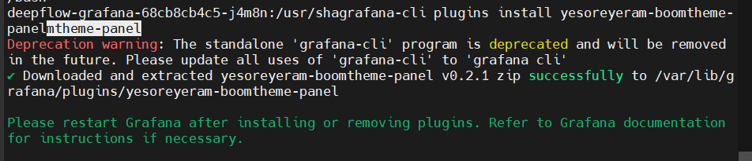

然后删除pod来重启pod

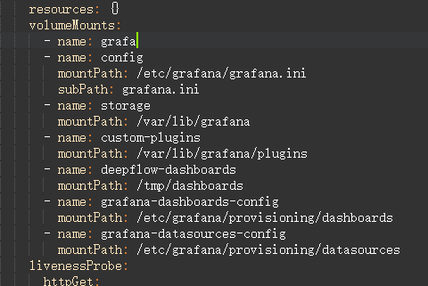

之后也没能成功，可以执行下面的命令查看有没有挂载到主机路径，但是这里显示是没有的，后面经历了很长的时间，也没能找到问题所在

```sh
kubectl exec -it xxx -n deepflow -- pf -h
```

**直到考完ccf后再回看，觉得问题可能出在多个grafana上面**

```sh
kubectl describe pod xxx -n deepflow
```

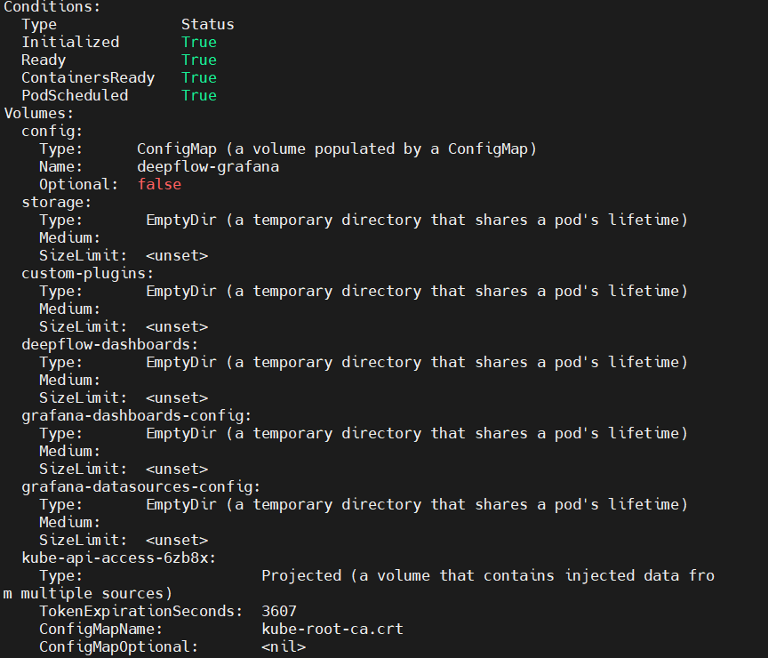

这个运行的grafana显示pvc为空，还是原来的emptyDir

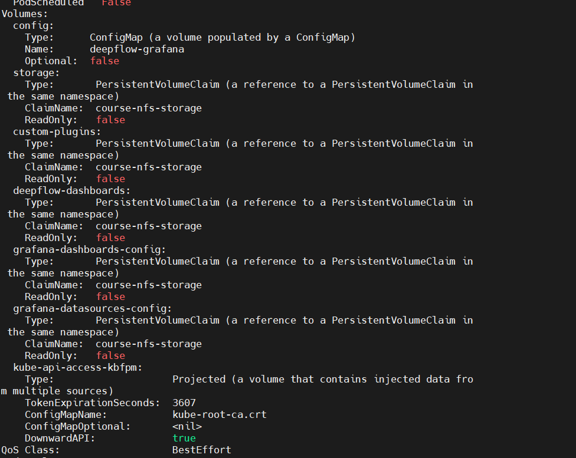

而这个没跑起来的grafana，却有pvc，所以大概率是两个pvc的问题，但是之前没解决掉两个grafana的问题，所以决定重装deepflow

重装的过程中也碰到了不少的问题，比如如果按照官网的“监控单个K8s集群部署

```sh
helm repo add deepflow https://deepflow-ce.oss-cn-beijing.aliyuncs.com/chart/stable
helm repo update deepflow # use `helm repo update` when helm < 3.7.0
cat << EOF > values-custom.yaml
global:
  image:
      repository: registry.cn-beijing.aliyuncs.com/deepflow-ce
EOF
helm install deepflow -n deepflow deepflow/deepflow --create-namespace \
  -f values-custom.yaml

```

那么Server就一直起不来，调大了探针也不行，因为一开始在手动drop deepflow的时候，就耗时二三十秒，我觉得可能磁盘不行，所以就放弃了。还是改用了All-inOne快速部署，但是保存了一下“监控单个K8s集群”的三个pvc的配置，以便后面自己配置。然后就碰到了还是存在两个grafana的情况，然后就一直重复删除安装，然后就莫名的可以了。

尽管这样，还是出现了更改deploy后grafana起不来的情况，最后的解决办法是先等grafana起来后，再更改deploy的配置。过程挺心累的，硬件配置总感觉还是不行，然后每次都要等待很长时间才能继续。

grafana的插件（因为试过同时有多个mount绑上去好像不行，可能得创建多个pvc）pvc如下：

```yaml
apiVersion: v1
kind: PersistentVolumeClaim
metadata:
  name: grafana-pvc
  namespace: deepflow
  labels:
    app: grafana
    app.kubernetes.io/instance: grafana
    app.kubernetes.io/managed-by: Helm
    app.kubernetes.io/name: grafana
  annotations:
    helm.sh/resource-policy: keep
    meta.helm.sh/release-name: grafana
    meta.helm.sh/release-namespace: deepflow
spec:
  accessModes:
    - ReadWriteOnce
  resources:
    requests:
      storage: 10Gi  # 根据您的需求设置存储大小
  storageClassName: course-nfs-storage # 根据您的实际情况设置存储类

```

先停掉grafana的pod，不然又会出现两个pod

```sh
kubectl scale deploy -n deepflow deepflow-grafana --replicas=0
```

然后在dashboard界面更改grafana的deploy

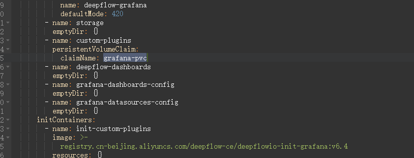

```sh
kubectl scale deploy -n deepflow deepflow-grafana --replicas=1
```

然后就可以了，虽然也不知道为什么之前这样不行。

```sh
root@lab1:/home/lab1/redeepflow# kubectl exec -it deepflow-grafana-566cffbdb-gnrjt -n deepflow -- df -h
Filesystem                Size      Used Available Use% Mounted on
overlay                  47.4G     26.2G     18.8G  58% /
tmpfs                    64.0M         0     64.0M   0% /dev
tmpfs                    15.7G         0     15.7G   0% /sys/fs/cgroup
/dev/mapper/ubuntu--vg-ubuntu--lv
                         47.4G     26.2G     18.8G  58% /dev/termination-log
/dev/mapper/ubuntu--vg-ubuntu--lv
                         47.4G     26.2G     18.8G  58% /tmp/dashboards
/dev/mapper/ubuntu--vg-ubuntu--lv
                         47.4G     26.2G     18.8G  58% /etc/resolv.conf
/dev/mapper/ubuntu--vg-ubuntu--lv
                         47.4G     26.2G     18.8G  58% /etc/hostname
/dev/mapper/ubuntu--vg-ubuntu--lv
                         47.4G     26.2G     18.8G  58% /etc/hosts
shm                      64.0M         0     64.0M   0% /dev/shm
/dev/mapper/ubuntu--vg-ubuntu--lv
                         47.4G     26.2G     18.8G  58% /var/lib/grafana
/dev/mapper/ubuntu--vg-ubuntu--lv
                         47.4G     26.2G     18.8G  58% /etc/grafana/grafana.ini
192.168.52.51:/home/lab1/nfs_share/deepflow-grafana-pvc-pvc-68a0f3c5-330e-4ac1-80b2-4cead70b5ef5
                         97.9G     19.9G     73.0G  21% /var/lib/grafana/plugins
/dev/mapper/ubuntu--vg-ubuntu--lv
                         47.4G     26.2G     18.8G  58% /etc/grafana/provisioning/dashboards
/dev/mapper/ubuntu--vg-ubuntu--lv
                         47.4G     26.2G     18.8G  58% /etc/grafana/provisioning/datasources
tmpfs                    31.3G     12.0K     31.3G   0% /run/secrets/kubernetes.io/serviceaccount
tmpfs                    15.7G         0     15.7G   0% /proc/acpi
tmpfs                    64.0M         0     64.0M   0% /proc/kcore
tmpfs                    64.0M         0     64.0M   0% /proc/keys
tmpfs                    64.0M         0     64.0M   0% /proc/timer_list
tmpfs                    64.0M         0     64.0M   0% /proc/sched_debug
tmpfs                    15.7G         0     15.7G   0% /proc/scsi
tmpfs                    15.7G         0     15.7G   0% /sys/firmware

```

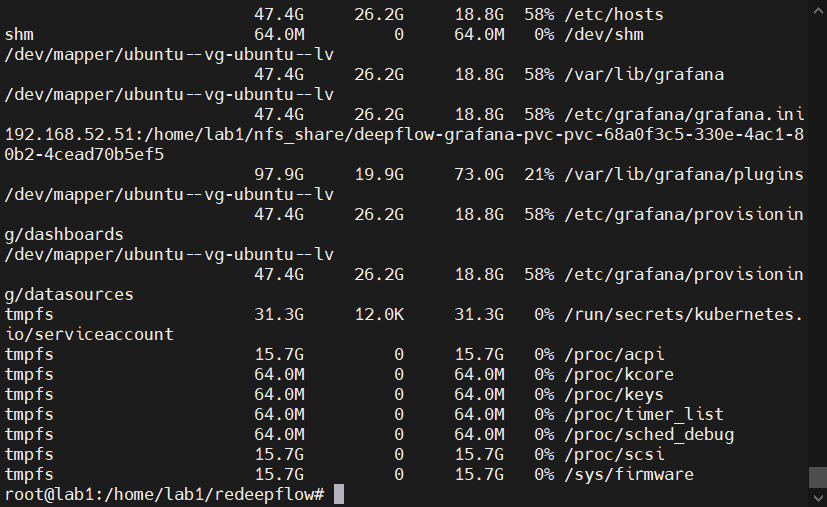


```sh
root@lab1:/home/lab1# kubectl exec -it deepflow-grafana-68cb8cb4c5-t6cwn -c grafana -n deepflow -- ls -l /usr/share/grafana -n deepflow

```


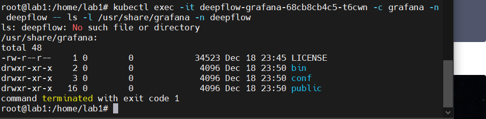

然后再重新把版本对应回v6.4

还是要先缩放先

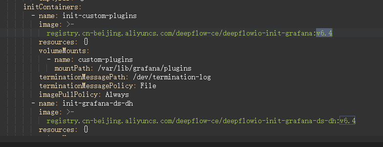

先安装插件测试一下吧

```sh
grafana-cli plugins install yesoreyeram-boomtheme-panel
```

然后重启pod发现可以了

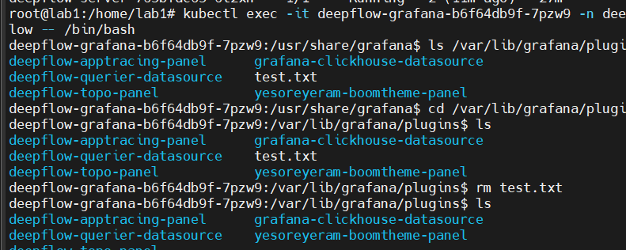

类目。

## grafana定制化

想到了两种方法（第一种是在原来的位置把/usr/share/grafana做持久化，然后改源码，但是容器内部没有编译环境，是个麻烦的做法。第二种是构建一个改过ui的grafana，然后把deepflow插件导入，翻聊天记录的时候发现的确是有deepflow的插件的。）因为在做完持久化之后没什么用，何况/usr/share/grafana/这个还不能做持久化（没找到样例，也看到了很多人做不了），所以只能从另一个种方法走了，用一个已有的grafana，然后装deepflow的插件。

[生产环境部署建议 | 云原生-可观测性-零侵扰采集-全栈可观测-分布式追踪-eBPF-Wasm-DeepFlow可观测性平台](https://deepflow.io/docs/zh/best-practice/production-deployment/#接入已有的-grafana)

### 构建grafana

为了做试验，把原来的物理机的lab1,10.12.52.66捡了回来，然后在上面装grafana

[Deploy Grafana on Kubernetes | Grafana documentation](https://grafana.com/docs/grafana/latest/setup-grafana/installation/kubernetes/)

参照官网的文件，部署了grafana，在这其中已经试过了，一旦挂载/usr/share/grafana，那么就会产生pod一直起不来的情况，还是合理怀疑磁盘问题

这是对应的文件，有pvc，deploy，service，这里我修改了deploy的权限，在securityContext字段，可以直接用root身份进入pod，然后还把service变成了nodeip，这里为了切合后面的VolkovLabs（当时找到的项目只更新到9.4.3），就先部署的是grafana:9.4.3

```yaml
---
apiVersion: v1
kind: PersistentVolumeClaim
metadata:
  name: grafana-pvc
spec:
  accessModes:
    - ReadWriteOnce
  resources:
    requests:
      storage: 1Gi
  storageClassName: course-nfs-storage

---
apiVersion: apps/v1
kind: Deployment
metadata:
  labels:
    app: grafana
  name: grafana
spec:
  selector:
    matchLabels:
      app: grafana
  template:
    metadata:
      labels:
        app: grafana
    spec:
      securityContext:
        runAsUser: 0
        runAsGroup: 0
        runAsNonRoot: false
        fsGroup: 0
        supplementalGroups:
          - 0
      containers:
        - name: grafana
          image: grafana/grafana:9.3.2
          imagePullPolicy: IfNotPresent
          ports:
            - containerPort: 3000
              name: http-grafana
              protocol: TCP
          readinessProbe:
            failureThreshold: 3
            httpGet:
              path: /robots.txt
              port: 3000
              scheme: HTTP
            initialDelaySeconds: 10
            periodSeconds: 30
            successThreshold: 1
            timeoutSeconds: 2
          livenessProbe:
            failureThreshold: 3
            initialDelaySeconds: 30
            periodSeconds: 10
            successThreshold: 1
            tcpSocket:
              port: 3000
            timeoutSeconds: 1
          resources:
            requests:
              cpu: 250m
              memory: 750Mi
          volumeMounts:
            - mountPath: /var/lib/grafana
              name: grafana-pv
      volumes:
        - name: grafana-pv
          persistentVolumeClaim:
            claimName: grafana-pvc

---
apiVersion: v1
kind: Service
metadata:
  name: grafana
spec:
  ports:
    - port: 3000
      protocol: TCP
      targetPort: http-grafana
      nodePort: 30009  # 选择一个未被占用的端口
  selector:
    app: grafana
  type: NodePort  # 将类型修改为 NodePort

```

拉取仓库，这是在grafana的论坛看到的，具体网址忘记了，记录太多了，但是有留YouTube网址

https://community.grafana.com/

[如何自定义Grafana 9.4 | Docker 容器和 Windows 的备忘单 - YouTube](https://www.youtube.com/watch?v=ChI78v4UZc0)

```sh
git clone https://github.com/VolkovLabs/volkovlabs-balena-app.git
```

然后进入文件夹，再进入nfs文件夹，再进入nfs文件夹下的Dockerfile，更换软件包仓库，不然docker-compose build的时候会卡住

[Index of /alpine/v3.17/main/ (alpinelinux.org)](https://dl-cdn.alpinelinux.org/alpine/v3.17/main/)这是原网址

```dockerfile
FROM nginx:stable-alpine

# 更改软件包仓库
RUN echo "http://mirrors.aliyun.com/alpine/v3.17/main/" > /etc/apk/repositories

## Environment
ENV API_HOST=localhost
ENV API_PORT=3001
ENV GRAFANA_HOST=localhost
ENV GRAFANA_PORT=3000
ENV GRAFANA_SSL=/C=US/ST=Florida/L=Tampa/O=Volkov Labs/OU=Technology/CN=localhost/

## Generate certificate
RUN apk add --update openssl && \
    rm -rf /var/cache/apk/*
RUN openssl req -x509 -out /etc/nginx/ssl.crt -keyout /etc/nginx/ssl.key -newkey rsa:4096 -nodes -sha256 -subj ${GRAFANA_SSL}

## Copy configuration
COPY default.conf /etc/nginx/templates/default.conf.template
COPY proxy.conf /etc/nginx/conf.d/proxy.conf
COPY http_headers.conf /etc/nginx/conf.d/http_headers.conf

CMD ["nginx", "-g", "daemon off;"]

```

然后需要安装docker-compose，安装完后加上权限

```sh
sudo chmod +x /usr/local/bin/docker-compose
```

然后执行

```sh
docker-compose build
```

后面了解完之后发现这里其实不用build，因为这里是这个实验室遗弃的项目（后面才知道的），印象当中这里build没什么问题，因为后面学会Dockerfile之后发现这里一直在build nginx文件夹的Dockerfile

所以这里可以直接

```sh
docker-compose up
```

起它原本的容器，然后成功了，做到这里的时候，心里落下了一个大石，总算是找到希望了。后面观看他YouTube的视频，去到新项目的位置clone

```sh
git clone https://github.com/VolkovLabs/volkovlabs-app.git
```

还是跟之前一样先更改nginx里面的Dockerfile换源。

这里印象当中报了个错

要更改VolkovLabs目录下的docker-compose.yml，将version改成3.3

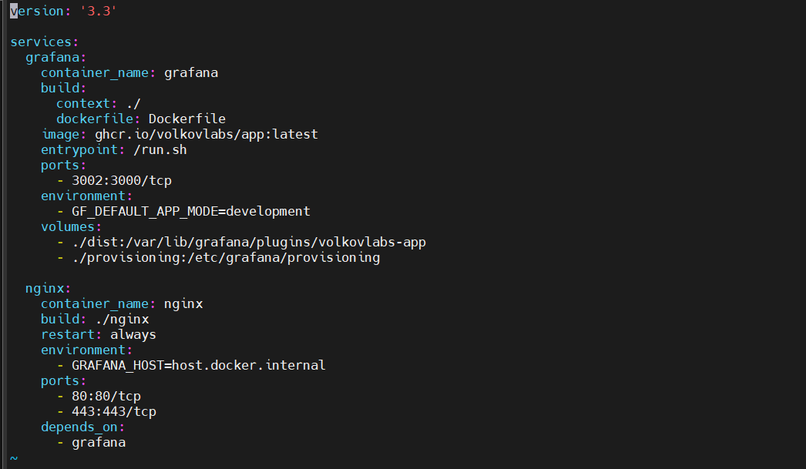

然后执行

```sh
docker-compose build grafana
```

这里会报错，会报没有找到dist目录什么的，因为这里没有构建他的插件，所以会报错

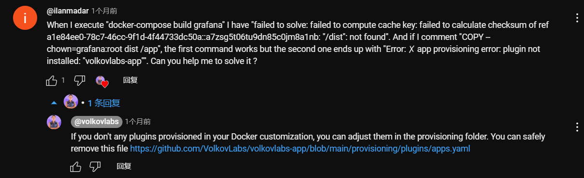

在YouTube看到了网友的评论，所以就暂时先把关于plugins的部分注释掉

```sh
vim Dockerfile
```

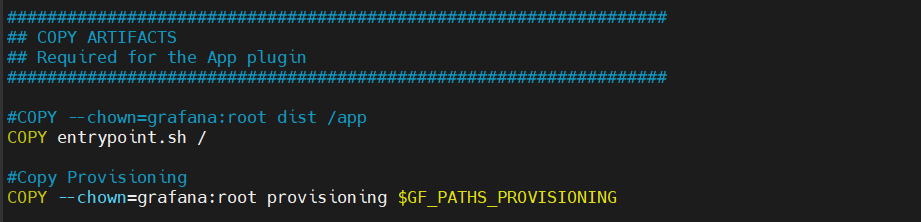

印象当中好像 entrypoint.sh不能注释掉，不然也会报错

build完成之后执行

```sh
docker-compose up grafana
```

up完成之后就可以去3000端口查看了，这里没问题，但是无法登录，可能还是需要构建插件？

同样也是找到了网友的评论


### npm安装插件

看着他就俩命令，但是报错一堆，还是看到了这个评论才成功的


```sh
apt install npm -y
#进到项目目录
#下面这三个是他给的报错提示又安装的，但是实际上安装了之后也是报错，也不知道有没有用吧，而且可能会卡住，我当时卡住太久了，直接ctrl+c取消了，但是物理机上的没什么问题，虚拟机是卡住了


npm install mocha@8.x
npm install @opentelemetry/api@1.7.0
npm install react@17.0.0

#重点就是一定要安装这个
npm install sucrase @babel/register esbuild-register @swc/register
```

安装nvm

```sh
curl -o- https://raw.githubusercontent.com/nvm-sh/nvm/v0.38.0/install.sh | bash
```

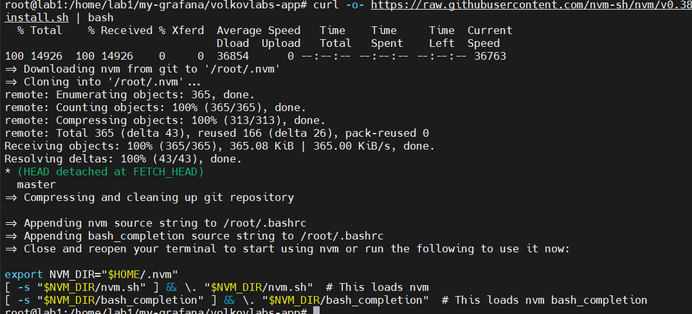

```sh
export NVM_DIR="$HOME/.nvm"
[ -s "$NVM_DIR/nvm.sh" ] && \. "$NVM_DIR/nvm.sh" # 这会加载 nvm
[ -s "$NVM_DIR/bash_completion" ] && \. "$NVM_DIR/bash_completion" # 这会加载 nvm 的 bash 补全功能
```

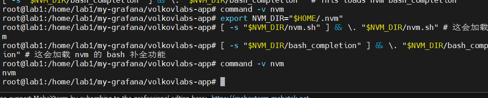

```sh
nvm install 16
nvm use 16
```

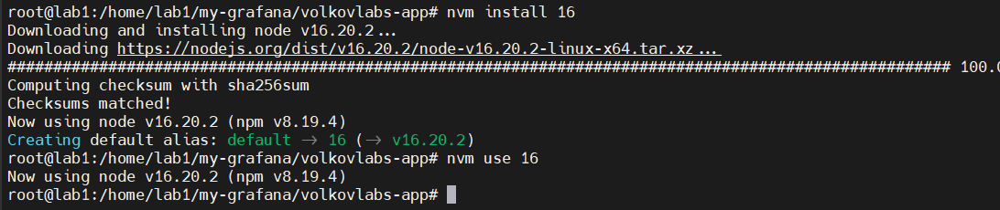

然后再运行

```sh
npm run build
```

```sh
root@lab1:/home/lab1/my-grafana/volkovlabs-app# npm run build

> volkovlabs-app@3.3.0 build
> webpack -c ./.config/webpack/webpack.config.ts --env production


assets by path marcusolsson-dynamictext-panel/ 1.51 MiB
  assets by status 1.51 MiB [big] 2 assets
  asset marcusolsson-dynamictext-panel/img/logo.svg 2.78 KiB [emitted] [from: marcusolsson-dynamictext-panel/img/logo.svg] [copied]
  asset marcusolsson-dynamictext-panel/plugin.json 1020 bytes [emitted] [from: marcusolsson-dynamictext-panel/plugin.json] [copied]
assets by path volkovlabs-rss-datasource/ 758 KiB
  assets by path volkovlabs-rss-datasource/img/ 718 KiB 2 assets
  asset volkovlabs-rss-datasource/module.js 38.3 KiB [emitted] [minimized] (name: volkovlabs-rss-datasource/module) 1 related asset
  asset volkovlabs-rss-datasource/plugin.json 1.14 KiB [emitted] [from: volkovlabs-rss-datasource/plugin.json] [copied]
assets by path *.md 5.88 KiB
  asset CHANGELOG.md 4.04 KiB [emitted] [from: ../CHANGELOG.md] [copied]
  asset README.md 1.85 KiB [emitted] [from: ../README.md] [copied]
asset module.js 32.1 KiB [emitted] [minimized] (name: module) 1 related asset
asset LICENSE 11.1 KiB [emitted] [from: ../LICENSE] [copied]
asset plugin.json 1.04 KiB [emitted] [from: plugin.json] [copied]
asset img/logo.svg 643 bytes [emitted] [from: img/logo.svg] [copied]
orphan modules 44.8 KiB [orphan] 21 modules
runtime modules 937 bytes 4 modules
built modules 3.16 MiB [built]
  cacheable modules 3.16 MiB
    ./module.ts + 21 modules 45 KiB [built] [code generated]
    ./volkovlabs-rss-datasource/module.js 81.1 KiB [built] [code generated]
    ./marcusolsson-dynamictext-panel/module.js 3.04 MiB [built] [code generated]
  modules by path external "@grafana/ 126 bytes
    external "@grafana/data" 42 bytes [built] [code generated]
    external "@grafana/runtime" 42 bytes [built] [code generated]
    external "@grafana/ui" 42 bytes [built] [code generated]
  + 9 modules

WARNING in asset size limit: The following asset(s) exceed the recommended size limit (244 KiB).
This can impact web performance.
Assets:
  marcusolsson-dynamictext-panel/module.js (1.21 MiB)
  marcusolsson-dynamictext-panel/img/screenshot.png (304 KiB)
  volkovlabs-rss-datasource/img/dashboard.png (717 KiB)

WARNING in entrypoint size limit: The following entrypoint(s) combined asset size exceeds the recommended limit (244 KiB). This can impact web performance.
Entrypoints:
  marcusolsson-dynamictext-panel/module (1.21 MiB)
      marcusolsson-dynamictext-panel/module.js


WARNING in webpack performance recommendations:
You can limit the size of your bundles by using import() or require.ensure to lazy load some parts of your application.
For more info visit https://webpack.js.org/guides/code-splitting/

webpack 5.90.0 compiled with 3 warnings in 28928 ms

```

这样应该就成功了，我在lab1和lab3都装了，lab2会报空间不足，就装不了

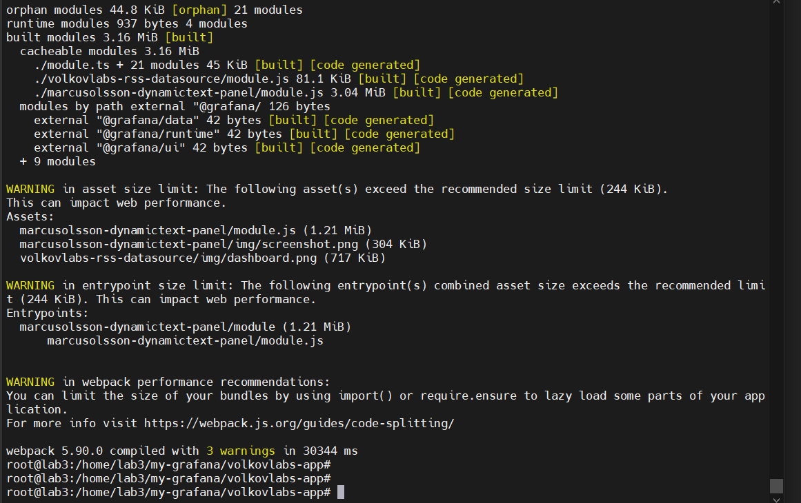

**PS：实际应该不用在虚拟机装，只是我回头记录的时候记录到一起了，当时是因为2.0的镜像还是报没装插件的错，应该是docker tag的时候没tag到对的镜像**

所以接下来就是改Dockerfile的事了，当然这里先进行了一下测试，把这个镜像挪到k8s中会不会有问题（只要能用docker run xxx起来的，就没问题）

### 修改Dockerfile

这里直接放修改之后的了，前后经历了两天半的修改和测试，要注意Favicon，一定要改名成fav32.png，不然会显示不出来

```dockerfile
FROM grafana/grafana-oss:10.3.1

##################################################################
## CONFIGURATION
##################################################################

## Set Grafana options
ENV GF_ENABLE_GZIP=true
ENV GF_USERS_DEFAULT_THEME=light

## Enable Anonymous Authentication
ENV GF_AUTH_ANONYMOUS_ENABLED=false
ENV GF_AUTH_BASIC_ENABLED=true

## Disable Sanitize
ENV GF_PANELS_DISABLE_SANITIZE_HTML=false

## Disable Explore
ENV GF_EXPLORE_ENABLED=true

# Updates Check
ENV GF_ANALYTICS_CHECK_FOR_UPDATES=false

## Set Home Dashboard
ENV GF_DASHBOARDS_DEFAULT_HOME_DASHBOARD_PATH=/etc/grafana/provisioning/dashboards/news.json

## Paths
ENV GF_PATHS_PROVISIONING="/etc/grafana/provisioning"
ENV GF_PATHS_PLUGINS="/var/lib/grafana/plugins"

##################################################################
## COPY ARTIFACTS
## Required for the App plugin
##################################################################

#COPY --chown=grafana:root dist /app
COPY entrypoint.sh /

#Copy Provisioning
COPY --chown=grafana:root provisioning $GF_PATHS_PROVISIONING

##################################################################
## Customization depends on the Grafana version
## May work or not work for the version different from the current
## Check GitHub file history for the previous Grafana versions
##################################################################
USER root

##################################################################
## VISUAL
##################################################################

## Replace Favicon and Apple Touch
COPY img/logo1.svg /usr/share/grafana/public/img
COPY img/logo1.svg /usr/share/grafana/public/img/apple-touch-icon.png

## Update Favicon
COPY img/fav32.png /usr/share/grafana/public/img/fav32.png

## Replace Logo
COPY img/logo1.svg /usr/share/grafana/public/img/grafana_icon.svg

## Update Background
COPY img/background.svg /usr/share/grafana/public/img/g8_login_dark.svg
COPY img/background.svg /usr/share/grafana/public/img/g8_login_light.svg

##################################################################
## HANDS-ON
##################################################################

# Update Title
RUN sed -i 's|<title>\[\[.AppTitle\]\]</title>|<title>CSDCP</title>|g' /usr/share/grafana/public/views/index.html

# Move Volkov Labs App to navigation root section
#RUN sed -i 's|\[navigation.app_sections\]|\[navigation.app_sections\]\nvolkovlabs-app=root|g' /usr/share/grafana/conf/defaults.ini

## Update Help menu
RUN sed -i "s|\[\[.NavTree\]\],|nav,|g; \
    s|window.grafanaBootData = {| \
    let nav = [[.NavTree]]; \
    const alerting = nav.find((element) => element.id === 'alerting'); \
    if (alerting) { alerting['url'] = '/alerting/list'; } \
    const dashboards = nav.find((element) => element.id === 'dashboards/browse'); \
    if (dashboards) { dashboards['children'] = [];} \
    const connections = nav.find((element) => element.id === 'connections'); \
    if (connections) { connections['url'] = '/datasources'; connections['children'].shift(); } \
    const help = nav.find((element) => element.id === 'help'); \
    if (help) { help['subTitle'] = 'Grafana OSS'; help['children'] = [];} \
    window.grafanaBootData = {|g" \
    /usr/share/grafana/public/views/index.html

## Update Preloader Text
RUN sed -i 's|<div class="preloader__text">Loading Grafana</div>|<div class="preloader__text">Loading CSDCP</div>|g' /usr/share/grafana/public/views/index.html

## Update Title
RUN find /usr/share/grafana/public/build/ -name *.js -exec sed -i 's|AppTitle="Grafana"|AppTitle="CSDCP"|g' {} \;

## Update Login Title
RUN find /usr/share/grafana/public/build/ -name *.js -exec sed -i 's|LoginTitle="Welcome to Grafana"|LoginTitle="Welcome to CSDCP"|g' {} \;

## Remove Documentation, Support, Community in the Footer
RUN find /usr/share/grafana/public/build/ -name *.js -exec sed -i 's|\[{target:"_blank",id:"documentation".*grafana_footer"}\]|\[\]|g' {} \;

## Remove Edition in the Footer
RUN find /usr/share/grafana/public/build/ -name *.js -exec sed -i 's|({target:"_blank",id:"license",.*licenseUrl})|()|g' {} \;

## Remove Version in the Footer
RUN find /usr/share/grafana/public/build/ -name *.js -exec sed -i 's|({target:"_blank",id:"version",.*CHANGELOG.md":void 0})|()|g' {} \;

## Remove News icon
RUN find /usr/share/grafana/public/build/ -name *.js -exec sed -i 's|..createElement(....,{className:.,onClick:.,iconOnly:!0,icon:"rss","aria-label":"News"})|null|g' {} \;

## Remove Open Source icon
RUN find /usr/share/grafana/public/build/ -name *.js -exec sed -i 's|.push({target:"_blank",id:"version",text:`${..edition}${.}`,url:..licenseUrl,icon:"external-link-alt"})||g' {} \;

##################################################################
## CLEANING Remove Native Data Sources
##################################################################

## Time series databases / Elasticsearch
RUN rm -rf /usr/share/grafana/public/app/plugins/datasource/elasticsearch
RUN rm -rf /usr/share/grafana/public/build/elasticsearch*

## Time series databases / Graphite
RUN rm -rf /usr/share/grafana/public/app/plugins/datasource/graphite
RUN rm -rf /usr/share/grafana/public/build/graphite*

## Time series databases / OpenTSDB
RUN rm -rf /usr/share/grafana/public/app/plugins/datasource/opentsdb
RUN rm -rf /usr/share/grafana/public/build/opentsdb*

## Time series databases / InfluxDB
RUN rm -rf /usr/share/grafana/public/app/plugins/datasource/influxdb
RUN rm -rf /usr/share/grafana/public/build/influxdb*

## SQL / Microsoft SQL Server
RUN rm -rf /usr/share/grafana/public/app/plugins/datasource/mssql
RUN rm -rf /usr/share/grafana/public/build/mssql*

## SQL / MySQL
RUN rm -rf /usr/share/grafana/public/app/plugins/datasource/mysql
RUN rm -rf /usr/share/grafana/public/build/mysql*

## Distributed tracing / Tempo
RUN rm -rf /usr/share/grafana/public/app/plugins/datasource/tempo
RUN rm -rf /usr/share/grafana/public/build/tempo*

## Distributed tracing / Jaeger
RUN rm -rf /usr/share/grafana/public/app/plugins/datasource/jaeger
RUN rm -rf /usr/share/grafana/public/build/jaeger*

## Distributed tracing / Zipkin
RUN rm -rf /usr/share/grafana/public/app/plugins/datasource/zipkin
RUN rm -rf /usr/share/grafana/public/build/zipkin*

## Cloud / Azure Monitor
RUN rm -rf /usr/share/grafana/public/app/plugins/datasource/azuremonitor
RUN rm -rf /usr/share/grafana/public/build/azureMonitor*

## Cloud / CloudWatch
RUN rm -rf /usr/share/grafana/public/app/plugins/datasource/cloudwatch
RUN rm -rf /usr/share/grafana/public/build/cloudwatch*

## Cloud / Google Cloud Monitoring
RUN rm -rf /usr/share/grafana/public/app/plugins/datasource/cloud-monitoring
RUN rm -rf /usr/share/grafana/public/build/cloudMonitoring*

## Profiling / Parca
RUN rm -rf /usr/share/grafana/public/app/plugins/datasource/parca
RUN rm -rf /usr/share/grafana/public/build/parca*

## Profiling / Phlare
RUN rm -rf /usr/share/grafana/public/app/plugins/datasource/phlare
RUN rm -rf /usr/share/grafana/public/build/phlare*

## Profiling / Pyroscope
RUN rm -rf /usr/share/grafana/public/app/plugins/datasource/grafana-pyroscope-datasource
RUN rm -rf /usr/share/grafana/public/build/pyroscope*

## Remove Cloud and Enterprise categories
RUN find /usr/share/grafana/public/build/ -name *.js -exec sed -i 's|.id==="enterprise"|.id==="notanenterprise"|g' {} \;
RUN find /usr/share/grafana/public/build/ -name *.js -exec sed -i 's|.id==="cloud"|.id==="notacloud"|g' {} \;

##################################################################
## CLEANING Remove Native Panels
##################################################################

## Alert list
RUN rm -rf /usr/share/grafana/public/app/plugins/panel/alertlist

## Annotations list
RUN rm -rf /usr/share/grafana/public/app/plugins/panel/annolist

## Dashboard list
RUN rm -rf /usr/share/grafana/public/app/plugins/panel/dashlist

## News
RUN rm -rf /usr/share/grafana/public/app/plugins/panel/news

## Table (old)
RUN rm -rf /usr/share/grafana/public/app/plugins/panel/table-old

## Traces
RUN rm -rf /usr/share/grafana/public/app/plugins/panel/traces

## Flamegraph
RUN rm -rf /usr/share/grafana/public/app/plugins/panel/flamegraph

##################################################################

USER grafana

## Entrypoint
ENTRYPOINT [ "/bin/bash", "/entrypoint.sh" ]

```

要先上传一下build完的镜像

这里如果没有dockerhub账号和对应仓库要先去官网注册和创建账户，这些做完之后回到终端

```sh
docker login #登录dockerhub的账号
```

```sh
docker tag IMAGE ID 0mobb0/innovative_practice:4.0
```

-p选项是做端口映射，如果是直接run的镜像可以这样，如果可以build的话可以直接修改docker-compose.yml文件，比如下面这样

```sh
docker run -d -p 8000:3000 ghcr.io/volkovlabs/balena-app
```

```yaml
version: '3.3'

services:
  grafana:
    container_name: grafana
    build:
      context: ./
      dockerfile: Dockerfile
    image: ghcr.io/volkovlabs/app:latest
    entrypoint: /run.sh
    ports:
      - 3002:3000/tcp
    environment:
      - GF_DEFAULT_APP_MODE=development
    volumes:
      - ./dist:/var/lib/grafana/plugins/volkovlabs-app
      - ./provisioning:/etc/grafana/provisioning

  nginx:
    container_name: nginx
    build: ./nginx
    restart: always
    environment:
      - GRAFANA_HOST=host.docker.internal
    ports:
      - 80:80/tcp
      - 443:443/tcp
    depends_on:
      - grafana

```

测试没问题之后再push镜像到dockerhub上，然后回到deepflow的deploy，修改grafana的镜像来源


## 安装deepflow插件

对于/etc/grafana/grafana.ini文件，貌似不能直接做持久化，学习之后发现可以做configmap

ConfigMap 是用来存储配置文件的 Kubernetes 资源对象，下面附两个网址

[K8S笔记06 --数据持久化PV、PVC和ConfigMap_pvc.xml-CSDN博客](https://blog.csdn.net/zhangxm_qz/article/details/119851157)

[我就想存个文件，怎么这么麻烦 ？- k8s PV、PVC、StorageClass 的关系 - 知乎 (zhihu.com)](https://zhuanlan.zhihu.com/p/438169246)

```sh
vim grafana.ini
```

将这一部分对应官网的步骤

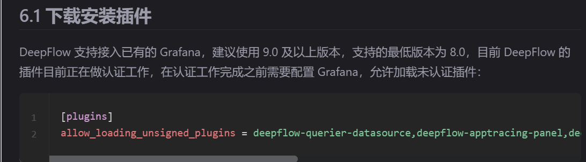

```ini
[log]
; # Either "debug", "info", "warn", "error", "critical", default is "info"
; # we change from info to debug level
level = debug
[plugins]
allow_loading_unsigned_plugins = deepflow-querier-datasource,deepflow-apptracing-panel,deepflow-topo-panel,deepflowio-tracing-panel,deepflowio-deepflow-datasource,deepflowio-topo-panel

```

创建configmap

```sh
kubectl create configmap ge-config --from-file=/home/lab1/grafana/grafana.ini --namespace=my-grafana
```


打开文件，然后在 Deployment 部分中，提供自定义配置 （） 的挂载路径，并引用为其新创建的 ConfigMap。`grafana.yaml``/etc/grafana`，这里是上面构建grafana的yaml文件中的

```yaml
---
apiVersion: apps/v1
kind: Deployment
metadata:
  labels:
    app: grafana
  name: grafana
# the rest of the code remains the same.
...
....
...
            requests:
            cpu: 250m
            memory: 750Mi
        volumeMounts:
          - mountPath: /var/lib/grafana
            name: grafana-pv
           # This is to mount the volume for the custom configuration
          - mountPath: /etc/grafana
            name: ge-config
    volumes:
      - name: grafana-pv
        persistentVolumeClaim:
          claimName: grafana-pvc
       # This is to provide the reference to the ConfigMap for the volume
      - name: ge-config
        configMap:
          name: ge-config
```


遇到这种情况就是要等很久，看运气。。。

发现没问题之后，就在pod中下载插件，pod中不能用curl，要改成wget

```sh
wget -O deepflow-gui-grafana.tar.gz https://deepflow-ce.oss-cn-beijing.aliyuncs.com/pkg/grafana-plugin/stable/deepflow-gui-grafana.tar.gz

```

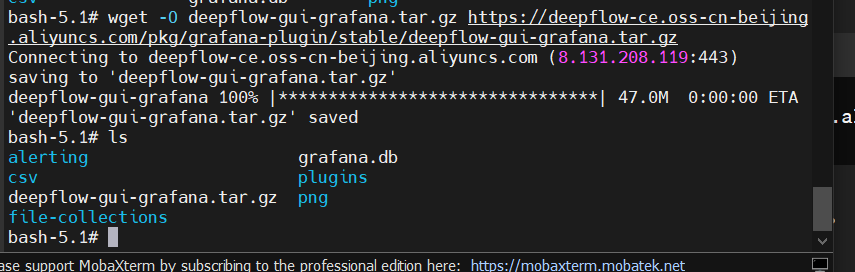

将下载好的插件解压至 Grafana 插件目录，例如 `/var/lib/grafana/plugins`，并重启 Grafana 加载插件：

```bash
tar -zxvf deepflow-gui-grafana.tar.gz -C /var/lib/grafana/plugins/
```

插件是生效了，后面添加添加 DeepFlow Data source的部分还没试

http://192.168.52.51:32319

http://192.168.52.51:31584


## DBN

首先安装conda，记得勾选添加环境变量的选项，具体可以看下面的网址，All users选项无所谓

[Anaconda超详细安装教程（Windows环境下）_conda安装-CSDN博客](https://blog.csdn.net/fan18317517352/article/details/123035625)

安装完后使用pycharm打开项目

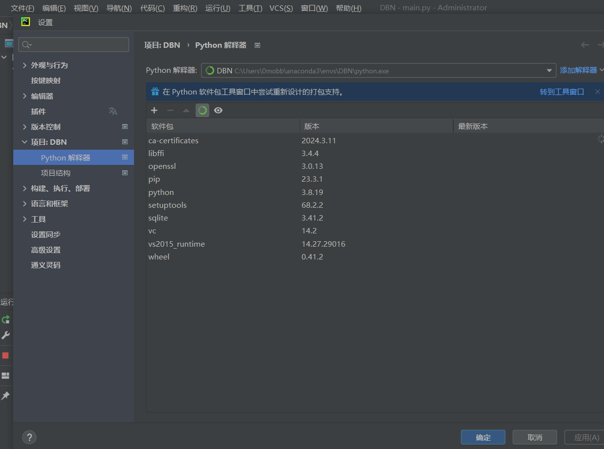

在文件->项目 里面创建新的python解释器，然后选择对应的python版本，应该是3.8

然后看下makefile，因为makefile都是构建和编译项目的信息

activate段是进行了venv虚拟环境的创建，但是我们已经用了conda了，所以这个命令就没必要，安装依赖需要，在pycharm打开终端，然后

```sh
pip install -r requirements.txt
```

我记得好像torch的安装出了问题，因为说什么1.9的版不存在，但是后面好像又不知道怎么又行了

配置好运行环境之后，再往下看，init部分创建了data的几个相关文件，我们这里可以自己手动创建

然后就是运行预处理的部分，这里会把我们的数据集进行切割，但是要注意一下label，因为如果只有BEGIN的label的话，就训练不了数据，会报说什么正负不行，总之就是要注意label的多样化（ps：因为这里我为了省时只分割了一个数据集，照常分割Monday到Friday的数据集是没问题的，虽然label还是不全）


预处理完之后我们就可以运行项目了，为了调试快点，这里可以把数据训练缩小到1*1，修改list的长度到1，然后这里n_classes也得修改到7，具体官网有个issue有提到，也不知道为什么

[A problem about the code implementation of ‘An Intrusion Detection System based on Deep Belief Networks’ · Issue #3 · othmbela/dbn-based-nids (github.com)](https://github.com/othmbela/dbn-based-nids/issues/3)

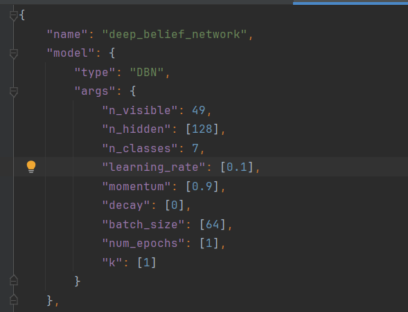

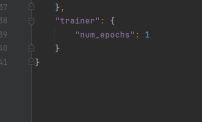

注意另外一个配置文件，也就是multilayerPerceptron.json也要改一下

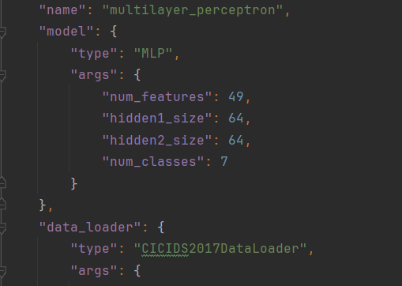

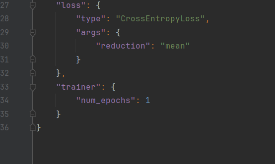


按照readme文件，运行命令是这两个

```sh
# train the deep belief network
    $ python main.py --config ./configs/deepBeliefNetwork.json

    # train the multi-layer perceptron
    $ python main.py --config ./configs/multilayerPerceptron.json
```

main函数的修改我放在下面了，具体就是因为会报label和训练预测后的label不匹配，要注意修改下面这部分

```python
labels=np.arange(0, len(labels), 1),  # 指定labels参数
```

下面是修改后的main.py

```python
from sklearn.metrics import classification_report, f1_score
from sklearn.preprocessing import LabelBinarizer
import pandas as pd
import numpy as np
import argparse
import logging
import os

import torch
import torch.optim as optim

from logger import setup_logging
from utils import (
    dataset,
    models,
    test,
    train,
    utils,
    visualisation,
)

LOG_CONFIG_PATH = os.path.join(os.path.abspath("."), "logger", "logger_config.json")
LOG_DIR = os.path.join(os.path.abspath("."), "logs")
DATA_DIR = os.path.join(os.path.abspath('.'), "data")
IMAGE_DIR = os.path.join(os.path.abspath("."), "images")
MODEL_DIR = os.path.join(os.path.abspath("."), "checkpoints")

DEVICE = torch.device("cuda" if torch.cuda.is_available() else "cpu")

# Ensure that all operations are deterministic for reproducibility, even on GPU (if used)
utils.set_seed(42)
torch.backends.cudnn.determinstic = True
torch.backends.cudnn.benchmark = False


def main(config):
    """Centralised"""

    # Configure logging module
    utils.mkdir(LOG_DIR)
    setup_logging(save_dir=LOG_DIR, log_config=LOG_CONFIG_PATH)

    logging.info(f'######## Training the {config["name"]} model ########')
    model = models.load_model(model_name=config["model"]["type"], params=config["model"]["args"])
    model.to(DEVICE)

    logging.info("Loading dataset...")
    train_loader, valid_loader, test_loader = dataset.load_data(
        data_path=DATA_DIR,
        balanced=config["data_loader"]["args"]["balanced"],
        batch_size=config["data_loader"]["args"]["batch_size"],
    )
    logging.info("Dataset loaded!")

    criterion = getattr(torch.nn, config["loss"]["type"])(**config["loss"]["args"])
    if config["model"]["type"] == "DBN":
        optimizer = [
            getattr(torch.optim, config["optimizer"]["type"])(params=m.parameters(), **config["optimizer"]["args"])
            for m in model.models
        ]

        # Pre-train the DBN model
        logging.info("Start pre-training the model...")
        model.fit(train_loader)
    else:
        optimizer = [
            getattr(torch.optim, config["optimizer"]["type"])(params=model.parameters(), **config["optimizer"]["args"])]

    logging.info("Start training the model...")
    train_history = train(
        model=model,
        criterion=criterion,
        optimizer=optimizer,
        train_loader=train_loader,
        valid_loader=valid_loader,
        num_epochs=config["trainer"]["num_epochs"],
        device=DEVICE
    )
    logging.info(f'{config["name"]} model trained!')


    train_output_true = train_history["train"]["output_true"]
    train_output_pred = train_history["train"]["output_pred"]
    valid_output_true = train_history["valid"]["output_true"]
    valid_output_pred = train_history["valid"]["output_pred"]
    #输出output_true和output_pred
    # utils.write_pickle(train_output_true, os.path.join(DATA_DIR, 'train_output_true.pkl'))
    # utils.write_pickle(train_output_pred, os.path.join(DATA_DIR, 'train_output_pred.pkl'))
    # utils.write_pickle(valid_output_true, os.path.join(DATA_DIR, 'valid_output_true.pkl'))
    # utils.write_pickle(valid_output_pred, os.path.join(DATA_DIR, 'valid_output_pred.pkl'))
    # with open("output.txt", "w") as f:
    #     f.write("训练集真实输出：" + str(train_output_true) + "\n")
    #     f.write("训练集预测输出：" + str(train_output_pred) + "\n")
    #     f.write("验证集真实输出：" + str(valid_output_true) + "\n")
    #     f.write("验证集预测输出：" + str(valid_output_pred) + "\n")

    labels = ["Benign", "Botnet ARES", "Brute Force", "DoS/DDoS", "PortScan", "Web Attack","Infiltration"]
    #labels = ["Benign", "Botnet ARES"]

    ## Training Set results
    logging.info('Training Set -- Classification Report')
    logging.info(classification_report(
        y_true=train_output_true,
        y_pred=train_output_pred,
        labels=np.arange(0, len(labels), 1),  # 指定labels参数
        target_names=labels

    ))

    visualisation.plot_confusion_matrix(
        y_true=train_output_true,
        y_pred=train_output_pred,
        labels=labels,
        save=True,
        save_dir=IMAGE_DIR,
        filename=f'{config["name"]}_train_confusion_matrix.pdf'
    )

    ## Validation Set results
    logging.info('Validation Set -- Classification Report')
    logging.info(classification_report(
        y_true=valid_output_true,
        y_pred=valid_output_pred,
        labels=np.arange(0, len(labels), 1),  # 指定labels参数
        target_names=labels
    ))

    visualisation.plot_confusion_matrix(
        y_true=valid_output_true,
        y_pred=valid_output_pred,
        labels=labels,
        save=True,
        save_dir=IMAGE_DIR,
        filename=f'{config["name"]}_train_confusion_matrix.pdf'
    )

    logging.info(f'Evaluate {config["name"]} model')
    test_history = test(
        model=model,
        criterion=criterion,
        test_loader=test_loader,
        device=DEVICE
    )

    test_output_true = test_history["test"]["output_true"]
    test_output_pred = test_history["test"]["output_pred"]
    test_output_pred_prob = test_history["test"]["output_pred_prob"]

    ## Testing Set results
    logging.info(f'Testing Set -- Classification Report {config["name"]}\n')
    logging.info(classification_report(
        y_true=test_output_true,
        y_pred=test_output_pred,
        labels=np.arange(0, len(labels), 1),  # 指定labels参数
        target_names=labels
    ))

    utils.mkdir(IMAGE_DIR)
    visualisation.plot_confusion_matrix(
        y_true=test_output_true,
        y_pred=test_output_pred,
        labels=labels,
        save=True,
        save_dir=IMAGE_DIR,
        filename=f'{config["name"]}_test_confusion_matrix.pdf'
    )

    lb = LabelBinarizer()
    lb.fit(labels)  # labels 是你的类别列表
    # y_test_bin = lb.transform(test_output_true)  # test_output_true 是你的真实标签
    #
    # y_test=y_test_bin
    #原代码
    y_test = pd.get_dummies(test_output_true).values

    y_score = np.array(test_output_pred_prob)
    print(f'y_test shape: {y_test.shape}')
    print(f'y_score shape: {y_score.shape}')

    # Plot ROC curve
    visualisation.plot_roc_curve(
        y_test=y_test,
        y_score=y_score,
        labels=labels,
        save=True,
        save_dir=IMAGE_DIR,
        filename=f'{config["name"]}_roc_curve.pdf'
    )
    print('visualisation.plot_roc_curve完成')
    # Plot Precision vs. Recall curve
    visualisation.plot_precision_recall_curve(
        y_test=y_test,
        y_score=y_score,
        labels=labels,
        save=True,
        save_dir=IMAGE_DIR,
        filename=f'{config["name"]}_prec_recall_curve.pdf'
    )

    path = os.path.join(MODEL_DIR, f'{config["name"]}.pt')
    utils.mkdir(MODEL_DIR)
    torch.save({
        'epoch': config["trainer"]["num_epochs"],
        'model_state_dict': model.state_dict(),
    }, path)
    print('程序已执行完成')

if __name__ == "__main__":
    parser = argparse.ArgumentParser()
    parser.add_argument(
        "-c",
        "--config",
        type=str,
        default=None,
        required=True,
        help="Config file path. (default: None)"
    )
    args = parser.parse_args()

    config = utils.read_json(args.config)
    main(config)
```

我印象当中好像就没什么问题了，然后就能跑了，只要看到


程序已执行完成（这部分自己加的，为了看是否执行到最后了），那就应该没什么问题，报异常的那部分好像也是因为label不全，因为他自己定义的label有7个，但是实际里面只有三个还是四个，就是那个2017的数据集，所以有些label的处理是空的，因为label为空

然后运行第二个命令应该也是没问题的。


## FlowMeter

要先安装gradle和Maven

[Maven & Gradle 下载、安装、配置详细步骤_gradle 3.5下载-CSDN博客](https://blog.csdn.net/Bingxuebojue/article/details/118282354)

注意Maven要下载bin版本的

[CICFlowMeter环境搭建与使用_cicflowmeter安装-CSDN博客](https://blog.csdn.net/Wait_Godot/article/details/136935178)

按照这个教程替换jnetpcap-1.4.r1425，可能也不用换吧，然后在项目文件下打开终端

```shell
G:\Flowmeter\CICFlowMeter-master>mvn install:install-file -Dfile=jnetpcap.jar -DgroupId=org.jnetpcap -DartifactId=jnetpcap -Dversion=1.4.1 -Dpackaging=jar
```


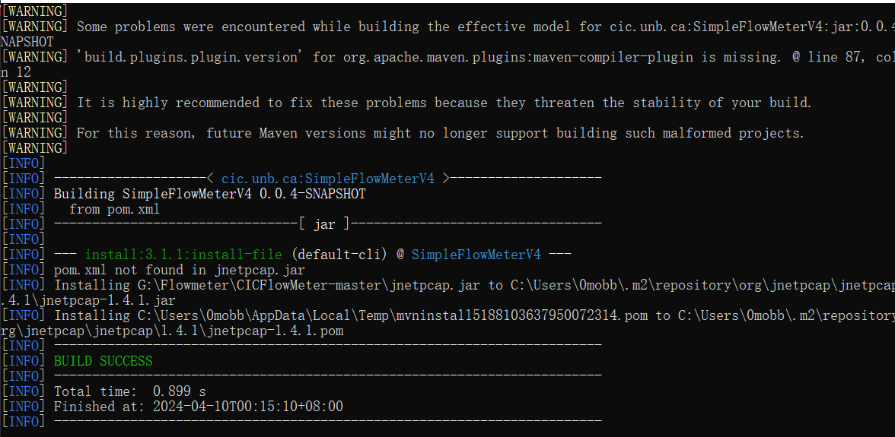

然后构建

```shell
.\gradlew build
```

```shell
.\gradlew execute
```

然后就会弹出一个窗口

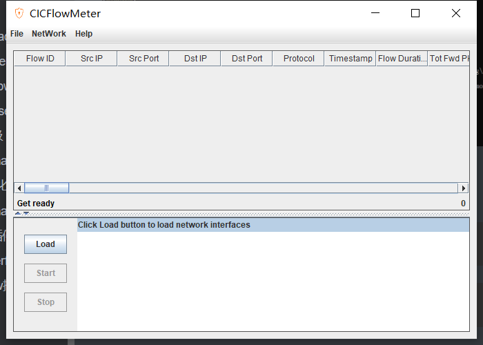


# ubuntu18.04

注意版本对应，sealos的仓库没有helm3.6.x版本的，所以得自己安装了

[calico 版本和k8s版本对应路径网址查看 - 滴滴滴 - 博客园](https://www.cnblogs.com/gaoyuechen/p/16851216.html)

[Helm 版本与 K8s 版本对应关系 · Helm](https://www.zhaowenyu.com/helm-doc/install/helm-k8s-version-relation.html)

去官网下载对应二进制版本

[Releases · helm/helm (github.com)](https://github.com/helm/helm/releases?page=5)

[Helm | Installing Helm](https://helm.sh/docs/intro/install/)

```shell
lab@lab:~/helm$ tar -zxvf helm-v3.6.1-linux-amd64.tar.gz
linux-amd64/
linux-amd64/helm
linux-amd64/LICENSE
linux-amd64/README.md
lab@lab:~/helm$ mv linux-amd64/helm /usr/local/bin/helm
mv: cannot move 'linux-amd64/helm' to '/usr/local/bin/helm': Permission denied
lab@lab:~/helm$ sudo mv linux-amd64/helm /usr/local/bin/helm
```

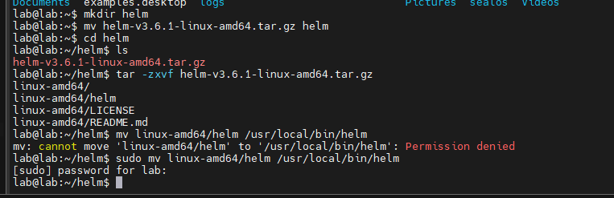

这个虚拟机ip会变（血的教训），需要固定ip

之前的版本网卡配置信息配置在/etc/network/interfaces文件，可以如下配置

```yaml
auto ens33
iface ens33 inet static
address 192.168.0.111
netmask 255.255.255.0
gateway 192.168.0.1
```

在18.04上也是可以用的，只是要重启才能生效。通过service networking restart无效。

下面介绍一下在18.04上新采用的netplan命令。网卡信息配置在/etc/netplan/01-network-manager-all.yaml文件，需做如下配置，

```yaml
Let NetworkManager manage all devices on this system

network:
  version: 2

renderer: NetworkManager

  ethernets:
          ens33:
                  addresses: [192.168.0.111/24]
                  gateway4: 192.168.0.1
                  nameservers:
                        addresses: [192.168.0.1]
```


然后使用以下命令使配置即时生效，

`netplan apply`

用sealos安装k8s

```sh
 sealos run labring/kubernetes-docker:v1.21.8 labring/calico:v3.22.1      --masters 192.168.52.134
```

```sh
Your Kubernetes control-plane has initialized successfully!

To start using your cluster, you need to run the following as a regular user:

  mkdir -p $HOME/.kube
  sudo cp -i /etc/kubernetes/admin.conf $HOME/.kube/config
  sudo chown $(id -u):$(id -g) $HOME/.kube/config

Alternatively, if you are the root user, you can run:

  export KUBECONFIG=/etc/kubernetes/admin.conf

You should now deploy a pod network to the cluster.
Run "kubectl apply -f [podnetwork].yaml" with one of the options listed at:
  https://kubernetes.io/docs/concepts/cluster-administration/addons/

You can now join any number of control-plane nodes by copying certificate authorities
and service account keys on each node and then running the following as root:

  kubeadm join apiserver.cluster.local:6443 --token <value withheld> \
        --discovery-token-ca-cert-hash sha256:f7cd1b4ea77032eb3541ed8e7d32ebba9651a8c964d1fb45f2e77e60ac9b5e2e \
        --control-plane --certificate-key <value withheld>

Then you can join any number of worker nodes by running the following on each as root:

kubeadm join apiserver.cluster.local:6443 --token <value withheld> \
        --discovery-token-ca-cert-hash sha256:f7cd1b4ea77032eb3541ed8e7d32ebba9651a8c964d1fb45f2e77e60ac9b5e2e
2024-03-08T20:46:48 info Executing pipeline Join in CreateProcessor.
2024-03-08T20:46:48 info Executing pipeline RunGuest in CreateProcessor.
customresourcedefinition.apiextensions.k8s.io/bgpconfigurations.crd.projectcalico.org created
customresourcedefinition.apiextensions.k8s.io/bgppeers.crd.projectcalico.org created
customresourcedefinition.apiextensions.k8s.io/blockaffinities.crd.projectcalico.org created
customresourcedefinition.apiextensions.k8s.io/caliconodestatuses.crd.projectcalico.org created
customresourcedefinition.apiextensions.k8s.io/clusterinformations.crd.projectcalico.org created
customresourcedefinition.apiextensions.k8s.io/felixconfigurations.crd.projectcalico.org created
customresourcedefinition.apiextensions.k8s.io/globalnetworkpolicies.crd.projectcalico.org created
customresourcedefinition.apiextensions.k8s.io/globalnetworksets.crd.projectcalico.org created
customresourcedefinition.apiextensions.k8s.io/hostendpoints.crd.projectcalico.org created
customresourcedefinition.apiextensions.k8s.io/ipamblocks.crd.projectcalico.org created
customresourcedefinition.apiextensions.k8s.io/ipamconfigs.crd.projectcalico.org created
customresourcedefinition.apiextensions.k8s.io/ipamhandles.crd.projectcalico.org created
customresourcedefinition.apiextensions.k8s.io/ippools.crd.projectcalico.org created
customresourcedefinition.apiextensions.k8s.io/ipreservations.crd.projectcalico.org created
customresourcedefinition.apiextensions.k8s.io/kubecontrollersconfigurations.crd.projectcalico.org created
customresourcedefinition.apiextensions.k8s.io/networkpolicies.crd.projectcalico.org created
customresourcedefinition.apiextensions.k8s.io/networksets.crd.projectcalico.org created
customresourcedefinition.apiextensions.k8s.io/apiservers.operator.tigera.io created
customresourcedefinition.apiextensions.k8s.io/imagesets.operator.tigera.io created
customresourcedefinition.apiextensions.k8s.io/installations.operator.tigera.io created
customresourcedefinition.apiextensions.k8s.io/tigerastatuses.operator.tigera.io created
namespace/tigera-operator created
Warning: policy/v1beta1 PodSecurityPolicy is deprecated in v1.21+, unavailable in v1.25+
podsecuritypolicy.policy/tigera-operator created
serviceaccount/tigera-operator created
clusterrole.rbac.authorization.k8s.io/tigera-operator created
clusterrolebinding.rbac.authorization.k8s.io/tigera-operator created
deployment.apps/tigera-operator created
installation.operator.tigera.io/default created
2024-03-08T20:46:56 info succeeded in creating a new cluster, enjoy it!
2024-03-08T20:46:56 info
      ___           ___           ___           ___       ___           ___
     /\  \         /\  \         /\  \         /\__\     /\  \         /\  \
    /::\  \       /::\  \       /::\  \       /:/  /    /::\  \       /::\  \
   /:/\ \  \     /:/\:\  \     /:/\:\  \     /:/  /    /:/\:\  \     /:/\ \  \
  _\:\~\ \  \   /::\~\:\  \   /::\~\:\  \   /:/  /    /:/  \:\  \   _\:\~\ \  \
 /\ \:\ \ \__\ /:/\:\ \:\__\ /:/\:\ \:\__\ /:/__/    /:/__/ \:\__\ /\ \:\ \ \__\
 \:\ \:\ \/__/ \:\~\:\ \/__/ \/__\:\/:/  / \:\  \    \:\  \ /:/  / \:\ \:\ \/__/
  \:\ \:\__\    \:\ \:\__\        \::/  /   \:\  \    \:\  /:/  /   \:\ \:\__\
   \:\/:/  /     \:\ \/__/        /:/  /     \:\  \    \:\/:/  /     \:\/:/  /
    \::/  /       \:\__\         /:/  /       \:\__\    \::/  /       \::/  /
     \/__/         \/__/         \/__/         \/__/     \/__/         \/__/

                  Website: https://www.sealos.io/
                  Address: github.com/labring/sealos
                  Version: 4.3.2-3d1cbf6c

```

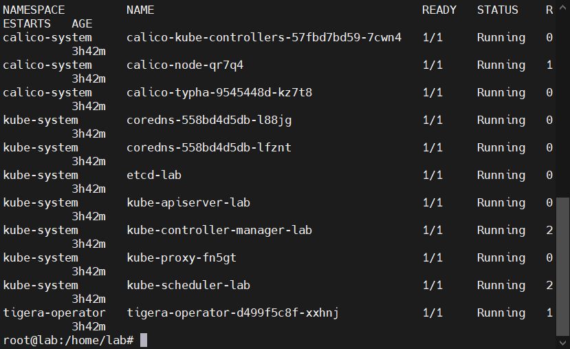

## 部署metarget

```sh
git clone https://github.com/brant-ruan/metarget.git
cd metarget/
pip3 install -r requirements.txt
```

必须得是pip3，pip没有docker源

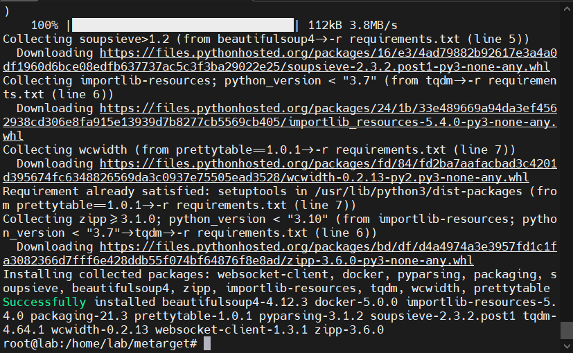

## 部署dvwa

```sh
./metarget appv install dvwa --external
```

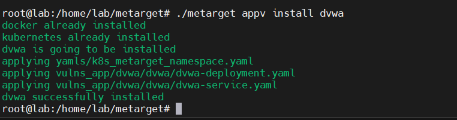


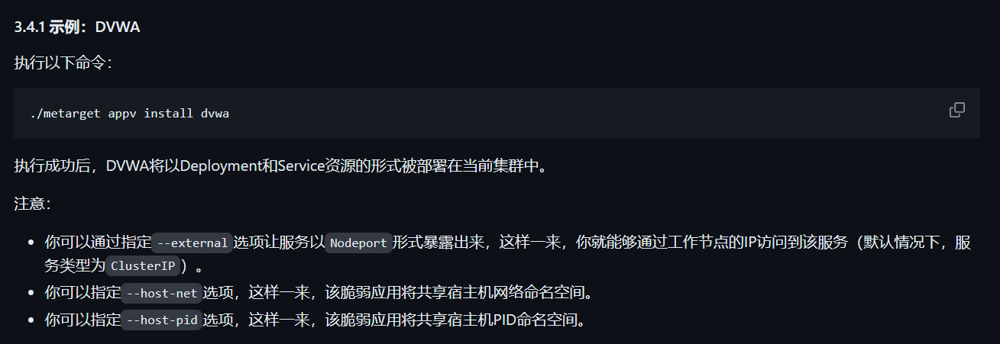


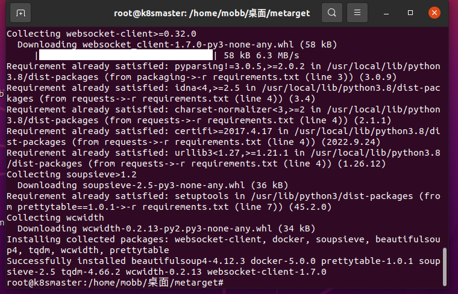

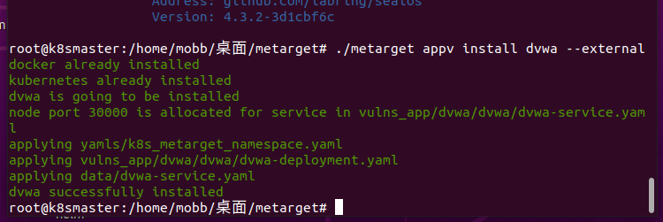

# 测试（于本机虚拟机上进行）

## 升级deepflow

```sh
helm repo update deepflow # use `helm repo update` when helm < 3.7.0
helm upgrade deepflow -n deepflow deepflow/deepflow -f values-custom.yaml

```


```sh

root@k8smaster:/home/mobb# helm upgrade deepflow -n deepflow deepflow/deepflow -f values-custom.yaml
Release "deepflow" has been upgraded. Happy Helming!
NAME: deepflow
LAST DEPLOYED: Sun Mar 17 23:07:09 2024
NAMESPACE: deepflow
STATUS: deployed
REVISION: 2
NOTES:
██████╗ ███████╗███████╗██████╗ ███████╗██╗      ██████╗ ██╗    ██╗
██╔══██╗██╔════╝██╔════╝██╔══██╗██╔════╝██║     ██╔═══██╗██║    ██║
██║  ██║█████╗  █████╗  ██████╔╝█████╗  ██║     ██║   ██║██║ █╗ ██║
██║  ██║██╔══╝  ██╔══╝  ██╔═══╝ ██╔══╝  ██║     ██║   ██║██║███╗██║
██████╔╝███████╗███████╗██║     ██║     ███████╗╚██████╔╝╚███╔███╔╝
╚═════╝ ╚══════╝╚══════╝╚═╝     ╚═╝     ╚══════╝ ╚═════╝  ╚══╝╚══╝ 

An automated observability platform for cloud-native developers.

# deepflow-agent Port for receiving trace, metrics, and log

deepflow-agent service: deepflow-agent.deepflow
deepflow-agent Host listening port: 38086

# Get the Grafana URL to visit by running these commands in the same shell

NODE_PORT=$(kubectl get --namespace deepflow -o jsonpath="{.spec.ports[0].nodePort}" services deepflow-grafana)
NODE_IP=$(kubectl get nodes -o jsonpath="{.items[0].status.addresses[0].address}")
echo -e "Grafana URL: http://$NODE_IP:$NODE_PORT  \nGrafana auth: admin:deepflow"

```


